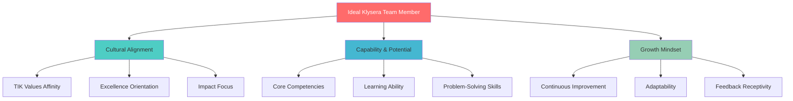

**[🏠 Home](../README.md)** | **[🧭 Navigation](../README.md)** | **[📚 Culture Hub](../Culture-Hub.md)** | **[🎯 Hiring & Onboarding](./_Overview)** | **Hiring Guide**

---

# Hiring Guide

**Cultural Alignment from Day One**

---

## Hiring Philosophy

### Who We're Looking For

### Core Hiring Principles

**Culture-First Hiring**
We hire for cultural alignment first, then skills. Skills can be developed; cultural fit determines long-term success and team harmony.

**Potential Over Experience**
We look for people who can grow into excellence, not just those who have achieved it in different contexts.

**Diverse Perspectives**
We actively seek different backgrounds, experiences, and thinking styles that strengthen our collective capability.

**Growth Partnership**
We hire people who want to grow with us and help others grow too.

---

## Candidate Assessment

### TIK Values Assessment

**Relentless Truth Indicators**
- Asks thoughtful, probing questions
- Shares examples of challenging assumptions
- Demonstrates evidence-based thinking
- Shows intellectual honesty about limitations

**Assessment Questions:**
- "Tell me about a time you had to change your approach based on new evidence"
- "Describe a situation where you challenged a common assumption"
- "How do you determine if something is actually working?"

**Uncompromising Excellence Indicators**
- Takes pride in quality of work
- Goes beyond minimum requirements
- Shows attention to detail that matters
- Demonstrates care for others' success

**Assessment Questions:**
- "Give me an example of when you exceeded expectations"
- "How do you maintain quality when under pressure?"
- "Describe a time you helped someone else achieve excellence"

**Meaningful Impact Indicators**
- Connects work to larger purpose
- Focuses on outcomes over activity
- Shows growth orientation
- Demonstrates care for transformation

**Assessment Questions:**
- "What impact are you most proud of creating?"
- "How do you measure success in your work?"
- "Tell me about a time your work transformed something important"

### Competency Assessment Framework

**Technical Skills**
- Core competencies for the role
- Learning ability and adaptability
- Problem-solving approach
- Quality of work examples

**Collaboration Skills**
- Communication effectiveness
- Team contribution examples
- Conflict resolution approach
- Support and development of others

**Leadership Potential**
- Initiative and ownership
- Influence without authority
- Decision-making capability
- Vision and strategic thinking

### Red Flags to Watch For

**Cultural Misalignment**
- Fixed mindset about learning
- Blame-oriented thinking
- Resistance to feedback
- Individual-over-team focus

**Performance Concerns**
- Inconsistent quality standards
- Poor communication patterns
- Lack of accountability
- Limited growth examples

---

## Interview Process

### Interview Structure

**Phase 1: Initial Screening (30 minutes)**
- Role and company overview
- Basic qualifications and interest assessment
- Initial cultural fit evaluation
- Logistics and next steps

**Phase 2: Cultural Alignment Interview (45 minutes)**
- Deep dive on TIK values alignment
- Behavioral questions and examples
- Work style and collaboration assessment
- Growth mindset and learning orientation

**Phase 3: Competency Assessment (60 minutes)**
- Technical skills evaluation
- Problem-solving scenarios
- Role-specific capability review
- Portfolio or work sample discussion

**Phase 4: Team Integration Interview (45 minutes)**
- Meet potential team members
- Collaborative problem-solving exercise
- Team dynamics assessment
- Mutual fit evaluation

**Phase 5: Leadership Interview (30 minutes)**
- Strategic thinking and vision
- Leadership philosophy discussion
- Growth plans and aspirations
- Final cultural alignment check

### Interview Best Practices

**Preparation**
- Review candidate materials thoroughly
- Prepare specific questions for each interview phase
- Coordinate with interview team on focus areas
- Set up appropriate environment and materials

**During Interviews**
- Create welcoming, professional atmosphere
- Ask behavioral questions with specific examples
- Listen actively and probe for depth
- Take notes for accurate evaluation

**After Interviews**
- Complete evaluation forms immediately
- Share feedback with interview team
- Make recommendations based on evidence
- Follow up on reference checks

### TIK Values Interview Questions

**Relentless Truth**
- "Describe a time when you had to deliver difficult but important information"
- "Tell me about a project where initial assumptions proved wrong"
- "How do you validate that your approach is actually working?"
- "Give an example of when you changed your mind based on evidence"

**Uncompromising Excellence**
- "Walk me through a piece of work you're particularly proud of"
- "How do you maintain high standards when deadlines are tight?"
- "Describe a time when you went above and beyond what was required"
- "Tell me about how you help others achieve excellence"

**Meaningful Impact**
- "What's the most meaningful impact you've created in your career?"
- "How do you connect your daily work to larger purposes?"
- "Describe a transformation you helped create"
- "Tell me about a time when you made something significantly better"

---

## Decision Making

### Evaluation Framework

**Cultural Fit Assessment (40%)**
- TIK values demonstration
- Growth mindset evidence
- Team collaboration potential
- Cultural contribution capability

**Capability Assessment (35%)**
- Technical skills and competencies
- Problem-solving ability
- Learning and adaptability
- Quality and excellence orientation

**Potential Assessment (25%)**
- Growth trajectory and aspirations
- Leadership potential
- Innovation and creativity
- Long-term contribution possibilities

### Decision Process

**Interview Team Debrief**
- Individual evaluator feedback sharing
- Consensus building on key criteria
- Discussion of concerns and positives
- Reference check review

**Hiring Decision**
- Clear recommendation with rationale
- Salary and offer terms discussion
- Start date and logistics planning
- Onboarding preparation

**Communication**
- Timely communication to all candidates
- Specific feedback for unsuccessful candidates
- Enthusiastic offer presentation for selected candidate
- Clear next steps and expectations

---

## Reference Checks

### Reference Check Process

**Professional References**
- Former managers and supervisors
- Peer colleagues and collaborators
- Direct reports (if applicable)
- Clients or stakeholders (if appropriate)

**Key Areas to Explore**
- Performance and work quality
- Cultural fit and values alignment
- Growth and development
- Areas for improvement

**Reference Questions**
- "How would you describe [candidate's] approach to quality and standards?"
- "Can you give me an example of how [candidate] handled a difficult situation?"
- "What would you say are [candidate's] greatest strengths and development opportunities?"
- "Would you hire [candidate] again? Why or why not?"

---

## Offer Process

### Offer Components

**Compensation Package**
- Base salary aligned with market and internal equity
- Variable compensation opportunities
- Benefits and perquisites
- Equity or ownership participation

**Role Definition**
- Clear job description and expectations
- Reporting relationships and team structure
- Performance goals and success metrics
- Growth and development opportunities

**Culture Integration**
- TIK culture orientation and expectations
- Team introduction and relationship building
- Mentoring and buddy system assignment
- Learning and development planning

### Offer Presentation

**Offer Discussion**
- Personal, enthusiastic delivery
- Clear explanation of all components
- Opportunity for questions and clarification
- Timeline for decision making

**Follow-up Support**
- Additional information or clarification
- Reference and background check completion
- Logistics and start date coordination
- Pre-arrival preparation and communication

---

## Diversity and Inclusion

### Inclusive Hiring Practices

**Diverse Candidate Sourcing**
- Broad network and channel utilization
- Partnership with diverse professional organizations
- Inclusive job description language
- Bias-free sourcing strategies

**Bias-Free Assessment**
- Structured interview processes
- Diverse interview panel composition
- Objective evaluation criteria
- Unconscious bias training for interviewers

**Inclusive Decision Making**
- Multiple perspective inclusion
- Bias checking and challenge processes
- Focus on potential and capability
- Long-term cultural contribution assessment

---

## Continuous Improvement

### Hiring Process Assessment

**Regular Process Review**
- Monthly hiring effectiveness assessment
- Candidate and interviewer feedback collection
- Time-to-hire and quality metrics analysis
- Best practice identification and sharing

**Process Enhancement**
- Interview question refinement
- Assessment criteria improvement
- Technology and tool upgrades
- Training and development for hiring team

### Success Measurement

**Quality Metrics**
- New hire performance and retention
- Cultural integration and contribution
- Time to productivity
- Hiring manager satisfaction

**Process Metrics**
- Time to hire and efficiency
- Candidate experience scores
- Interview process effectiveness
- Offer acceptance rates

---

## Related Resources

- **[Onboarding Journey →](./Onboarding-Journey.md)** - First 30 days integration
- **[Integration Tools →](./Integration-Tools.md)** - Resources and checklists
- **[TIK Identity →](../Culture/TIK-Identity.md)** - Understanding our values
- **[← Back to Culture Hub](../Culture-Hub.md)**

---

**Great hiring ensures we bring in people who will thrive in our TIK culture and contribute to our collective excellence.**

**Hire for culture, develop for competence, grow for impact.**