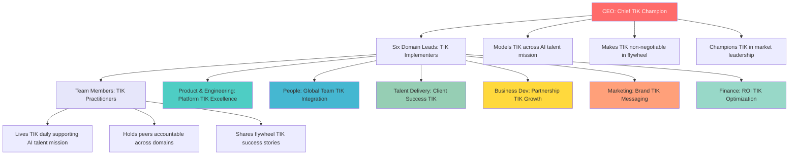
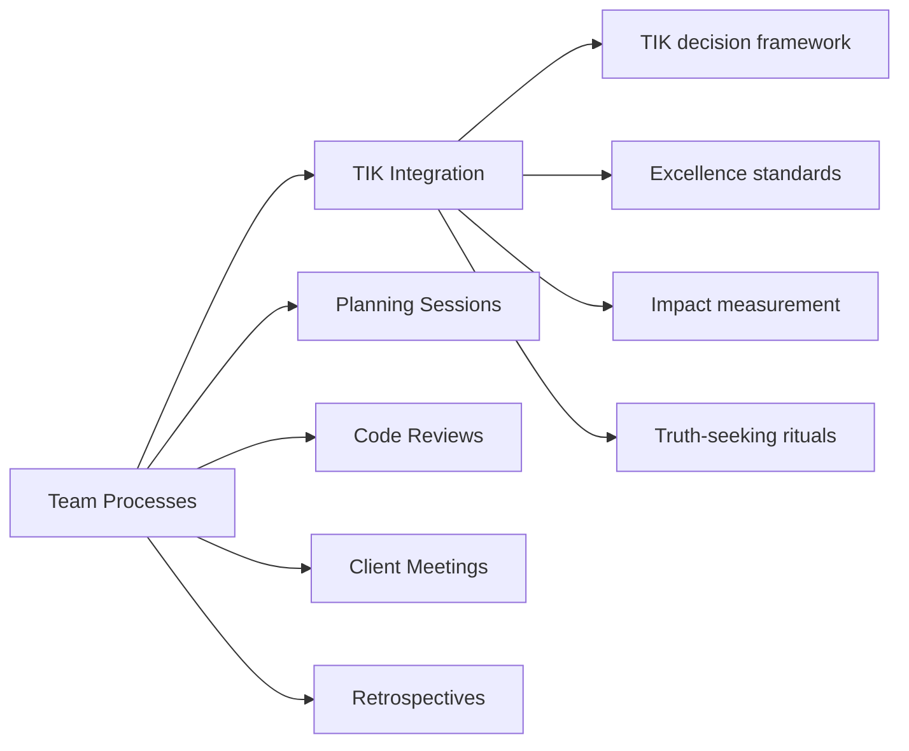
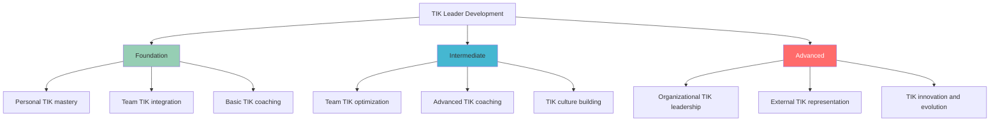

# Leadership Responsibilities for TIK Culture

## Klysera Leadership Hierarchy & TIK Ownership

## CEO: Chief TIK Champion

### Core Responsibilities

#### 1. TIK Modeling (Daily)
**Standard:** CEO embodies TIK perfectly in every interaction

- **In meetings:** Every decision filters through TIK framework
- **In communication:** TIK language is natural and consistent
- **In challenges:** TIK values guide response, not convenience
- **In success:** Credit TIK culture for achievements

#### 2. TIK Non-Negotiability (Strategic)
**Standard:** TIK is central to all company decisions

- **Hiring:** TIK alignment is mandatory, not optional
- **Strategy:** Business decisions must pass TIK test
- **Partnerships:** External relationships reflect TIK values
- **Investment:** Resource allocation prioritizes TIK outcomes

#### 3. TIK Storytelling (Weekly)
**Standard:** CEO shares personal TIK examples regularly

- **All-hands:** Every presentation includes TIK story
- **One-on-ones:** Connect individual work to TIK purpose
- **External:** Represent Klysera as TIK organization
- **Social:** Share TIK moments on professional platforms

### CEO TIK Scorecard

| Responsibility | Daily | Weekly | Monthly |
|----------------|-------|--------|---------|
| **Model TIK Language** | ✓ | - | - |
| **Share TIK Decision** | ✓ | - | - |
| **TIK Story/Example** | - | ✓ | - |
| **All-hands TIK Focus** | - | ✓ | - |
| **Culture Measurement Review** | - | - | ✓ |
| **Leadership TIK Coaching** | - | - | ✓ |

## Domain Leads: TIK Implementers

### Universal Responsibilities (All Domain Leads)

All domain leads share these core TIK responsibilities regardless of their specific domain:

#### 1. Team Process Integration
**Make TIK operational in daily work**

**Specific Actions:**
- **Planning:** Every sprint/project uses TIK framework
- **Reviews:** Code/design evaluated against TIK standards
- **Meetings:** TIK language and energy in all interactions
- **Decisions:** Document TIK reasoning for major choices

#### 2. Values Coaching
**Develop team members' TIK capabilities**

**Weekly TIK Coaching:**
- One-on-ones include TIK growth discussion
- Identify individual TIK strengths and development areas
- Connect personal aspirations to TIK opportunities
- Share resources for TIK skill building

**Monthly TIK Development:**
- Team workshop on specific TIK skill
- Peer learning sessions on TIK practices
- External learning focused on TIK areas
- TIK mentoring relationships facilitated

#### 3. Public TIK Celebration
**Recognize and amplify TIK moments**

**When TIK Happens:**
- Immediate recognition in team channels
- Specific TIK value called out
- Impact of TIK behavior highlighted
- Story shared for others to learn

**Monthly TIK Champions:**
- Nominate team members for TIK recognition
- Document specific TIK behaviors and outcomes
- Share stories in all-hands meetings
- Create culture of TIK aspiration

#### 4. Direct TIK Accountability
**Address TIK misalignment with support**

**When TIK is Missing:**
1. **Immediate gentle correction:** "Is this TIK?"
2. **Private conversation:** Understand barriers, provide support
3. **Clear expectations:** Specific TIK behaviors needed
4. **Follow-up:** Check progress and provide ongoing coaching

### Domain Lead TIK Scorecard

| Responsibility | Weekly | Monthly | Quarterly |
|----------------|--------|---------|-----------|
| **Team TIK Integration** | ✓ | - | - |
| **Individual TIK Coaching** | ✓ | - | - |
| **TIK Moment Recognition** | ✓ | - | - |
| **TIK Development Session** | - | ✓ | - |
| **TIK Champion Nomination** | - | ✓ | - |
| **Team TIK Assessment** | - | - | ✓ |

### Domain-Specific TIK Responsibilities

Each domain lead has unique TIK focus areas aligned with Klysera's mission:

#### Product & Engineering Domain Lead
**TIK Focus: Platform Excellence & AI Innovation**

**Truth Responsibilities:**
- Research optimal AI assessment methodologies from industry leaders
- A/B test platform features with data-driven decision making
- Share transparent metrics on vetting accuracy and matching performance
- Document and learn from platform failures and optimizations

**Excellence Responsibilities:**
- Maintain 0.9% vetting pass rate without compromise
- Ensure 95%+ matching accuracy through continuous improvement
- Set engineering standards that exceed industry benchmarks
- Code review culture that reflects Klysera's quality standards

**Impact Responsibilities:**
- Track client success metrics and platform contribution to ROI
- Measure talent advancement through platform features
- Connect engineering work to flywheel acceleration
- Quantify platform's role in solving AI talent crunch

#### People Domain Lead
**TIK Focus: Global Team Excellence & Culture**

**Truth Responsibilities:**
- Research best practices for remote global team management
- Gather honest feedback on culture effectiveness across time zones
- Data-driven approach to talent retention and engagement
- Transparent reporting on team satisfaction and growth metrics

**Excellence Responsibilities:**
- 24/7 support standards for global talent community
- Exceptional onboarding experience for international team members
- Compensation frameworks that attract top talent from untapped markets
- Culture programs that work across diverse cultural contexts

**Impact Responsibilities:**
- 95%+ talent retention rate achievement
- Career pathway clarity driving 80% advancement annually
- Connection between individual purpose and company mission
- Global team satisfaction scores exceeding industry standards

#### Talent Delivery Domain Lead
**TIK Focus: Client Success & Talent Excellence**

**Truth Responsibilities:**
- Research most effective interview preparation methodologies
- Track and share honest metrics on placement success rates
- Gather feedback from both clients and talent on delivery quality
- Experiment with onboarding approaches to optimize time-to-productivity

**Excellence Responsibilities:**
- 95%+ client satisfaction within first week of talent placement
- Interview preparation that results in 90%+ offer acceptance
- Onboarding excellence reducing client time-to-value
- Performance tracking ensuring continued talent success

**Impact Responsibilities:**
- Client cost savings of 20%+ through effective talent delivery
- Talent career advancement through client success
- Long-term client relationships driving flywheel growth
- Measurable contribution to client business outcomes

#### Business Development Domain Lead
**TIK Focus: Partnership Growth & Flywheel Acceleration**

**Truth Responsibilities:**
- Research competitor pricing and value propositions with data
- Share transparent metrics on sales pipeline and conversion rates
- Honest reporting on client needs and market feedback
- A/B testing of partnership strategies and outreach approaches

**Excellence Responsibilities:**
- 80+ NPS scores from client relationships
- Sales process that reflects Klysera's premium quality despite cost advantage
- Partnership agreements that create mutual long-term value
- Client success programs exceeding industry standards

**Impact Responsibilities:**
- Drive 20% growth in client partnerships quarterly
- Generate referrals through exceptional client experience
- Connect client success to talent advancement opportunities
- Contribute to market positioning as AI talent leader

#### Marketing Domain Lead
**TIK Focus: Brand Excellence & Market Leadership**

**Truth Responsibilities:**
- Research target audience preferences with data-driven insights
- A/B testing of messaging and campaign effectiveness
- Honest metrics on brand perception and market positioning
- Share transparent reporting on marketing ROI and attribution

**Excellence Responsibilities:**
- Content quality that establishes thought leadership in AI talent
- Brand consistency across all touchpoints and markets
- Campaign execution that exceeds industry benchmarks
- Creative excellence that reflects Klysera's innovation

**Impact Responsibilities:**
- Generate qualified leads supporting 20% business growth
- Build brand recognition as AI talent platform leader
- Support talent attraction through compelling employer branding
- Contribute to market education about global talent advantages

#### Finance Domain Lead
**TIK Focus: ROI Excellence & Sustainable Growth**

**Truth Responsibilities:**
- Transparent financial reporting with data-driven insights
- Research optimal cost structures for global talent platform
- Honest assessment of unit economics and profitability metrics
- Share financial learnings and optimizations with leadership

**Excellence Responsibilities:**
- Financial controls that support 20%+ margins while maintaining cost advantage
- Budgeting accuracy within 5% variance
- Compliance excellence across all operating markets
- Financial reporting that enables optimal decision making

**Impact Responsibilities:**
- Support client cost savings of 20% through efficient operations
- Enable talent compensation competitiveness in global markets
- Financial foundation supporting sustainable 20% growth
- ROI measurement connecting all activities to business outcomes

## All Team Members: TIK Practitioners

### Core Responsibilities

#### 1. Daily TIK Ritual Practice
**Live TIK through consistent daily habits**

- **Morning:** Impact intention aligned with TIK
- **Standup:** Share impact, not tasks
- **Work:** Apply TIK decision framework
- **Evening:** Reflect on TIK delivery

#### 2. Peer TIK Accountability
**Support team members' TIK growth**

**In the moment:**
- Ask "Is this TIK?" when something feels off
- Celebrate TIK moments immediately
- Offer TIK perspective in discussions
- Model TIK behavior consistently

**Ongoing support:**
- Share TIK resources and insights
- Mentor newer team members on TIK
- Create psychological safety for TIK practice
- Build TIK habits together

#### 3. TIK Story Sharing
**Contribute to TIK culture building**

- **Weekly:** Share one TIK example or learning
- **Monthly:** Contribute to TIK story library
- **Quarterly:** Present TIK insight to team
- **Annually:** Reflect on personal TIK growth

## Leadership Development Pipeline

### TIK Leadership Competencies

### Leadership Assessment Framework

#### Foundation Level (Individual Contributors → Team Leads)
**Requirements:**
- [ ] Consistently practices daily TIK rituals
- [ ] Uses TIK decision framework naturally
- [ ] Celebrates team TIK moments regularly
- [ ] Provides supportive TIK accountability
- [ ] Demonstrates TIK in challenging situations

#### Intermediate Level (Team Leads → Domain Leads)
**Requirements:**
- [ ] Integrates TIK into all team processes
- [ ] Coaches individuals on TIK development
- [ ] Builds psychological safety for TIK practice
- [ ] Addresses TIK misalignment effectively
- [ ] Creates TIK innovation within domain

#### Advanced Level (Domain Leads → Organizational Leaders)
**Requirements:**
- [ ] Champions TIK across organization
- [ ] Represents TIK externally with clients/partners
- [ ] Innovates new TIK practices and frameworks
- [ ] Develops other TIK leaders successfully
- [ ] Drives organizational TIK evolution

## TIK Leadership Emergency Protocols

### When Leadership Fails TIK

#### For CEO TIK Failure
- **Immediate:** CEO acknowledges publicly and commits to improvement
- **Short-term:** Extra coaching and accountability from board/advisors
- **Long-term:** TIK becomes board-level governance topic

#### For Domain Lead TIK Failure
- **Immediate:** CEO addresses directly with support
- **Short-term:** Intensive TIK coaching and mentoring
- **Long-term:** Performance improvement plan with TIK focus

#### For Team Member TIK Patterns
- **Immediate:** Domain lead provides coaching
- **Short-term:** Additional resources and support
- **Long-term:** Culture fit assessment if no improvement

### TIK Crisis Management

**When TIK Culture is Threatened:**

1. **Emergency Leadership Session**
   - All leaders align on TIK priority
   - Identify specific threats to culture
   - Create immediate action plan

2. **Team Communication**
   - Transparent acknowledgment of challenge
   - Reaffirmation of TIK commitment
   - Clear actions being taken

3. **Intensive TIK Focus**
   - Daily TIK check-ins for leadership
   - Extra TIK coaching resources
   - Accelerated TIK celebration

## Questions & Accountability

### Common Leadership Questions

**Q: What if business pressure conflicts with TIK?**
**A:** TIK drives business success. Find creative solutions that honor both, don't compromise TIK for short-term pressure.

**Q: How do I address TIK resistance?**
**A:** Understand root cause, provide specific support, clear expectations, and follow through with accountability.

**Q: What if I make a TIK mistake as a leader?**
**A:** Acknowledge immediately, learn publicly, recommit visibly. Model TIK in how you handle failure.

### Leadership TIK Accountability

**Monthly Leadership Review:**
- How did I model TIK this month?
- What TIK coaching did I provide?
- Where did I miss TIK opportunities?
- How did my leadership advance TIK culture?

---

*[← Back to Values Overview](../../Culture/TIK-Identity.md) | [View Implementation Guide →](../Implementation/Quick-Start-Guide.md)*