**[🏠 Home](../../README.md)** | **[🧭 Navigation](../../README.md)** | **[📚 Culture Hub](../../Culture-Hub.md)** | **[🔧 Operating Principles](../_Overview)** | **[📊 Measurement](./Culture-Metrics.md)** | **Culture Metrics**

---

# TIK Culture Success Metrics for Klysera

## TIK Measurement Philosophy: Driving the AI Talent Flywheel


## Comprehensive TIK Dashboard

### Klysera TIK Culture Health Dashboard

| Metric Category | Key Indicators | Current | Target | Status |
|-----------------|----------------|---------|--------|---------|
| **Flywheel Culture** | AI talent mission alignment, Global team integration, Domain collaboration | - | 95%, 90%, 85% | 🟡 |
| **Excellence Standards** | 0.9% vetting maintenance, 95% matching accuracy, Client NPS 80+ | - | 100%, 100%, 100% | 🟡 |
| **Truth Seeking** | Platform data transparency, Market research frequency, Experiment velocity | - | 90%, Monthly, 5+/domain | 🟡 |
| **Impact Delivery** | Client cost savings 20%, Talent advancement 80%, Revenue growth 20% | - | 100%, 100%, 100% | 🟡 |

### Value-Specific Metrics

#### Relentless Truth Metrics (AI Talent Platform Focus)


**Tracking Methods:**
- **Platform Experiment Log:** A/B test results on vetting and matching accuracy
- **Market Research Database:** Competitor analysis and talent market insights
- **Transparency Metrics:** Real-time dashboards for client and talent success

#### Uncompromising Excellence Metrics (Platform & Talent Focus)


**Tracking Methods:**
- **Platform Quality Dashboard:** Real-time tracking of vetting, matching, and uptime
- **Talent Success Tracking:** Career advancement and satisfaction monitoring
- **Client Excellence Metrics:** NPS, retention, and productivity measurements

#### Meaningful Impact Metrics (Flywheel & AI Mission Focus)


**Tracking Methods:**
- **Flywheel Success Tracking:** Client savings, talent advancement, market growth
- **Mission Alignment Survey:** Quarterly connection to AI talent mission
- **Business Impact Dashboard:** ROI, expansion rates, market positioning

## Measurement Frequency & Ownership

### Daily Metrics (Automated)
| Metric | Owner | Collection Method |
|--------|-------|-------------------|
| TIK Language Usage | P&C Lead | Slack/Teams message analysis |
| Ritual Participation | Domain Leads | #daily-impact channel posts |
| Decision Framework Usage | All Leaders | Decision documentation count |

### Weekly Metrics (Pulse)
| Metric | Owner | Collection Method |
|--------|-------|-------------------|
| Psychological Safety Score | P&C Lead | 3-question pulse survey |
| TIK Culture Health | CEO | Leadership observation |
| Excellence Recognition | Domain Leads | Peer nomination tracking |

### Monthly Metrics (Survey)
| Metric | Owner | Collection Method |
|--------|-------|-------------------|
| Values Demonstration | P&C Lead | 360-degree feedback |
| Impact Story Collection | All Team | Story submission system |
| Culture Satisfaction | P&C Lead | Comprehensive survey |

### Quarterly Metrics (Deep Dive)
| Metric | Owner | Collection Method |
|--------|-------|-------------------|
| Business Impact Correlation | CEO | Performance vs culture analysis |
| Client TIK Recognition | Sales/Success | Client feedback analysis |
| Leadership TIK Effectiveness | P&C Lead | Leadership assessment |

## Leading vs. Lagging Indicators

### Leading Indicators (Predict Future Success)

```mermaid
graph TD
    A[Leading Indicators] --> B[Behavioral Changes]
    B --> C[Cultural Shifts]
    C --> D[Business Outcomes]

    B --> B1[TIK language adoption rate]
    B --> B2[Decision framework usage frequency]
    B --> B3[Peer accountability instances]

    C --> C1[Psychological safety improvements]
    C --> C2[Excellence standard elevation]
    C --> C3[Purpose clarity increases]

    D --> D1[Client satisfaction gains]
    D --> D2[Team retention improvements]
    D --> D3[Performance metric increases]
```



### Lagging Indicators (Confirm Success)

- **Client NPS scores:** Quarterly
- **Employee retention rates:** Quarterly
- **Revenue per client:** Quarterly
- **Time to productivity (new hires):** Monthly
- **Quality incident rates:** Monthly

## TIK Culture Maturity Model

### Level 1: Foundation (Month 1-2)
**Characteristics:**
- TIK language introduced but inconsistent
- Rituals practiced with reminders
- Decision framework used occasionally

**Success Metrics:**
- [ ] 70% ritual participation
- [ ] 50% TIK language adoption
- [ ] 60% decision framework usage

### Level 2: Integration (Month 3-6)
**Characteristics:**
- TIK language becomes natural
- Rituals are habitual
- Values-based decisions are norm

**Success Metrics:**
- [ ] 85% ritual participation
- [ ] 80% TIK language adoption
- [ ] 85% decision framework usage

### Level 3: Embodiment (Month 7-12)
**Characteristics:**
- TIK is automatic and authentic
- Culture is self-reinforcing
- External recognition of TIK difference

**Success Metrics:**
- [ ] 95% ritual participation
- [ ] 95% TIK language adoption
- [ ] 95% decision framework usage

### Level 4: Evolution (Year 2+)
**Characteristics:**
- TIK culture drives innovation
- Team members coach TIK naturally
- TIK becomes market differentiator

**Success Metrics:**
- [ ] 100% ritual participation
- [ ] 100% TIK language adoption
- [ ] 100% decision framework usage

## Red Flag Metrics

### Immediate Attention Required

| Red Flag | Threshold | Response |
|----------|-----------|----------|
| **Ritual participation drops** | <70% for 2 weeks | Emergency culture session |
| **TIK language disappears** | <50% usage for 1 week | Leadership intervention |
| **Psychological safety drops** | <80% for 2 surveys | Immediate coaching focus |
| **Excellence metrics decline** | <85% for 1 month | Quality improvement plan |

### Early Warning Signs

| Warning Sign | Threshold | Response |
|-------------|-----------|----------|
| **Decision framework avoidance** | <80% usage | Additional training |
| **Impact story shortage** | <5 stories/month | Impact coaching |
| **Peer accountability decreases** | <3 instances/week | Culture reinforcement |
| **Leadership TIK modeling issues** | Any instance | Immediate coaching |

## Measurement Tools & Systems

### Survey Infrastructure

#### Weekly Pulse (2 minutes)
```
1. I felt psychologically safe to share truth this week (1-5)
2. I witnessed TIK excellence this week (Yes/No + example)
3. My work created meaningful impact this week (1-5)
```

#### Monthly Culture Health (10 minutes)
```
Truth Section:
- I feel comfortable admitting mistakes
- I see experimentation encouraged
- I witness first-principles thinking

Excellence Section:
- Our quality standards are clear
- I see people going above and beyond
- I'm proud of our work quality

Impact Section:
- I understand how my work creates value
- I feel connected to company purpose
- I see meaningful client transformation
```

### Analytics Dashboard

#### Real-Time TIK Monitor
- Live TIK language usage (Slack/Teams)
- Daily ritual completion rates
- Decision documentation frequency
- Celebration activity levels

#### Weekly Culture Report
- Participation trend analysis
- Culture health score changes
- Leading indicator movements
- Red flag identification

#### Monthly Business Correlation
- Culture metrics vs business performance
- Client satisfaction vs TIK scores
- Retention rates vs engagement levels
- Performance vs values demonstration

## Action-Oriented Metrics

### When Metrics Show Issues

#### Declining Participation
1. **Individual check-ins:** Understand barriers
2. **Process simplification:** Remove friction
3. **Leadership modeling:** Increase visibility
4. **Peer support:** Buddy system activation

#### Low Quality Scores
1. **Standard clarification:** Ensure understanding
2. **Skill development:** Targeted training
3. **Resource provision:** Remove capability gaps
4. **Recognition increase:** Celebrate excellence

#### Weak Impact Connection
1. **Purpose workshops:** Clarify individual connection
2. **Context provision:** Explain strategy and goals
3. **Outcome visibility:** Share client feedback
4. **Story collection:** Document transformation

## ROI of TIK Culture

### Business Impact Correlation


### Investment vs. Return

| TIK Investment | Measurable Return |
|----------------|-------------------|
| **Ritual time (30 min/day)** | 25% faster decisions, 20% better quality |
| **Culture training (2 hrs/month)** | 40% reduction in team conflicts |
| **Values assessment (quarterly)** | 80% improvement in culture fit |
| **Leadership modeling (ongoing)** | 60% increase in engagement scores |

---

*[← Back to Values Overview](../../Culture/TIK-Identity.md) | [View Shared Frameworks →](../Shared-Frameworks.md)*