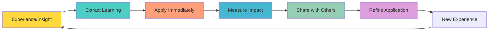
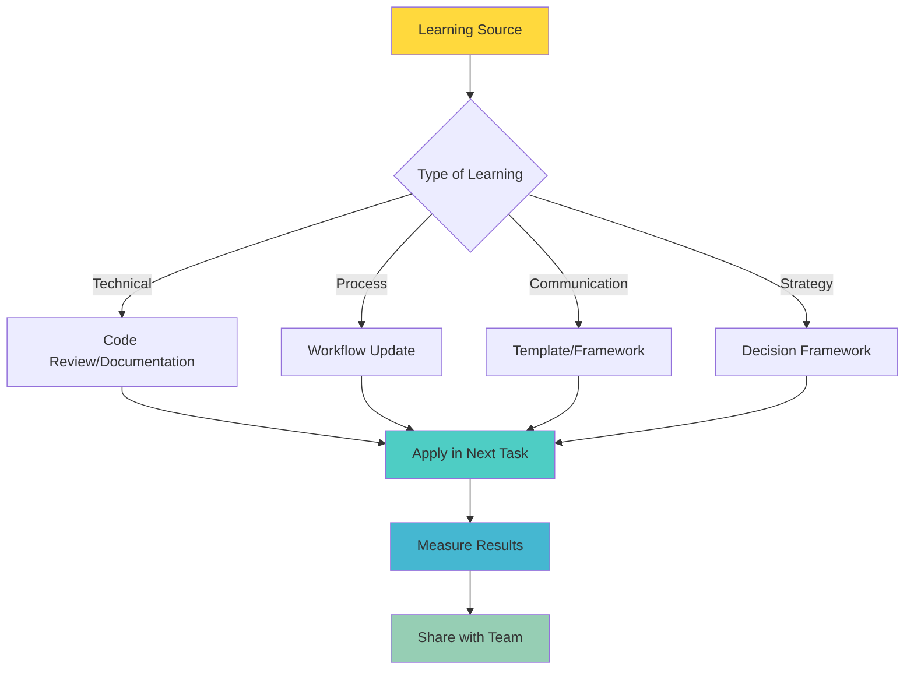
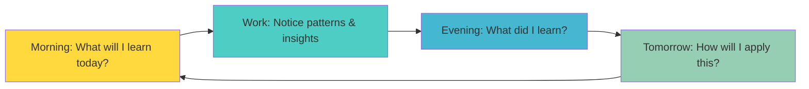
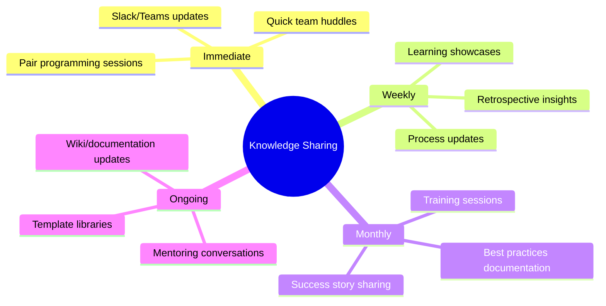
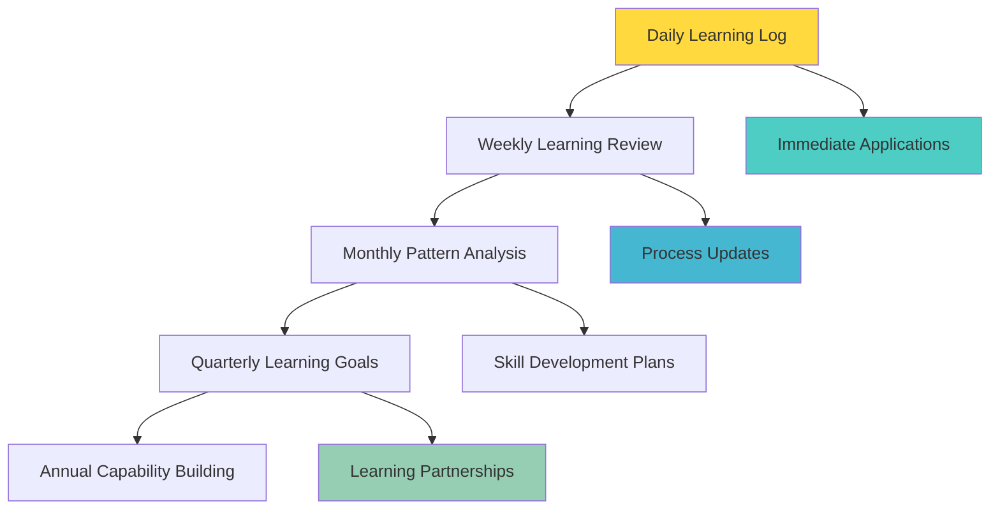

**[🏠 Home](../../README.md)** | **[🧭 Navigation](../../README.md)** | **[📚 Culture Hub](../../Culture-Hub.md)** | **[🔧 Operating Principles](../_Overview)** | **[🧪 Principles](../Tools/Quick-Reference-Cards.md)** | **Learn Fast, Apply Faster**

---

# Learn Fast, Apply Faster

**"Turn every experience into immediate improvement."**

**[← Back to Operating Principles Overview](../_Overview)**

---

## Definition

**Learn Fast, Apply Faster** means turning every experience into immediate improvement. We don't just gather knowledge - we apply it immediately. Speed of learning and application is our competitive advantage. What we learn today improves what we do tomorrow.

---

## What It Means

- **Immediate Application:** Apply learnings within hours, not months
- **Continuous Improvement:** Every experience becomes input for better performance
- **Knowledge Sharing:** Insights spread rapidly across teams
- **Iterative Refinement:** Quick cycles of learn-apply-improve
- **Learning Culture:** Failures and successes both generate valuable insights

---

## In Practice

### Daily Implementation

**After Every Task:**
- What did I learn from this?
- How can I apply this insight immediately?
- What would I do differently next time?
- Who else could benefit from this learning?

**During Projects:**
- Weekly retrospectives with immediate action items
- Daily standup sharing of learnings and applications
- Real-time process adjustments based on what's working
- Quick feedback loops with stakeholders

**Knowledge Management:**
- Document learnings in shared repositories
- Update processes immediately when better ways are found
- Create templates from successful approaches
- Build reusable solutions from repeated patterns

### Learning Acceleration Practices

**Learning Sources:**
- Project retrospectives
- Client feedback
- Team member insights
- External research
- Failure analysis
- Success pattern identification

**Application Methods:**
- Immediate process updates
- Next-day implementation
- Team knowledge sharing
- Template creation
- Standard operating procedure updates

---

## Examples in Action

### ✅ Living Learn Fast, Apply Faster

**Technical Learning:**
- Learning a new coding pattern on Monday, implementing it in Tuesday's work
- Discovering a better testing approach and updating team standards immediately
- Finding a performance optimization and applying it across similar projects

**Process Improvements:**
- Client feedback about communication leads to same-day process adjustment
- Meeting runs long, team immediately implements time-boxing for next meeting
- Discovering bottleneck in workflow, implementing solution within the week

**Client Success:**
- Learning what delights one client, applying those insights to other client relationships
- Feedback about presentation style immediately incorporated into next presentation
- Success pattern identified and documented for team replication

**Team Development:**
- Someone shares a productivity tip in standup, others try it that same day
- Learning from industry conference applied in current project within days
- Mentoring conversation insights immediately implemented in work approach

**TIK Moments:**
- "TIK! You took that learning and applied it immediately!"
- "TIK! Fast learning, faster application - that's how we improve!"

### ❌ Violating Learn Fast, Apply Faster

- Learning something valuable but waiting weeks or months to apply it
- Repeating the same mistakes because lessons weren't captured or applied
- Hoarding insights instead of sharing them with the team
- Making the same process errors repeatedly without improvement
- Attending training or conferences without immediate implementation

---

## Tools & Frameworks

### Daily Learning Loop

### Learning Capture Framework

**For Every Significant Experience:**
1. **What happened?** (Facts)
2. **What worked well?** (Successes)
3. **What didn't work?** (Challenges)
4. **What would I do differently?** (Improvements)
5. **How can I apply this immediately?** (Action)
6. **Who else should know this?** (Sharing)

### Rapid Application Process

**Step 1: Immediate Assessment (within 1 hour)**
- Is this learning applicable to current work?
- What's the smallest way to test this insight?
- Who can help validate or refine this approach?

**Step 2: Quick Implementation (within 24 hours)**
- Apply the learning in the next relevant task
- Create a template or process update
- Share with immediate team members

**Step 3: Measure & Refine (within 1 week)**
- Did the application improve outcomes?
- What adjustments are needed?
- How can this be scaled to others?

### Knowledge Sharing Methods

---

## Common Challenges

### "I don't have time to document learnings"
- **Response:** 2 minutes of documentation saves 20 minutes of re-learning
- **Solution:** Use quick templates and voice notes
- **Tools:** Simple formats like "What/So What/Now What"

### "My learning doesn't apply to others"
- **Response:** You'd be surprised what others can adapt
- **Solution:** Share the principle behind the specific learning
- **Example:** Process improvement from client work can apply to internal processes

### "We already have too many process changes"
- **Response:** Small, continuous improvements are less disruptive than big changes
- **Solution:** Focus on highest-impact learnings first
- **Approach:** Test improvements before full implementation

### "People don't read our documentation"
- **Response:** Change how you share learnings
- **Solutions:**
  - Quick team demos
  - Story-based sharing
  - Embed in existing workflows
  - Visual summaries

---

## Measuring Success

### Individual Level
- Time from learning to application (target: <24 hours for simple insights)
- Number of process improvements implemented per month
- Knowledge sharing frequency and quality
- Repetition of resolved problems (should decrease)

### Team Level
- Team learning velocity and application speed
- Cross-pollination of insights between team members
- Collective problem-solving improvement
- Reduction in time to competency for new approaches

### Organizational Level
- Organizational learning speed compared to industry
- Innovation rate and implementation success
- Mistake repetition across teams (should decrease)
- Knowledge transfer effectiveness

---

## Learning Acceleration Techniques

### Personal Learning System

**Daily Practice:**
- Morning: "What do I want to learn today?"
- Evening: "What did I learn and how will I use it tomorrow?"

**Weekly Practice:**
- Review learning log for patterns
- Share top insights with team
- Plan application of new learnings

### Team Learning Rituals

**Learning Standups:** Quick sharing of daily insights
**Failure Fridays:** Monthly celebration of learning from mistakes
**Success Sharing:** Weekly showcase of what worked well
**Retrospective Plus:** Add "What did we learn?" to every project review

---

## Creating a Learning Culture

### Environment Setup

**Psychological Safety:**
- Celebrate learning from failures
- Reward knowledge sharing
- Make it safe to admit "I don't know"
- Encourage experimentation

**Systems Support:**
- Easy documentation tools
- Searchable knowledge base
- Regular learning time
- Cross-team collaboration

**Recognition:**
- Acknowledge rapid application of insights
- Celebrate process improvements
- Share success stories
- Reward knowledge sharing

---

## Daily Reflection Questions

- **Morning:** What will I learn today and how will I apply it?
- **During work:** What pattern am I noticing that I can improve?
- **After tasks:** What just worked well that I should remember?
- **End of day:** How did I apply today's learnings?
- **Weekly:** What insights should I share with others?

---

## Next Steps

1. **Start Today:** Begin a simple learning log
2. **Practice:** Apply one insight within 24 hours
3. **Share:** Tell someone else about a recent learning
4. **Measure:** Track time from learning to application

**Remember:** The fastest learners become the best performers.

---

*This Is Klysera. We learn fast. We apply faster. We improve continuously.*