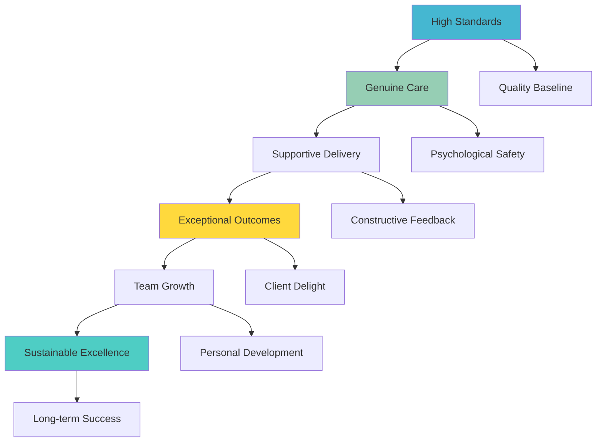
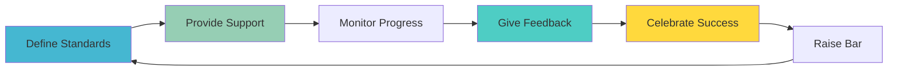
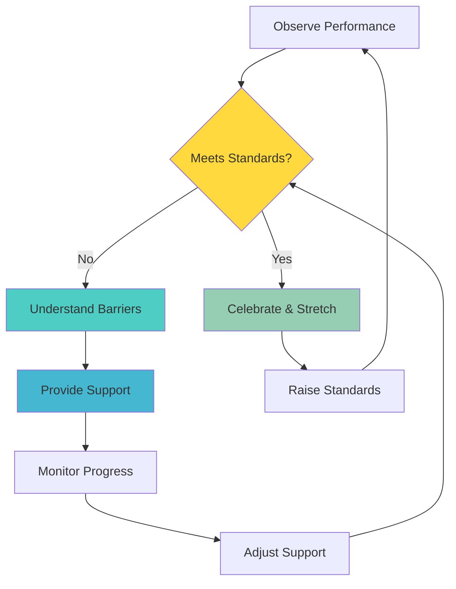
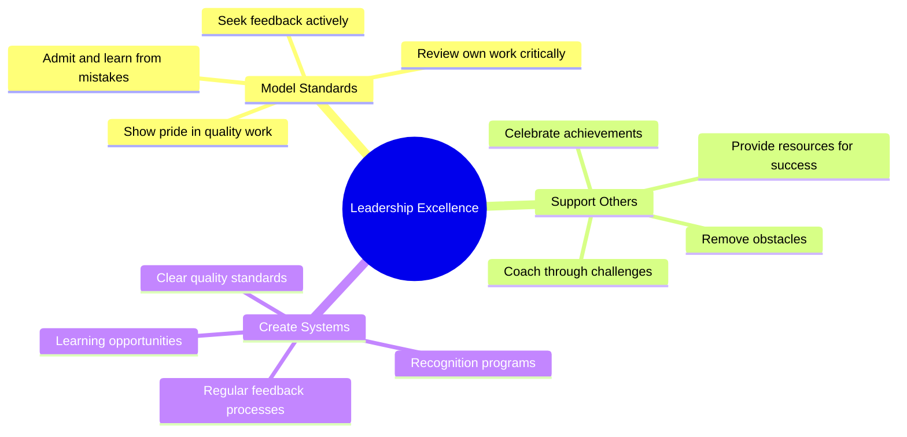

**[🏠 Home](../../README.md)** | **[🧭 Navigation](../../README.md)** | **[📚 Culture Hub](../../Culture-Hub.md)** | **[🔧 Operating Principles](../_Overview.md)** | **[🧪 Principles](../Tools/Quick-Reference-Cards.md)** | **Excellence with Warmth**

---

# Excellence with Warmth

**"Deliver exceptional quality with genuine care."**

**[← Back to Operating Principles Overview](../_Overview.md)**

---

## Definition

**Excellence with Warmth** means maintaining uncompromising quality while delivering it with genuine care and support for people. High standards don't require harshness. We deliver exceptional work because we care - about the outcome, about our teammates, and about our clients. Excellence and kindness work together, not against each other.

---

## What It Means

- **Quality Without Compromise:** We never lower standards for speed, convenience, or pressure
- **Supportive Standards:** High expectations delivered with encouragement and support
- **Growth-Oriented:** Excellence helps people become better versions of themselves
- **Constructive Approach:** We build people up while building quality up
- **Sustainable Performance:** Excellence that energizes rather than exhausts

---

## In Practice

### Daily Implementation

**Quality Standards:**
- Review your work before submitting: "Am I proud of this?"
- Ask "Would I be comfortable showing this to the best person in our industry?"
- Fix root causes, not just symptoms
- Go above and beyond what's asked when it adds real value

**Supportive Delivery:**
- Give feedback that helps people grow, not just critique
- Acknowledge effort and progress while maintaining standards
- Offer help when someone is struggling to meet expectations
- Celebrate excellent work publicly and specifically

**Team Interactions:**
- Coach for success, not compliance
- Share knowledge generously to help others excel
- Create psychological safety where people can take risks
- Support teammates through challenges while maintaining accountability

### Excellence Delivery Framework

**Clear Expectations:**
- Define what excellent looks like
- Share examples of outstanding work
- Explain the why behind quality standards
- Provide resources and tools for success

**Ongoing Support:**
- Regular check-ins and guidance
- Remove obstacles that prevent excellence
- Pair people with mentors or experts
- Invest in skills development

---

## Examples in Action

### ✅ Living Excellence with Warmth

**Project Delivery:**
- Delivering work that exceeds client expectations while ensuring team doesn't burn out
- Taking extra time to polish details because "this represents our company"
- Saying "Let's make this even better" rather than "This isn't good enough"

**Team Feedback:**
- "I can see how much effort you put into this. Here's how we can make it even stronger..."
- Acknowledging progress: "You've improved significantly in X, now let's work on Y"
- Offering specific help: "I see you're struggling with Z. Let me show you how I approach it"

**Quality Assurance:**
- Building quality checks into processes rather than catching errors after
- Creating templates and guides that make excellence easier to achieve
- Refusing to ship substandard work while supporting the team to reach standards

**Coaching Conversations:**
- Manager: "I know you want to deliver excellence. What's blocking you right now?"
- Instead of: "Your work doesn't meet standards"
- Focus: "How can I help you succeed?"

**TIK Moments:**
- "TIK! Excellence delivered with genuine care for the team!"
- "TIK! High standards that help people grow!"

### ❌ Violating Excellence with Warmth

- Lowering standards to avoid difficult conversations
- Delivering harsh criticism without support or constructive guidance
- Accepting "good enough" work to avoid pushing people
- Creating stress and burnout in pursuit of perfection
- Using excellence as a weapon rather than a growth tool

---

## Tools & Frameworks

### Excellence Coaching Framework

### Quality with Care Checklist

**Before Giving Feedback:**
- [ ] Is my intent to help them succeed?
- [ ] Do I have specific, actionable suggestions?
- [ ] Am I addressing the work, not the person?
- [ ] Can I offer support or resources?
- [ ] Will this conversation build them up?

**When Setting Standards:**
- [ ] Have I explained why this standard matters?
- [ ] Do they have the tools/knowledge to meet it?
- [ ] Is the timeline reasonable for quality work?
- [ ] How will I support their success?
- [ ] What does success look like specifically?

### Excellence Recognition Template

**For Outstanding Work:**
"[Name], I want to recognize the excellence you delivered on [specific work]. What impressed me most was [specific quality/behavior]. This demonstrates [principle/value] and shows [impact]. Thank you for setting this standard for all of us."

**For Growth Progress:**
"[Name], I've noticed significant improvement in [specific area]. The [specific example] shows you're applying [feedback/learning]. Keep building on this momentum - you're developing real strength here."

---

## Common Challenges

### "High standards create stress"
- **Response:** Unclear standards create stress; clear standards with support create growth
- **Solution:** Define expectations clearly and provide pathways to success
- **Practice:** Regular check-ins and proactive support

### "We don't have time for excellence"
- **Response:** We don't have time for the rework that comes from poor quality
- **Solution:** Build quality practices into workflow, don't add them afterward
- **Mindset:** Excellence is efficient when built into the process

### "People take feedback personally"
- **Response:** Focus on the work and future success, not past mistakes
- **Solution:** Use growth-oriented language and offer specific support
- **Example:** "How can we make this even better?" vs. "This is wrong"

### "Excellence standards seem subjective"
- **Response:** Make excellence criteria specific and measurable
- **Solution:** Provide examples, rubrics, and clear success indicators
- **Practice:** Collaborative standard-setting with team input

---

## Measuring Success

### Quality Indicators
- Work that consistently exceeds expectations
- Reduced rework and error rates
- Client satisfaction and delight
- Industry recognition and benchmarking

### Team Health Indicators
- High engagement alongside high performance
- Voluntary effort to exceed standards
- People helping others achieve excellence
- Growth in capabilities over time

### Cultural Indicators
- People proud to show their work
- Standards maintained under pressure
- Excellence celebrated, not just demanded
- Learning from mistakes encouraged

---

## Building Excellence Culture

### Leadership Modeling

### Team Practices

**Excellence Rituals:**
- Start projects by defining "what does excellence look like?"
- Regular quality reviews with constructive feedback
- Peer mentoring and knowledge sharing
- Celebration of exceptional work and growth

**Support Systems:**
- Mentorship programs
- Skills development resources
- Quality templates and guides
- Safe spaces for learning and experimentation

---

## Balancing Excellence and Warmth

### When Excellence Requires Difficult Conversations

**The Framework:**
1. **Lead with care:** "I want you to succeed, which is why..."
2. **Be specific:** Share concrete examples and impacts
3. **Focus forward:** "Here's how we can improve..."
4. **Offer support:** "What do you need from me to make this happen?"
5. **Follow up:** Regular check-ins and encouragement

### When Warmth Might Lower Standards

**Key Principles:**
- Kindness doesn't mean accepting poor quality
- Support people to reach standards rather than lowering standards
- Address performance issues quickly and constructively
- Separate person from performance - care for both

---

## Daily Reflection Questions

- **Morning:** How will I deliver excellence with care today?
- **During work:** Am I proud of the quality I'm producing?
- **Team interactions:** How can I support others while maintaining standards?
- **End of day:** Did I help someone grow through excellence today?
- **Weekly:** How did warmth and standards work together to create better outcomes?

---

## Next Steps

1. **Assess Current State:** Where do you maintain high standards with support?
2. **Identify Gaps:** Where could you be more supportive or raise standards?
3. **Practice:** Give feedback using the excellence coaching framework
4. **Model:** Show what excellence with warmth looks like

**Remember:** People perform best when they feel supported to achieve their highest potential.

---

*This Is Klysera. We deliver excellence. We do it with care. We build each other up.*