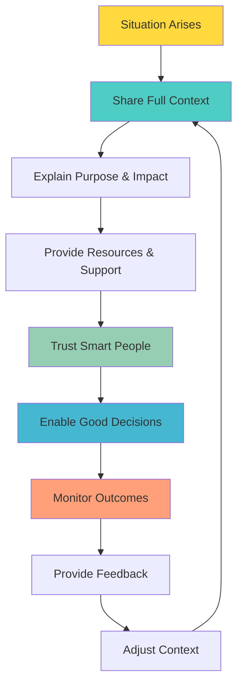
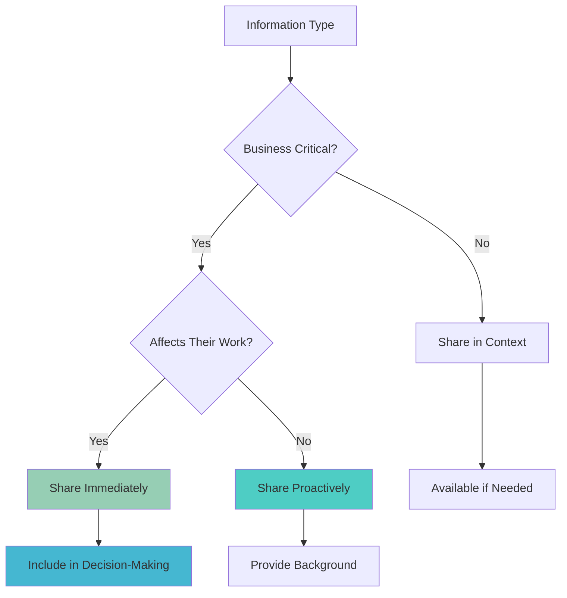
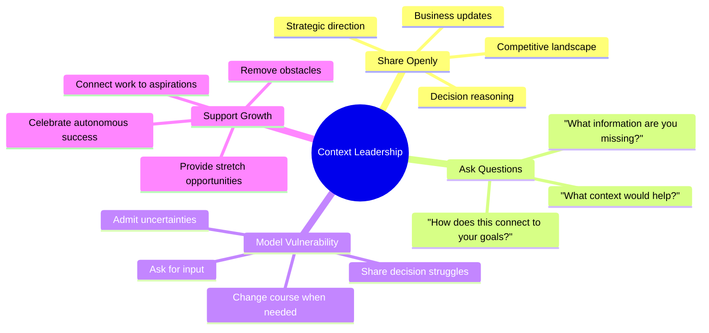
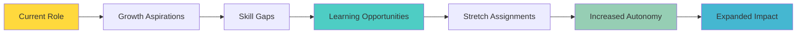

# Context Not Control

**"Empower through information and purpose."**

**[← Back to Operating Principles Overview](../_Overview.md)**

---

## Definition

**Context Not Control** means empowering people through information, understanding, and purpose rather than through micromanagement and rigid processes. We share the why, not just the what. When people understand the full picture and how their work connects to larger goals, they make better decisions and find better solutions than any control system could produce.

---

## What It Means

- **Information Sharing:** Provide the background, constraints, and reasoning behind decisions
- **Purpose Connection:** Help people understand how their work contributes to larger goals
- **Autonomous Decision-Making:** Trust people to find the best path when they have context
- **Guidance Over Rules:** Provide principles and frameworks rather than rigid procedures
- **Growth Enablement:** Create conditions for people to develop judgment and expertise

---

## In Practice

### Daily Implementation

**When Assigning Work:**
- Explain the business context and why this work matters
- Share the constraints and success criteria
- Connect the task to individual growth goals
- Provide resources and remove obstacles
- Trust people to determine the best approach

**Communication Style:**
- Lead with the why before the what
- Share decision-making criteria openly
- Admit when you don't have complete information
- Ask for input and alternative perspectives
- Explain reasoning behind changes in direction

**Team Empowerment:**
- Give ownership of outcomes, not just tasks
- Share financial, strategic, and competitive context
- Include team members in relevant decision-making
- Provide learning opportunities aligned with goals
- Support experimentation and intelligent risk-taking

### Context Sharing Framework

**Background:** What led to this situation/decision/priority?
**Constraints:** What limitations or requirements must be considered?
**Success:** What does good outcome look like?
**Purpose:** How does this connect to larger goals and individual growth?
**Resources:** What support, tools, or information is available?
**Trust:** How will we monitor progress and provide support?

---

## Examples in Action

### ✅ Living Context Not Control

**Project Assignment:**
- "We need to improve client onboarding because we're losing 20% of new clients in their first month. The constraint is we can't add significant new tools or headcount. Success looks like 95% completion rate and 4.5+ satisfaction score. This connects to your goal of becoming our client experience expert. You have access to our analytics, client feedback, and the design team. What approach do you think would work best?"

**Strategic Change:**
- "We're shifting our focus to mid-market clients because enterprise sales cycles are too long for our current runway. This means some of our tools need to be simpler and more cost-effective. I know this affects your current project - let's discuss how to pivot in a way that serves both the business need and your professional development."

**Performance Guidance:**
- "I've noticed client feedback mentions communication delays. Our goal is same-day response to client questions. The business impact is client retention and referrals. I'd like to understand what's causing the delays and how I can support better responsiveness. What obstacles are you facing?"

**Team Decision-Making:**
- "Here's our budget situation, competitive landscape, and client feedback. We need to decide between these three initiatives. What questions do you have about the context? What factors should we consider that I might be missing?"

**TIK Moments:**
- "TIK! That context enabled excellent decision-making!"
- "TIK! Empowerment through information - that's how we work!"

### ❌ Violating Context Not Control

- Giving tasks without explaining why they matter
- Making decisions without sharing the reasoning
- Micromanaging how work gets done instead of defining outcomes
- Withholding information "until people need to know"
- Controlling processes instead of enabling good judgment

---

## Tools & Frameworks

### The Context Checklist

**Before Assigning Any Significant Work:**
- [ ] Have I explained why this matters?
- [ ] Do they understand the business context?
- [ ] Are the constraints and success criteria clear?
- [ ] How does this connect to their growth goals?
- [ ] What resources and support do they need?
- [ ] Am I trusting them to find the best approach?

### Information Sharing Matrix

**Share Immediately:** Information that directly affects their current work
**Share Proactively:** Information that provides helpful context for decisions
**Available if Needed:** Background information they can access when relevant

### Purpose Connection Process

**For Every Role and Task:**
1. **Individual Level:** How does this work contribute to your professional goals?
2. **Team Level:** How does this work help our team succeed?
3. **Client Level:** How does this work create value for our clients?
4. **Company Level:** How does this work advance our mission?
5. **Personal Level:** How does this work connect to what matters to you?

---

## Common Challenges

### "Information sharing takes too much time"
- **Response:** Context-setting saves time by preventing miscommunication and rework
- **Solution:** Develop standard context templates and frameworks
- **Investment:** Spend more time upfront to save exponentially more later

### "People don't need to know business details"
- **Response:** People make better decisions when they understand the business
- **Solution:** Share relevant context while respecting confidentiality
- **Practice:** Default to sharing unless there's specific reason not to

### "Too much context overwhelms people"
- **Response:** Structure information clearly and let people ask for more detail
- **Solution:** Provide layered information - summary with available details
- **Approach:** Start with key points, expand based on questions

### "What if people disagree with decisions?"
- **Response:** Disagreement with context is better than compliance without understanding
- **Solution:** Welcome input and discussion; explain when decisions can't change
- **Benefit:** Even when people disagree, they can execute more effectively with context

---

## Measuring Success

### Empowerment Indicators
- Quality of decisions made autonomously
- Speed of problem-solving without escalation
- Proactive identification of opportunities and issues
- Innovation and improvement suggestions from team

### Context Effectiveness
- Reduced need for clarification questions
- Faster onboarding and time to productivity
- Improved alignment between actions and goals
- Higher engagement and ownership levels

### Trust and Growth
- Team members taking on larger responsibilities
- Successful delegation of complex work
- People connecting their work to larger purpose
- Individual growth and skill development acceleration

---

## Building Context Culture

### Leadership Practices

### Team Rituals

**Weekly Context Updates:**
- Business performance and key metrics
- Strategic priorities and changes
- Client feedback and market insights
- Resource availability and constraints

**Monthly Purpose Sessions:**
- How individual work connects to team goals
- Progress toward larger objectives
- Personal growth and development discussions
- Celebration of autonomous successes

**Quarterly Context Deep-Dives:**
- Comprehensive business and market updates
- Long-term strategic direction
- Individual career planning and goal setting
- Team capability building priorities

---

## Empowerment Through Growth

### Individual Development Integration

**Regular Growth Conversations:**
- Where do you want to be in 2-3 years?
- What skills do you want to develop?
- How can your current work advance these goals?
- What additional context would help your growth?
- What obstacles can I remove?

### Context for Career Development

**Share Information About:**
- Skills valued in target roles
- Industry trends affecting career paths
- Internal opportunities and requirements
- External learning and networking resources
- How current projects build relevant experience

---

## Context Without Overwhelming

### Information Architecture

**Essential:** Must know to do their job well
**Important:** Helpful for better decision-making
**Interesting:** Good to know for broader understanding
**Available:** Accessible if/when needed

### Delivery Methods

**Daily:** Quick updates on immediate priorities
**Weekly:** Broader context and strategic updates
**Monthly:** Deep dives on specific topics
**Quarterly:** Comprehensive business and market reviews
**On-Demand:** Detailed information available when needed

---

## Advanced Context Techniques

### The "CEO for a Day" Exercise
Regularly ask: "If you were CEO, what would you do in this situation?" Then share the actual CEO-level context they would need.

### Context Laddering
For any decision, explain:
- The immediate reason
- The strategic reason
- The business reason
- The market reason

### Reverse Context Sharing
Ask team members to share their context:
- What are they seeing that leadership might miss?
- What information do they have that could inform decisions?
- How do external factors affect their work?

---

## Daily Reflection Questions

- **Morning:** What context do people need from me today?
- **During work:** Am I explaining the why, not just the what?
- **Decision moments:** Who needs to understand this decision and why?
- **End of day:** How did I empower through information today?
- **Weekly:** Where can I share more context to enable better decisions?

---

## Next Steps

1. **Audit Current Communication:** Where do you give what without why?
2. **Practice Context Sharing:** Use the context checklist for next assignment
3. **Ask for Feedback:** What context would help your team make better decisions?
4. **Connect to Purpose:** Help one person see how their work connects to their goals

**Remember:** Information is power. Shared information is empowerment.

---

*This Is Klysera. We share context. We trust people. We enable excellence through understanding.*