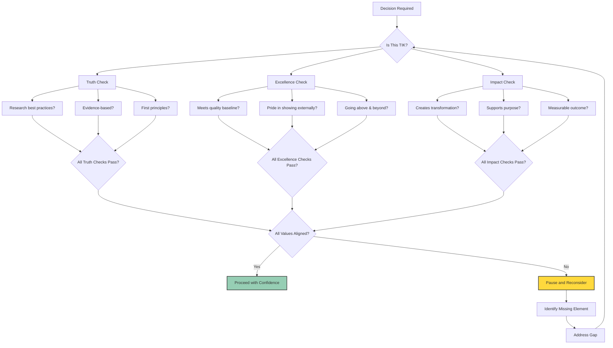
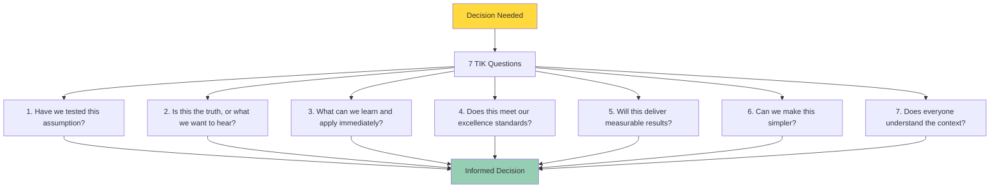
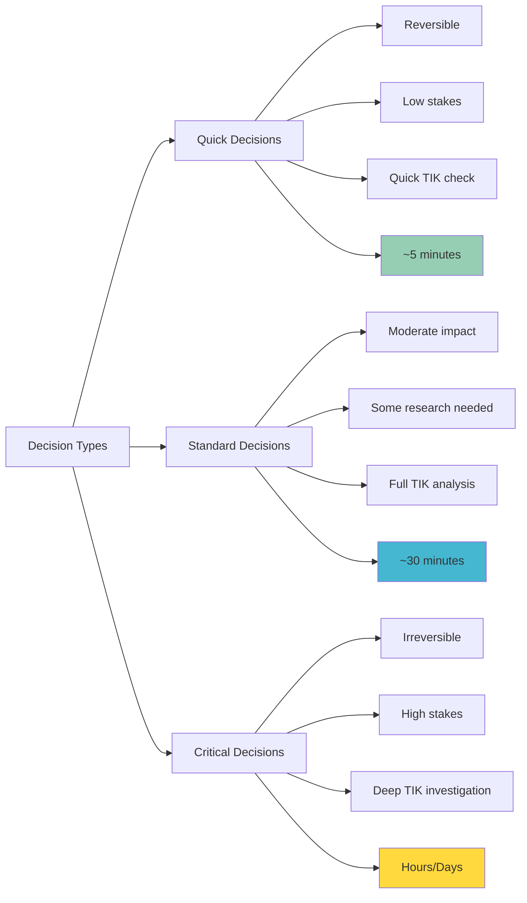

# TIK Decision Framework

**How We Make TIK-Aligned Decisions**

## The Master Question: "Is This TIK?"



---

## Detailed 7-Question Framework

For significant decisions, work through these 7 questions systematically:



### 1. Have we tested this assumption?
**Relentless Truth Application**
- What evidence supports this approach?
- What experiments could validate our thinking?
- Who has tried this before and what were the results?
- What could we test quickly to gain confidence?

**Quick Tools:** Small pilot programs, customer interviews, market research, A/B testing

### 2. Is this the truth, or what we want to hear?
**Honest Assessment**
- Are we ignoring inconvenient data?
- Who might disagree and why?
- What are we afraid to acknowledge?
- How can we get more objective perspective?

**Quick Tools:** Devil's advocate role, external expert consultation, anonymous feedback collection

### 3. What can we learn and apply immediately?
**Learning Orientation**
- How will this decision teach us something valuable?
- What insights can we gain from this choice?
- How can we apply learnings quickly?
- What feedback loops can we create?

**Quick Tools:** Success metrics definition, learning milestone planning, rapid iteration cycles

### 4. Does this meet our excellence standards?
**Quality Check**
- Are we proud to put our name on this?
- Does this exceed expectations?
- Will this reflect well on our brand?
- How can we make this even better?

**Quick Tools:** Quality checklist review, peer review process, client expectation assessment

### 5. Will this deliver measurable results?
**Impact Focus**
- What specific outcomes will this create?
- How will we measure success?
- What transformation will this enable?
- Why does this matter to our mission?

**Quick Tools:** Success metrics definition, ROI calculation, impact assessment

### 6. Can we make this simpler?
**Simplicity Check**
- What's the simplest version that would work?
- What complexity can we eliminate?
- How can we make this easier to understand?
- What would radical simplicity look like?

**Quick Tools:** Minimum viable approach, complexity audit, user experience review

### 7. Does everyone understand the context?
**Context Sharing**
- What background information is needed?
- Who needs to understand the 'why'?
- How can we ensure alignment?
- What communication is required?

**Quick Tools:** Context briefing sessions, written explanations, Q&A sessions

---

## Quick Decision Checklist

### ✅ Relentless Truth
- [ ] Have we researched how others solve this?
- [ ] Do we have data/evidence supporting this?
- [ ] Are we reasoning from first principles?
- [ ] Have we questioned our assumptions?
- [ ] Would we change course if evidence suggested it?

### ✅ Uncompromising Excellence
- [ ] Does this meet our quality baseline?
- [ ] Would we proudly show this to anyone?
- [ ] Are we going above and beyond?
- [ ] Have we considered edge cases?
- [ ] Is this sustainable long-term?

### ✅ Meaningful Impact
- [ ] What specific transformation will this create?
- [ ] How does this connect to individual purpose?
- [ ] Can we measure the outcome?
- [ ] Will clients/users genuinely benefit?
- [ ] Does this matter in 6 months?

## Decision Scenarios & Application

### Scenario 1: Feature Development

**Decision:** Should we build this new feature?

**TIK Analysis:**
```
Truth Check:
✓ Researched 3 competitor implementations
✓ User research shows 73% need this
✓ First principles: solves core problem

Excellence Check:
✓ Design exceeds industry standards
✓ Code architecture is scalable
✓ Includes comprehensive testing

Impact Check:
✓ Reduces user workflow by 40%
✓ Aligns with team's growth goals
✓ Success metrics defined

Decision: YES - This Is TIK!
```

### Scenario 2: Technical Debt

**Decision:** Should we refactor this legacy code?

**TIK Analysis:**
```
Truth Check:
✓ Performance data shows bottleneck
✓ Best practice is modular architecture
? Haven't researched alternatives fully

Excellence Check:
✓ Current code below our standards
✓ Refactor plan is comprehensive
✓ Will enable future features

Impact Check:
? No immediate client benefit
✓ Reduces maintenance time 50%
✓ Enables team to move faster

Decision: PAUSE - Research alternatives first
```

### Scenario 3: Hiring Decision

**Decision:** Should we hire this candidate?

**TIK Analysis:**
```
Truth Check:
✓ Reference checks validate claims
✓ Technical assessment passed
✓ Cultural assessment shows alignment

Excellence Check:
✓ Skills exceed role requirements
✓ Growth mindset demonstrated
✓ Raises team capability

Impact Check:
✓ Fills critical capability gap
✓ Aligned with company mission
✓ Excited about creating impact

Decision: YES - This Is TIK!
```

## Decision Speed vs. Quality



## When Klysera Values Conflict

Sometimes values seem to conflict. Here's how to resolve:

| Apparent Conflict | Resolution Through TIK |
|-------------------|------------------------|
| **Speed vs. Excellence** | Find the excellence level that enables speed without compromise |
| **Truth-seeking vs. Deadlines** | Time-box research, use best available data |
| **Individual impact vs. Team impact** | Optimize for collective transformation |
| **Short-term vs. Long-term** | Balance with clear trade-off documentation |

## Decision Documentation Template

```markdown
## Decision: [Title]
**Date:** [Date]
**Stakeholders:** [Who's involved]

### TIK Analysis

**Relentless Truth**
- Research conducted: [What we investigated]
- Evidence gathered: [Data/facts]
- First principles applied: [Core reasoning]

**Uncompromising Excellence**
- Quality standards met: [Which standards]
- Excellence demonstrated: [How we go above]
- Sustainability confirmed: [Long-term viability]

**Meaningful Impact**
- Transformation created: [Specific change]
- Purpose alignment: [How it connects]
- Success metrics: [How we measure]

### Decision: [YES/NO/PAUSE]
**Rationale:** [Why this aligns/doesn't align with TIK]
**Next Steps:** [Action items]
```

## Emergency Decision Protocol

When you must decide immediately:

1. **10-Second TIK Gut Check**
   - Does this feel like Truth? (honest/transparent)
   - Does this feel like Excellence? (proud/quality)
   - Does this feel like Impact? (meaningful/transformative)

2. **If Any Feel Wrong**
   - Can you buy time? Even 5 minutes helps
   - Can you make it reversible?
   - Can you limit scope initially?

3. **Post-Decision**
   - Document why you had to decide quickly
   - Schedule full TIK analysis ASAP
   - Share learnings with team

## Building TIK Decision Muscle

### Daily Practice
- Use TIK for one small decision daily
- Share your TIK reasoning in standups
- Ask "Is this TIK?" before committing

### Weekly Practice
- Document one TIK decision analysis
- Review decisions that weren't TIK
- Identify patterns in your decision-making

### Monthly Practice
- Share TIK decision wins with team
- Analyze one decision that failed TIK
- Refine your TIK intuition

---

*[← Back to Values Overview](../Klysera-Values-Overview.md) | [View Daily Rituals →](../Shared-Frameworks.md#daily-rituals-framework)*