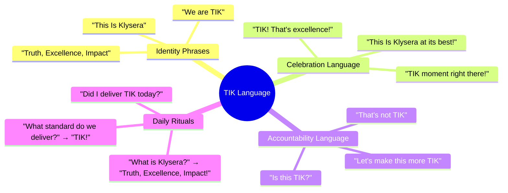
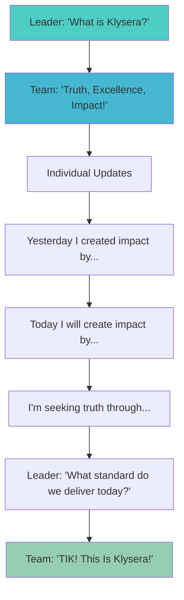

# TIK Language Guide

## The Power of TIK Language



## TIK Vocabulary Dictionary

### Core Terms

| Term | Definition | Usage Example |
|------|------------|---------------|
| **TIK** | This Is Klysera - our identity and standard | "That solution is TIK!" |
| **TIK Moment** | When someone exemplifies our values perfectly | "That was a TIK moment when you..." |
| **TIK Check** | Quick assessment against our values | "Let's do a TIK check on this decision" |
| **TIK Standard** | The non-negotiable level of quality we deliver | "Does this meet TIK standard?" |
| **TIK Salute** | Physical gesture showing unity and celebration | *Fist over heart while saying "TIK!"* |

### Value-Specific Language

#### Relentless Truth Language
- "What's the evidence?"
- "Let's experiment first"
- "I don't know, but I'll find out"
- "What would prove us wrong?"
- "How do the best companies do this?"
- "Let's look at the data"

#### Uncompromising Excellence Language
- "Good enough isn't good enough"
- "How can we go above and beyond?"
- "Would we be proud to ship this?"
- "Let's raise the bar"
- "Excellence is our baseline"
- "This deserves another iteration"

#### Meaningful Impact Language
- "What transformation does this create?"
- "How does this connect to your purpose?"
- "What's the measurable outcome?"
- "Who benefits from this?"
- "Will this matter in 6 months?"
- "Impact over activity"

## Daily TIK Conversations

### Morning Standup Script



### Celebration Scenarios

**When someone delivers exceptional work:**
- "TIK! That's what excellence looks like!"
- "That's a TIK moment - This Is Klysera!"
- "You just raised the TIK standard!"

**When a team achieves a milestone:**
- "TIK! We delivered truth, excellence, and impact!"
- "This Is Klysera - this is how we win!"
- "Team TIK salute - we earned this!"

**When someone demonstrates values:**
- "TIK! That took courage to seek truth!"
- "TIK! Going above and beyond!"
- "TIK! That's meaningful impact!"

### Accountability Conversations

#### Gentle Correction
**Scenario:** Work doesn't meet standards

**Not TIK:** "This isn't good enough."

**TIK Language:** "This doesn't quite meet our TIK standard yet. How can we bring more excellence to it?"

#### Challenging Ideas
**Scenario:** Disagreeing with approach

**Not TIK:** "That won't work."

**TIK Language:** "I see a potential gap in TIK alignment here. Can we explore if this approach delivers truth, excellence, and impact?"

#### Requesting Improvement
**Scenario:** Pattern of substandard work

**Not TIK:** "You keep making mistakes."

**TIK Language:** "I notice we're not consistently hitting TIK standard. What support do you need to deliver excellence?"

## TIK Phrases for Different Situations

### In Meetings

| Situation | TIK Phrase |
|-----------|------------|
| **Starting meeting** | "Let's make this meeting TIK - purposeful and impactful" |
| **Making decision** | "Which option is most TIK?" |
| **Disagreeing** | "I don't think that's aligned with TIK because..." |
| **Closing meeting** | "Did we deliver TIK value in this meeting?" |

### In Code Reviews

| Situation | TIK Phrase |
|-----------|------------|
| **Praising code** | "This code is TIK - clean, efficient, impactful" |
| **Suggesting improvement** | "How can we make this more TIK?" |
| **Questioning approach** | "Is this the TIK way to solve this?" |
| **Approving PR** | "TIK standard achieved! Ship it!" |

### With Clients

| Situation | TIK Phrase |
|-----------|------------|
| **Setting expectations** | "We deliver TIK standard - nothing less" |
| **Explaining approach** | "Our TIK values drive us to find the best solution" |
| **Handling feedback** | "That feedback helps us deliver more TIK value" |
| **Celebrating success** | "This outcome represents TIK in action" |

## Building TIK Language Habits

### Week 1: Foundation
- Use "TIK" at least 3 times daily
- Start meetings with "What is Klysera?"
- End day with "Did I deliver TIK?"

### Week 2: Integration
- Replace "good job" with "TIK!"
- Use "Is this TIK?" for decisions
- Introduce TIK salute in celebrations

### Week 3: Fluency
- TIK language becomes natural
- Team corrects non-TIK language
- TIK stories shared regularly

### Week 4: Culture
- TIK is how we communicate
- New members learn TIK language
- Clients recognize TIK standard

## TIK Language Don'ts

### Avoid These Phrases

| Don't Say | Say Instead |
|-----------|------------|
| "That's fine" | "Is that TIK?" |
| "Good enough" | "Let's make it TIK" |
| "We've always done it this way" | "What's the TIK approach?" |
| "I don't care" | "How does this serve TIK?" |
| "Just ship it" | "Does it meet TIK standard?" |

## TIK Language in Written Communication

### Email Signatures
```
Delivering TIK daily,
[Name]

This Is Klysera: Truth, Excellence, Impact
```

### Slack Status
- 🎯 Delivering TIK
- 💡 Seeking truth
- ⭐ Pursuing excellence
- 🚀 Creating impact

### Pull Request Templates
```markdown
## TIK Check
- [ ] Truth: Researched best approach
- [ ] Excellence: Meets quality standards
- [ ] Impact: Creates meaningful value

This PR delivers TIK because: [explanation]
```

### Documentation Headers
```markdown
# [Title]
*Built on TIK: Truth, Excellence, Impact*
```

## Evolving TIK Language

As Klysera grows, TIK language evolves. Document new phrases that emerge:

### TIK Language Log
```
Date: [Date]
New Phrase: [Phrase]
Context: [When it emerged]
Meaning: [What it conveys]
Adoption: [How widely used]
```

Share new TIK language monthly to keep culture fresh and authentic.

---

*[← Back to Values Overview](../../Culture/TIK-Identity.md) | [View TIK Standard Guide →](../04-TIK-Standard-Guide.md)*