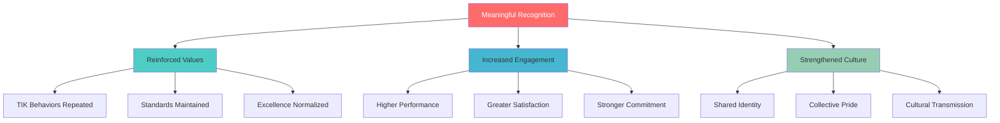

**[🏠 Home](../README.md)** | **[🧭 Navigation](../NAVIGATION.md)** | **[📚 Culture Hub](../Culture-Hub.md)** | **[🏆 Recognition & Rituals](./_Overview.md)** | **Recognition Framework**

---

# Recognition Framework

**How We Celebrate Excellence and Live TIK Values**

---

## Recognition Philosophy

### Why Recognition Matters



### Core Recognition Principles

**Immediate and Specific**
Recognition is most powerful when it happens close to the behavior and specifically describes what was excellent.

**Values-Aligned**
Every recognition moment should connect back to our TIK values and operating principles.

**Peer-to-Peer Powered**
The most meaningful recognition often comes from colleagues who witness excellence firsthand.

**Impact-Focused**
We celebrate not just effort, but the transformation and value created.

**Inclusive and Accessible**
Everyone should have opportunities to give and receive recognition regardless of role or level.

---

## The TIK Recognition Model

### Framework Components

**T - Truth in Recognition**
- Based on specific, observable behaviors
- Honest about the impact created
- Evidence of excellence demonstrated

**I - Immediate and Intentional**
- Given as close to the behavior as possible
- Thoughtfully crafted and meaningful
- Connected to our values and principles

**K - Klysera Standard**
- Reflects our excellence expectations
- Reinforces cultural norms
- Builds on our identity and mission

---

## Recognition Categories

### TIK Moments
**Quick recognition for daily demonstrations of our values**

**Format:**
- "TIK! That's Relentless Truth in action!"
- "TIK! Uncompromising Excellence delivered with care!"
- "TIK! Meaningful Impact that transforms!"

**When to Use:**
- Daily value demonstrations
- Immediate behavior recognition
- Team meeting celebrations
- Informal appreciation sharing

### Excellence Spotlights
**Deeper recognition for significant achievements**

**Components:**
- Detailed description of what was accomplished
- Specific connection to TIK values
- Impact on team, clients, or organization
- Learning and inspiration for others

**When to Use:**
- Weekly team celebrations
- Project completion recognition
- Goal achievement acknowledgment
- Peer nomination programs

### Transformation Stories
**Comprehensive recognition for major impact**

**Elements:**
- Full narrative of the challenge and solution
- Multiple value demonstrations
- Lasting change created
- Broader organizational impact

**When to Use:**
- Monthly all-hands presentations
- Quarterly culture celebrations
- Annual recognition events
- Client success story sharing

---

## Recognition Methods

### Peer-to-Peer Recognition

**TIK Cards**
Physical or digital cards for instant recognition

**Example TIK Card:**
```
🎯 TIK! Relentless Truth

[Name], your willingness to challenge our
assumptions about the client project led
to a much better solution. Your evidence-
based thinking saved us time and delivered
better results.

Thank you for living TIK!
- [Recognizer Name]
```

**Recognition Channels**
- Team communication platforms
- Public recognition boards
- Team meeting shout-outs
- Direct personal messages

### Manager Recognition

**Formal Recognition**
- Performance review acknowledgments
- Goal achievement celebrations
- Development milestone recognition
- Career advancement recommendations

**Informal Recognition**
- Daily appreciation and thanks
- Public recognition in meetings
- Recognition sharing with leadership
- Celebration of growth and learning

### Leadership Recognition

**Organizational Recognition**
- Company-wide announcements
- Leadership team acknowledgments
- Board and stakeholder sharing
- Industry award nominations

**Culture Recognition**
- Culture champion designations
- Values embodiment awards
- Cultural leadership honors
- Legacy and impact celebrations

---

## Recognition Implementation

### Daily Recognition Practices

**Morning Intention**
- Plan recognition opportunities for the day
- Identify team members to appreciate
- Look for TIK moments to celebrate
- Prepare to give specific feedback

**Throughout the Day**
- Notice and acknowledge excellence immediately
- Use TIK language in recognition
- Share appreciation publicly when appropriate
- Document recognition for future reference

**End of Day**
- Reflect on recognition given and received
- Plan follow-up recognition for tomorrow
- Share recognition stories with team
- Appreciate daily progress and growth

### Weekly Recognition Rituals

**TIK Spotlight Fridays**
Every Friday, teams gather to:
- Share the week's best TIK moments
- Recognize outstanding contributions
- Celebrate progress and learning
- Plan next week's excellence focus

**Weekly Team Recognition**
- Start meetings with appreciation
- End projects with recognition
- Share client feedback and praise
- Celebrate learning and growth

### Monthly Recognition Programs

**Culture Champions**
Monthly recognition of individuals who exemplified TIK values:
- Story of their impact and excellence
- Specific value demonstration examples
- Team and client benefit created
- Public celebration and appreciation

**Recognition Themes**
- Truth Seeker of the Month
- Excellence Champion Recognition
- Impact Creator Celebration
- Team Culture Builder Award

---

## Recognition Tools and Templates

### Recognition Message Templates

**TIK Moment Recognition**
```
🎯 TIK! [Value Name]

[Name], [specific behavior/action description]
demonstrated [value] by [impact created].

This is exactly what [value] looks like in
action, and it made a real difference by
[specific outcome].

Thank you for living TIK!
```

**Excellence Spotlight Template**
```
⭐ Excellence Spotlight

[Name] delivered exceptional [work/behavior]
that exemplified [value(s)] and created
[specific impact].

Here's what made it excellent:
• [Specific detail 1]
• [Specific detail 2]
• [Specific detail 3]

Impact created:
• [Outcome 1]
• [Outcome 2]

This is the standard of excellence we
celebrate at Klysera!
```

**Transformation Story Template**
```
🚀 Transformation Story

[Name/Team] created meaningful transformation
by [challenge addressed and solution delivered].

The TIK Journey:
• Truth: [Evidence-based approach taken]
• Excellence: [Quality and care demonstrated]
• Impact: [Transformation and value created]

Results achieved:
• [Specific outcome 1]
• [Specific outcome 2]
• [Long-term impact created]

This is what meaningful impact looks like!
```

---

## Special Recognition Programs

### Annual TIK Awards

**Truth Seeker Award**
Outstanding evidence-based thinking and decision-making

**Excellence Champion Award**
Consistent quality delivery and support of others' excellence

**Impact Creator Award**
Significant transformation and value creation

**Culture Carrier Award**
Exceptional values embodiment and cultural leadership

**Growth Catalyst Award**
Outstanding development and enablement of others

### Peer Nomination Programs

**Monthly Peer Recognition**
- Nominations from team members
- Specific examples and impact stories
- Public recognition and celebration
- Recognition sharing across organization

**Quarterly Team Awards**
- Team-based recognition programs
- Collaborative achievement celebration
- Cross-team recognition and appreciation
- Team culture and excellence awards

### Client Recognition Sharing

**Client Success Celebrations**
- Monthly sharing of client feedback
- Success story presentations
- Impact and transformation showcases
- Team contribution acknowledgments

**Client Champion Recognition**
- Outstanding client relationship building
- Exceptional client service delivery
- Client transformation enablement
- Long-term partnership development

---

## Recognition Measurement

### Recognition Metrics

**Frequency Indicators**
- Number of TIK moments shared daily
- Peer-to-peer recognition instances
- Manager recognition activities
- Leadership recognition programs

**Quality Indicators**
- Specificity and meaningfulness of recognition
- Connection to TIK values and principles
- Impact and transformation focus
- Cultural reinforcement effectiveness

**Impact Indicators**
- Team engagement and satisfaction improvements
- Culture health and values demonstration
- Performance and quality enhancements
- Retention and attraction benefits

### Recognition Assessment

**Monthly Recognition Review**
- Recognition frequency and quality analysis
- Team feedback on recognition effectiveness
- Recognition program participation rates
- Culture impact and reinforcement assessment

**Quarterly Recognition Enhancement**
- Recognition method effectiveness review
- New recognition approach experimentation
- Recognition training and development
- Recognition tool and resource improvement

---

## Recognition Development

### Training and Support

**Recognition Skills Development**
- How to give meaningful recognition
- Connecting recognition to values
- Creating specific and impactful messages
- Building recognition into daily practices

**Recognition Leadership**
- Modeling recognition behavior
- Creating recognition opportunities
- Building recognition culture
- Measuring recognition effectiveness

### Recognition Champions

**Recognition Ambassador Program**
- Volunteer team members who promote recognition
- Training on effective recognition practices
- Support for recognition program implementation
- Recognition culture development leadership

**Recognition Mentoring**
- Experienced recognizers mentoring others
- Best practice sharing and development
- Recognition skill building support
- Recognition culture enhancement

---

## Related Resources

- **[Daily Rituals →](./Daily-Rituals.md)** - Living culture through daily practices
- **[Special Programs →](./Special-Programs.md)** - Annual awards and celebrations
- **[TIK Identity →](../Culture/TIK-Identity.md)** - Understanding our values
- **[← Back to Culture Hub](../Culture-Hub.md)**

---

**Recognition is how we make our values tangible and our culture alive every single day.**

**Recognize often, recognize specifically, recognize with truth, excellence, and impact.**