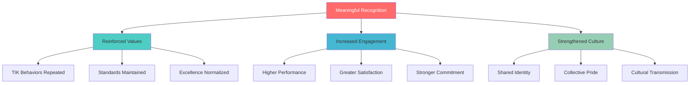

# Recognition & Rituals Overview

**Keeping TIK Culture Alive Through Celebration and Practice**

---

## Module Purpose

This Recognition & Rituals module provides the frameworks and practices that make TIK culture tangible and alive in our daily work. It's how we celebrate excellence, reinforce values, and create meaningful moments that strengthen our cultural foundation.

---

## Recognition & Rituals Resources

### 🎯 Recognition Framework
**[Recognition Framework →](./Recognition-Framework.md)**
- TIK recognition philosophy and principles
- Recognition categories and methods
- Peer-to-peer and leadership recognition
- Implementation guidelines and tools

### 📅 Daily Practices
**[Daily Rituals →](./Daily-Rituals.md)**
- Morning TIK intention setting
- Throughout-the-day practices
- End-of-day reflection rituals
- Weekly team celebrations

### 🏆 Special Events
**[Special Programs →](./Special-Programs.md)**
- Annual TIK Awards and recognition
- Quarterly celebration programs
- Monthly all-hands celebrations
- Team building and social events

---

## Quick Start Guides

### For Everyone
1. **Learn [Recognition Framework](./Recognition-Framework.md)** - Understand how we celebrate
2. **Practice [Daily Rituals](./Daily-Rituals.md)** - Live TIK culture every day
3. **Give recognition frequently** - Use TIK language to appreciate others
4. **Participate in celebrations** - Engage in team and company events

### For Managers
1. **Master [Recognition Framework](./Recognition-Framework.md)** - Lead by example in recognition
2. **Implement [Daily Rituals](./Daily-Rituals.md)** - Create team recognition practices
3. **Plan team celebrations** - Use frameworks for meaningful recognition
4. **Connect to performance** - Link recognition to development and goals

### For HR/People & Culture
1. **Orchestrate [Special Programs](./Special-Programs.md)** - Plan company-wide celebrations
2. **Train on [Recognition Framework](./Recognition-Framework.md)** - Help everyone recognize well
3. **Measure culture impact** - Track recognition effectiveness
4. **Evolve programs** - Continuously improve based on feedback

### For Culture Champions
1. **Model all practices** - Be an example of recognition excellence
2. **Help others learn** - Teach recognition and ritual practices
3. **Create new traditions** - Innovate within our framework
4. **Share stories** - Capture and share recognition moments

---

## Recognition Philosophy

### Why Recognition Matters

### Core Principles
- **Immediate and Specific** - Close to behavior, detailed description
- **Values-Aligned** - Connected to TIK values and principles
- **Peer-to-Peer Powered** - Colleagues recognizing colleagues
- **Impact-Focused** - Celebrating transformation created
- **Inclusive and Accessible** - Everyone can give and receive

---

## Daily Recognition Rhythm

### Morning (5 minutes)
- Set TIK intentions for the day
- Plan recognition opportunities
- Identify colleagues to appreciate

### Throughout Day
- Notice and acknowledge excellence immediately
- Use TIK language in recognition
- Share appreciation publicly when appropriate
- Document recognition for future sharing

### End of Day (5 minutes)
- Reflect on TIK moments witnessed
- Plan follow-up recognition for tomorrow
- Appreciate daily progress and growth

### Weekly (30 minutes)
- TIK Spotlight Friday celebrations
- Share week's best TIK moments
- Recognize outstanding contributions
- Plan next week's excellence focus

---

## Recognition Categories

### TIK Moments
**Quick recognition for daily value demonstrations**
- "TIK! That's Relentless Truth in action!"
- "TIK! Uncompromising Excellence delivered with care!"
- "TIK! Meaningful Impact that transforms!"

### Excellence Spotlights
**Deeper recognition for significant achievements**
- Detailed achievement description
- Specific connection to TIK values
- Impact on team, clients, or organization

### Transformation Stories
**Comprehensive recognition for major impact**
- Full narrative of challenge and solution
- Multiple value demonstrations
- Lasting change created

---

## Special Programs Calendar

### Monthly Events
- **All-Hands Culture Celebrations** - Company-wide recognition
- **Culture Champion Recognition** - Outstanding values embodiment
- **Client Success Spotlights** - Impact story sharing

### Quarterly Programs
- **TIK Awards Ceremonies** - Excellence in each value
- **Team Achievement Celebrations** - Collaborative success recognition
- **Innovation and Improvement Spotlights** - Creative solution sharing

### Annual Celebrations
- **Culture Summit** - Year's achievements and future planning
- **TIK Excellence Awards** - Highest recognition for value demonstration
- **Anniversary and Milestone Recognition** - Service and contribution appreciation

---

## Implementation Guidelines

### Getting Started (Week 1)
- Introduce recognition framework to team
- Begin daily TIK moment sharing
- Start using recognition language and tools
- Plan first weekly celebration

### Building Rhythm (Month 1)
- Establish weekly celebration routine
- Increase peer-to-peer recognition frequency
- Connect recognition to business results
- Gather feedback and adjust approach

### Full Integration (Quarter 1)
- Launch monthly all-hands celebrations
- Implement special recognition programs
- Create culture ritual traditions
- Measure and assess impact

---

## Success Metrics

### Recognition Frequency
- Number of TIK moments shared daily
- Peer-to-peer recognition instances
- Manager and leadership recognition activities
- Participation in celebration events

### Cultural Impact
- Team engagement and satisfaction scores
- Values demonstration frequency
- Cultural behavior observations
- Retention and attraction metrics

### Business Results
- Performance improvement correlation
- Client satisfaction increases
- Team collaboration effectiveness
- Innovation and improvement rates

---

## Common Challenges & Solutions

### Low Participation
**Challenge:** Team members not giving recognition regularly
**Solution:** Model behavior, make it easy, celebrate participation

### Generic Recognition
**Challenge:** Recognition lacks specificity and impact
**Solution:** Train on specific examples, provide templates, coach improvement

### Event Fatigue
**Challenge:** Too many celebrations lose meaning
**Solution:** Focus on quality over quantity, vary formats, gather feedback

### Remote Team Integration
**Challenge:** Difficulty creating connection in distributed teams
**Solution:** Digital tools, video celebrations, regular check-ins

---

## Continuous Improvement

### Monthly Assessment
- Recognition frequency and quality analysis
- Team feedback on effectiveness
- Program participation rates
- Culture impact measurement

### Quarterly Enhancement
- Recognition method effectiveness review
- New approach experimentation
- Training and development updates
- Tool and resource improvement

### Annual Evolution
- Comprehensive program evaluation
- Major enhancement planning
- Best practice research and adoption
- Cultural tradition establishment

---

## Related Resources

- **[TIK Identity →](../Culture/TIK-Identity.md)** - Understanding values for recognition
- **[Culture Stories →](../Culture/Culture-Stories.md)** - Examples to inspire recognition
- **[Leadership Overview →](../Leadership/_Overview.md)** - Leadership role in recognition
- **[← Back to Culture Hub](../Culture-Hub.md)**

---

**Recognition and rituals are how we make TIK culture tangible and alive every single day.**

**Recognize often, recognize specifically, recognize with truth, excellence, and impact.**

---

*Recognition & Rituals Overview v1.0 | October 2025*
*Complete Guide to Cultural Celebration and Practice*