**[🏠 Home](../README.md)** | **[🧭 Navigation](../NAVIGATION.md)** | **[📚 Culture Hub](../Culture-Hub.md)** | **🗺️ Roadmap**

---

# P&C Domain Roadmap Hub

**Operational Readiness for Incoming Employees**

---

## 🚨 URGENT: Your Primary Focus

### **[2-Month Operational Readiness Roadmap](./2-Month-Operational-Roadmap.md)**
**CRITICAL MISSION: Build minimum viable P&C infrastructure to serve incoming employees**

#### Success Target
*Be able to legally hire, onboard, pay, and support new employees within 2 months*

#### Current Critical Path

```mermaid
gantt
    title Your 2-Month Implementation Plan
    dateFormat X
    axisFormat Week %d

    section CRITICAL FOUNDATION
    Legal Compliance: 1, 2
    Employment Contracts: 1, 2
    Core HR Policies: 1, 2

    section OPERATIONAL SYSTEMS
    HRIS Setup: 3, 2
    Payroll System: 3, 2
    Communication Channels: 3, 2

    section EMPLOYEE EXPERIENCE
    Onboarding Process: 5, 2
    Support Framework: 5, 2
    Manager Training: 5, 2

    section LAUNCH READY
    End-to-End Testing: 7, 2
    Process Documentation: 7, 2
    Go-Live: 7, 2
```

---

## Your Week 1 IMMEDIATE Actions

### Monday (Day 1)
- [ ] **Review 2-month roadmap** with Founders for alignment
- [ ] **Identify legal support** resource for document review
- [ ] **Begin Nigerian Labour Act research** for compliance
- [ ] **Create project tracking** system

### Tuesday (Day 2)
- [ ] **Draft employment contract** outline
- [ ] **List all required HR policies** (leave, remote work, conduct)
- [ ] **Schedule legal consultation** appointment
- [ ] **Begin employee handbook** structure

### Wednesday (Day 3)
- [ ] **Continue policy drafting** (remote work priority)
- [ ] **Research HRIS options** (Zoho People, BambooHR)
- [ ] **Identify payroll providers** in Nigeria
- [ ] **Document compliance requirements**

### Thursday (Day 4)
- [ ] **Legal consultation session** on contracts and policies
- [ ] **Revise contracts** based on legal feedback
- [ ] **Continue handbook development**
- [ ] **Create onboarding checklist** draft

### Friday (Day 5)
- [ ] **Finalize Week 1 deliverables**
- [ ] **Plan Week 2 activities**
- [ ] **Update Founders** on progress
- [ ] **Identify blockers** for next week

---

## Critical Success Criteria (End of 2 Months)

### Legal Foundation ⚖️
- [ ] Employment contracts approved by legal
- [ ] Nigerian labor law compliance achieved
- [ ] Core HR policies documented
- [ ] Employee handbook completed
- [ ] Data protection policy in place

### Operational Systems 💻
- [ ] HRIS system operational
- [ ] Payroll processing established
- [ ] Employee database functional
- [ ] Communication channels setup
- [ ] Document storage system ready

### Employee Experience 🤝
- [ ] Onboarding process documented
- [ ] Day 1 checklist ready
- [ ] Employee support channels active
- [ ] Manager training completed
- [ ] Feedback mechanism established

### Reporting & Governance 📊
- [ ] Monthly reporting template ready
- [ ] Compliance tracking system
- [ ] Employee metrics dashboard
- [ ] Founder update process

## What You're NOT Focusing On (Can Wait)

### Beyond 2-Month Scope
- ❌ Advanced performance management systems
- ❌ Comprehensive L&D programs
- ❌ Complex analytics and insights
- ❌ Multiple system integrations
- ❌ Elaborate culture programs
- ❌ Industry benchmarking

*These are important but NOT critical for serving incoming employees*

---

---

**FOCUS: Build only what's needed to legally and effectively support incoming employees. Everything else can wait.**

---

*P&C Operational Roadmap Hub v1.0 | October 2025*
*Minimum Viable Infrastructure for Employee Support*