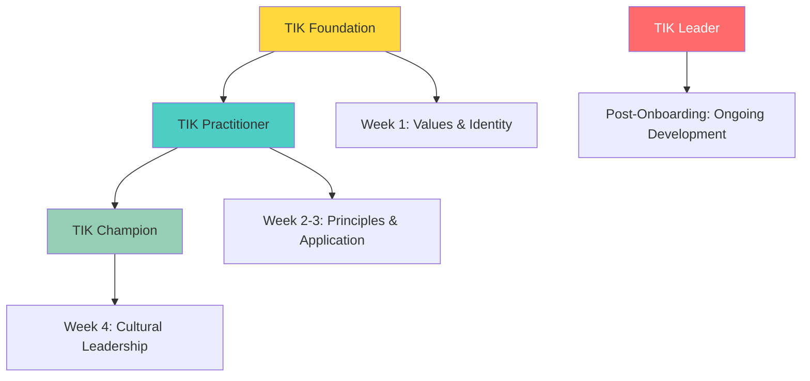

**[🏠 Home](../README.md)** | **[🧭 Navigation](../README.md)** | **[📚 Culture Hub](../Culture-Hub.md)** | **[🎯 Hiring & Onboarding](./Overview.md)** | **TIK Certification Program**

---

# TIK Certification Program

**Ensuring Deep Cultural Integration Through Validated Learning**

---

## Program Overview

The TIK Certification Program is a structured assessment system that validates new team members' understanding and internalization of our TIK values, operating principles, and cultural foundations. This remote-friendly certification ensures consistent cultural integration regardless of location.

### Certification Levels



---

## TIK Foundation Certification
**Timeline:** Week 1 | **Required for all new hires**

### Learning Objectives
- Understand and articulate the three TIK values
- Recognize TIK behaviors in action
- Demonstrate basic TIK decision-making
- Connect personal work to TIK impact

### Assessment Components

**1. Knowledge Verification (25%)**
- TIK values definition and examples
- Company culture and history
- Basic principle understanding
- Key terminology and language

**2. Scenario Analysis (35%)**
- Identify TIK responses to workplace situations
- Evaluate decisions through TIK lens
- Recognize anti-TIK behaviors
- Suggest TIK-aligned improvements

**3. Personal Reflection (25%)**
- Connect personal values to TIK
- Share TIK moments from first weeks
- Identify growth areas
- Commit to TIK development

**4. Practical Application (15%)**
- Demonstrate TIK in daily work
- Use TIK language appropriately
- Apply basic decision framework
- Show cultural curiosity

### Certification Requirements
- Score 85% or higher on all components
- Complete buddy-validated practical examples
- Pass manager observation assessment
- Submit reflection essay (500 words)

---

## TIK Practitioner Certification
**Timeline:** Weeks 2-3 | **Required for role progression**

### Learning Objectives
- Apply all 7 operating principles consistently
- Demonstrate TIK leadership behaviors
- Coach others in TIK application
- Drive TIK-aligned results

### Assessment Components

**1. Principle Mastery (30%)**
- Demonstrate understanding of all 7 principles
- Apply principles to complex scenarios
- Explain principle interconnections
- Show principle-driven decision making

**2. Cultural Leadership (25%)**
- Model TIK behaviors consistently
- Influence others toward TIK
- Handle cultural conflicts
- Strengthen team culture

**3. Results Through TIK (25%)**
- Achieve goals using TIK approach
- Demonstrate quality and impact
- Show continuous improvement
- Connect outcomes to values

**4. Coaching and Development (20%)**
- Help others understand TIK
- Provide TIK-based feedback
- Support team member growth
- Share TIK stories and examples

### Certification Requirements
- Score 85% or higher on all components
- Complete 360-degree feedback assessment
- Lead successful TIK project
- Pass comprehensive case study evaluation

---

## TIK Champion Certification
**Timeline:** Week 4 | **Required for onboarding completion**

### Learning Objectives
- Drive cultural transformation
- Develop TIK capability in others
- Solve complex challenges through TIK
- Represent TIK externally

### Assessment Components

**1. Cultural Innovation (30%)**
- Create new TIK applications
- Solve cultural challenges
- Improve team TIK practices
- Design cultural experiences

**2. Development Leadership (25%)**
- Mentor others in TIK
- Design learning experiences
- Measure cultural progress
- Build TIK capability

**3. External Representation (25%)**
- Represent TIK to clients
- Share TIK with stakeholders
- Demonstrate TIK in challenges
- Build TIK-based relationships

**4. Strategic Integration (20%)**
- Align strategy with TIK
- Drive TIK-based decisions
- Influence organizational direction
- Create sustainable culture

### Certification Requirements
- Score 90% or higher on all components
- Complete cultural project with measurable impact
- Pass leadership simulation assessment
- Receive client or stakeholder validation

---

## TIK Leader Certification
**Timeline:** Post-Onboarding (3-6 months) | **Required for senior leadership**

### Learning Objectives
- Shape organizational culture
- Enable TIK excellence in others
- Drive transformation through TIK
- Advance TIK evolution

### Assessment Components

**1. Cultural Architecture (35%)**
- Design cultural systems
- Shape organizational behavior
- Create lasting change
- Build cultural resilience

**2. Excellence Enablement (30%)**
- Develop high-performing teams
- Create conditions for success
- Scale TIK across organization
- Measure cultural impact

**3. Transformation Leadership (35%)**
- Lead major cultural initiatives
- Navigate complex change
- Align culture with strategy
- Drive sustainable results

### Certification Requirements
- Score 95% or higher on all components
- Lead successful organizational transformation
- Pass executive assessment panel
- Demonstrate sustained cultural impact

---

## Remote Assessment Methods

### Digital Assessment Platform
**Interactive Learning and Testing**
- Online modules with embedded assessments
- Video scenario analysis
- Virtual role-playing exercises
- Digital portfolio submission

### Virtual Observation
**Real-time Behavior Assessment**
- Video call behavior observation
- Screen sharing decision-making
- Virtual meeting participation
- Digital collaboration assessment

### Peer Validation
**360-Degree Remote Feedback**
- Anonymous peer surveys
- Buddy verification reports
- Team member testimonials
- Client feedback collection

### Portfolio Documentation
**Evidence-Based Validation**
- TIK decision journals
- Cultural moment documentation
- Impact story collection
- Growth reflection essays

---

## Assessment Rubrics

### TIK Values Demonstration Rubric

| Level | Relentless Truth | Uncompromising Excellence | Meaningful Impact |
|-------|------------------|---------------------------|-------------------|
| **Mastery (4)** | Consistently seeks truth, challenges assumptions, makes evidence-based decisions | Always exceeds standards, enables others' excellence, maintains quality under pressure | Creates lasting transformation, focuses on outcomes, drives organizational impact |
| **Proficient (3)** | Regularly pursues facts, questions approaches, considers multiple perspectives | Meets high standards consistently, supports quality, shows attention to important details | Contributes to meaningful change, connects work to purpose, measures real results |
| **Developing (2)** | Sometimes seeks truth, occasionally questions, shows some evidence-based thinking | Usually meets standards, generally supports quality, pays attention to most details | Sometimes creates impact, understands purpose, focuses on some outcomes |
| **Beginning (1)** | Rarely questions assumptions, limited evidence-based thinking, accepts surface information | Meets minimum standards, inconsistent quality focus, limited attention to detail | Limited impact awareness, unclear purpose connection, activity-focused |

### Operating Principles Application Rubric

| Principle | Mastery (4) | Proficient (3) | Developing (2) | Beginning (1) |
|-----------|-------------|----------------|----------------|--------------|
| **Experimental Mindset** | Designs and runs experiments, learns from failure, iterates rapidly | Tests approaches, learns from outcomes, adapts based on results | Sometimes tests ideas, learns from some failures, makes adjustments | Rarely experiments, limited learning from failure, slow to adapt |
| **Truth Over Comfort** | Consistently chooses difficult truths, speaks up when needed, fact-based decisions | Usually chooses truth, speaks up appropriately, mostly fact-based | Sometimes chooses truth, occasionally speaks up, some fact-based decisions | Rarely chooses difficult truth, avoids speaking up, emotion-based decisions |
| **Learn Fast, Apply Faster** | Rapid learning and application, teaches others, continuous improvement | Quick learning and application, shares knowledge, regular improvement | Moderate learning pace, sometimes shares, periodic improvement | Slow learning, limited sharing, minimal improvement |
| **Excellence with Warmth** | Exceptional quality with genuine care, enables others, creates positive environment | High quality with care, supports others, contributes positively | Good quality usually, generally supportive, mostly positive | Minimum quality, limited support, neutral environment |
| **Results Over Motion** | Focus on meaningful outcomes, efficient execution, measure impact | Focus on results, effective execution, track progress | Sometimes focus on results, adequate execution, limited measurement | Activity-focused, inefficient execution, no measurement |
| **Radical Simplicity** | Eliminates complexity, creates elegant solutions, enables clarity | Reduces complexity, clear solutions, promotes understanding | Sometimes simplifies, adequate clarity, generally understandable | Complex approaches, unclear solutions, limited understanding |
| **Context Not Control** | Provides clear context, enables autonomy, empowers decisions | Shares context, supports autonomy, guides decisions | Some context sharing, limited autonomy, directs decisions | Little context, controls decisions, micromanages |

---

## Certification Tracking

### Individual Progress Dashboard
```
TIK Certification Progress - [Name]

Foundation Level: ✅ CERTIFIED (Week 2)
├── Knowledge: 92% (Pass)
├── Scenarios: 88% (Pass)
├── Reflection: 95% (Pass)
└── Application: 87% (Pass)

Practitioner Level: 🔄 IN PROGRESS (Week 5)
├── Principles: 78% (Needs improvement)
├── Leadership: 85% (Pass)
├── Results: 90% (Pass)
└── Coaching: 82% (Pass)

Champion Level: ⏳ PENDING (Month 2)
Leader Level: ⏳ PENDING (Month 4+)
```

### Team Certification Overview
```
Team TIK Certification Status

Foundation: 8/8 (100% certified)
Practitioner: 6/8 (75% certified, 2 in progress)
Champion: 3/8 (37% certified, 3 in progress)
Leader: 1/8 (12% certified, 2 in progress)

Team Cultural Readiness: 82% (Strong)
```

### Organizational Metrics
- Certification completion rates by timeline
- Assessment score trends over time
- Cultural integration effectiveness
- Performance correlation with certification levels

---

## Remediation and Support

### Additional Learning Support
**For Assessment Challenges**
- Extended learning time with resources
- Additional coaching and mentoring
- Peer learning partnerships
- Specialized training modules

### Retake Policies
**Fair and Supportive Assessment**
- One retake allowed per certification level
- 2-week improvement period before retake
- Additional support resources provided
- Focus on learning, not punishment

### Cultural Coaching
**Personalized Development**
- Individual cultural coaching sessions
- Specific skill development plans
- Regular check-ins and feedback
- Success celebration and recognition

---

## Integration with Onboarding

### Week 1: Foundation Focus
- TIK Foundation learning and assessment
- Cultural immersion activities
- Buddy support for understanding
- Manager coaching on application

### Week 2-3: Practitioner Development
- Operating principles deep dive
- Real project application
- Team integration through TIK
- Regular assessment and feedback

### Week 4: Champion Achievement
- Leadership demonstration
- Cultural contribution project
- Comprehensive assessment
- Onboarding completion certification

### Post-Onboarding: Leader Development
- Strategic TIK application (ongoing)
- Organizational impact projects
- Senior leadership exposure
- Continuous development planning

---

## Technology Platform Requirements

### Learning Management System
- Course delivery and tracking
- Assessment administration
- Progress monitoring
- Certificate generation

### Assessment Tools
- Video-based scenario evaluation
- Peer feedback collection
- Portfolio submission system
- Real-time progress tracking

### Communication Integration
- Slack/Teams notifications
- Calendar scheduling
- Reminder systems
- Celebration announcements

---

## Success Metrics

### Individual Success
- Certification completion rates and timelines
- Assessment scores and improvement trends
- Cultural integration survey results
- Performance and engagement correlation

### Team Success
- Team certification coverage
- Cultural behavior observation scores
- Team performance and TIK alignment
- Client satisfaction and cultural feedback

### Organizational Success
- Overall certification completion rates
- Cultural strength metrics improvement
- Retention correlation with certification
- Cultural transformation indicators

---

## Related Resources

- **[Onboarding Journey →](./Onboarding-Journey.md)** - Complete 30-day journey
- **[Integration Tools →](./Integration-Tools.md)** - Assessment templates
- **[TIK Identity →](../Culture/TIK-Identity.md)** - Values foundation
- **[Operating Principles →](../../Operating-Principles/Overview.md)** - Principle framework
- **[← Back to Hiring & Onboarding Overview](./Overview.md)**

---

**The TIK Certification Program ensures every team member deeply understands and lives our culture, creating consistency and excellence regardless of location.**

**Certified cultural alignment drives sustained performance and meaningful impact.**

---

*TIK Certification Program v1.0 | October 2025*
*Remote-First Cultural Assessment and Validation*