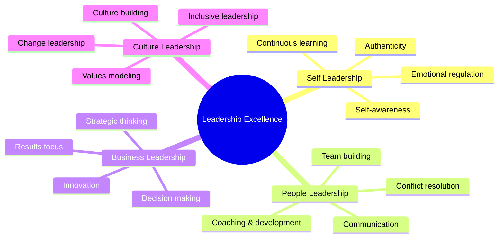

**[🏠 Home](../README.md)** | **[🧭 Navigation](../README.md)** | **[📚 Culture Hub](../Culture-Hub.md)** | **[👑 Leadership](./Overview.md)** | **Leadership Development**

---

# Leadership Development

**Growing Excellent Leaders at Klysera**

---

## Leadership Development Framework

### New Leader Onboarding

**Month 1: Foundation Setting**
- TIK values integration and modeling
- Leadership principles deep dive
- Team assessment and relationship building
- Initial goal setting and expectation alignment

**Month 2: Practice and Feedback**
- Regular coaching on leadership situations
- Peer shadowing and observation
- Feedback collection from team and stakeholders
- Adjustment and refinement of approach

**Month 3: Full Ownership**
- Independent leadership of major initiatives
- Regular feedback sessions with mentor
- Documentation of lessons learned
- Planning for continued growth

### Ongoing Development Programs

**Monthly Leadership Forums**
- Case study discussions
- Best practice sharing
- Challenge problem-solving
- Peer coaching and support

**Quarterly Leadership Reviews**
- 360-degree feedback collection
- Leadership effectiveness assessment
- Development planning and goal setting
- Cross-team leadership project planning

**Annual Leadership Planning**
- Strategic leadership development
- Succession planning discussions
- Leadership competency assessment
- Long-term growth pathway planning

---

## Leadership Competency Model

### Core Competencies

### Competency Levels

**Developing (Level 1)**
- Demonstrates basic understanding
- Shows willingness to learn and improve
- Seeks guidance and feedback actively
- Makes progress with support

**Proficient (Level 2)**
- Consistently demonstrates competency
- Works independently with minimal guidance
- Contributes effectively to team success
- Helps others develop in this area

**Expert (Level 3)**
- Exceptional demonstration of competency
- Innovates and improves practices
- Mentors and develops others
- Drives organizational excellence

**Master (Level 4)**
- Sets industry standards
- Creates new frameworks and approaches
- Develops other experts
- Shapes organizational and industry direction

---

## Development Pathways

### Individual Contributor to Team Leader

**Prerequisites:**
- Consistent demonstration of TIK values
- Excellence in current role performance
- Evidence of helping others succeed
- Desire to develop and lead others

**Development Plan:**
1. **Leadership fundamentals training**
2. **Mentoring with experienced leader**
3. **Project leadership opportunities**
4. **Team lead transition with support**

### Team Leader to Senior Leader

**Prerequisites:**
- Successful team leadership track record
- Strong culture building and modeling
- Business results and impact delivery
- Development of other leaders

**Development Plan:**
1. **Strategic thinking development**
2. **Cross-functional leadership experience**
3. **Change management and transformation**
4. **Senior leadership mentoring**

### Senior Leader to Executive

**Prerequisites:**
- Organizational impact and transformation
- Industry recognition and expertise
- Strong leadership pipeline development
- Cultural and business innovation

**Development Plan:**
1. **Executive education and coaching**
2. **Board and stakeholder engagement**
3. **Industry leadership and thought leadership**
4. **Succession planning and leadership development**

---

## Development Methods

### Experiential Learning

**Stretch Assignments**
- Leading cross-functional projects
- Managing significant client relationships
- Launching new initiatives or processes
- Representing company at industry events

**Job Rotation**
- Temporary assignments in different functions
- Cross-team collaboration leadership
- International or remote team leadership
- Special project and transformation leadership

### Formal Learning

**Internal Training Programs**
- Leadership fundamentals course
- Advanced leadership development program
- Executive leadership intensives
- Specialized skill development workshops

**External Development**
- Industry leadership programs
- Executive education at universities
- Professional coaching and mentoring
- Leadership conferences and events

### Social Learning

**Mentoring Programs**
- Senior leader mentoring relationships
- Peer mentoring circles
- Reverse mentoring opportunities
- External mentor connections

**Leadership Communities**
- Internal leadership forums
- Industry leadership groups
- Professional association participation
- Cross-company leadership networks

---

## Assessment and Feedback

### 360-Degree Feedback Process

**Feedback Sources:**
- Direct reports (team members)
- Peers (other leaders and colleagues)
- Manager (direct supervisor)
- Stakeholders (clients, partners)
- Self-assessment

**Feedback Areas:**
- TIK values demonstration
- Leadership principle application
- Team development and support
- Business results and impact
- Cultural contribution and modeling

**Feedback Cycle:**
- Quarterly mini-assessments
- Annual comprehensive review
- Development planning sessions
- Progress tracking and adjustment

### Leadership Metrics

**Team Performance Indicators**
- Team engagement and satisfaction scores
- Individual team member growth and development
- Business results and goal achievement
- Culture health and values demonstration

**Individual Leadership Indicators**
- Leadership competency assessments
- 360-degree feedback scores
- Development goal achievement
- Innovation and improvement contributions

---

## Career Planning

### Leadership Career Paths

**Functional Leadership Track**
- Team Lead → Manager → Director → VP
- Deep expertise in specific function
- Cross-functional collaboration leadership
- Strategic function development

**General Management Track**
- Team Lead → Manager → Regional Leader → General Manager
- Broad business and operational leadership
- Cross-functional team leadership
- P&L responsibility and business development

**Executive Leadership Track**
- Senior Leader → VP → SVP → C-Suite
- Organizational and industry leadership
- Transformation and change leadership
- Board and stakeholder engagement

### Development Planning Process

**Annual Development Planning**
1. **Current state assessment** - Competencies and performance
2. **Future state visioning** - Career aspirations and goals
3. **Gap analysis** - Development needs identification
4. **Development plan creation** - Specific actions and timelines
5. **Resource allocation** - Training, mentoring, and support
6. **Progress tracking** - Regular check-ins and adjustments

---

## Leadership Support Systems

### Mentoring and Coaching

**Internal Mentoring**
- Senior leader mentor assignments
- Cross-functional mentoring relationships
- Peer mentoring circles
- Leadership coaching programs

**External Support**
- Professional executive coaching
- Industry mentor connections
- Leadership development consultants
- Executive peer groups

### Learning Resources

**Leadership Library**
- Curated leadership books and articles
- Case studies and best practices
- Leadership assessment tools
- Development planning templates

**Digital Learning Platform**
- Online leadership courses
- Webinar and video libraries
- Leadership podcast recommendations
- Interactive learning modules

---

## Succession Planning

### Leadership Pipeline Development

**Identification Process**
- High-potential talent identification
- Leadership competency assessment
- Career aspiration discussions
- Development readiness evaluation

**Development Acceleration**
- Targeted development programs
- Stretch assignment opportunities
- Cross-functional exposure
- Senior leadership mentoring

**Succession Readiness**
- Role-specific preparation
- Business knowledge development
- Stakeholder relationship building
- Transition planning and support

### Knowledge Transfer

**Leadership Knowledge Capture**
- Documentation of best practices
- Process and procedure knowledge
- Relationship and context transfer
- Historical insight preservation

**Transition Support**
- Gradual responsibility transfer
- Mentoring during transition
- Stakeholder introduction and relationship building
- Performance monitoring and support

---

## Related Resources

- **[Leadership Overview →](./Overview.md)** - Core leadership principles
- **[Leadership Tools →](./Leadership-Tools.md)** - Practical resources
- **[Leadership Assessment →](./Leadership-Assessment.md)** - Performance evaluation
- **[← Back to Culture Hub](../Culture-Hub.md)**

---

**Great leaders are developed, not born. We invest in growing leaders who can multiply excellence and impact.**

**Your leadership development is an investment in Klysera's future success.**