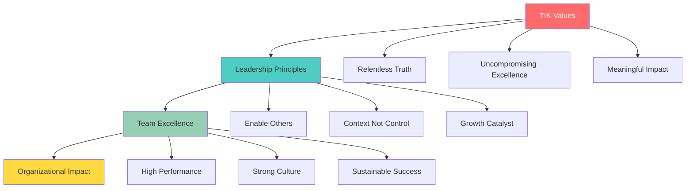

**[Home](//#/)** | **[Navigation](//#/)** | **[Culture Hub](/docs/Klysera/Culture-Hub.md)** | **👑 Leadership**

---

# Leadership Overview

**How Leaders Enable TIK Excellence**

---

## Leadership Philosophy

Leadership at Klysera isn't about hierarchy—it's about **enabling excellence** in others. Our leaders are Culture Carriers who embody TIK values and create conditions for everyone to do their best work. They lead through context, not control, and measure success by the growth and impact of their teams.

---

## Our 7 Leadership Principles

### 1. Lead with Truth and Transparency
**"Create clarity through honest, evidence-based communication"**

Share information openly, admit when you don't know something, and base decisions on evidence rather than assumptions.

### 2. Enable Excellence Through Support
**"Create conditions for others to exceed expectations"**

Remove barriers, provide resources, and set clear standards that help people achieve their best performance.

### 3. Develop People as a Primary Responsibility
**"Growing others is how leaders multiply impact"**

Make everyone's growth a priority through coaching, stretch opportunities, and clear advancement pathways.

### 4. Make Decisions with Context and Speed
**"Empower others through information and clear decision-making"**

Share the why behind decisions and push decision-making to the appropriate level with proper context.

### 5. Build Culture Through Modeling
**"Culture is what leaders do when no one is watching"**

Embody TIK values consistently and create rituals that reinforce our cultural foundation.

### 6. Focus on Results and Impact
**"Measure success by transformation created, not activity completed"**

Define clear outcomes, focus on impact over activity, and connect work to larger purpose.

### 7. Adapt and Learn Continuously
**"Model the experimental mindset and continuous improvement"**

Embrace change, learn from failures quickly, and evolve leadership approach based on feedback.

---

## Leadership Resources

### 📚 Development & Training
**[Leadership Development →](docs/Klysera/Leadership-Development.md)**
- New leader onboarding process
- Ongoing development programs
- Competency model and assessment
- Growth pathway planning

### 🛠️ Tools & Templates
**[Leadership Tools →](docs/Klysera/Leadership-Tools.md)**
- Daily leadership practices
- Decision-making frameworks
- Communication templates
- 1:1 meeting structures

### 📊 Assessment & Feedback
**[Leadership Assessment →](docs/Klysera/Leadership-Assessment.md)**
- Performance standards and metrics
- 360-degree feedback processes
- Self-assessment tools
- Continuous improvement planning

---

## Quick Start for New Leaders

1. **Study the [Leadership Development](docs/Klysera/Leadership-Development.md) guide**
2. **Practice with [Leadership Tools](docs/Klysera/Leadership-Tools.md)**
3. **Set up regular [Leadership Assessment](docs/Klysera/Leadership-Assessment.md) cycles**
4. **Connect with experienced leader mentors**

---

## Quick Start for Team Members

1. **Understand what excellent leadership looks like**
2. **Provide feedback to help leaders grow**
3. **Take ownership of your own development**
4. **Model leadership behaviors in your role**

---

## The Leadership Promise

### To Our Teams
**We commit to:**
- Creating conditions for your best work
- Supporting your growth and development
- Providing clear direction and context
- Recognizing and celebrating your contributions

### To Our Organization
**We commit to:**
- Building and maintaining strong culture
- Delivering exceptional business results
- Developing future leaders
- Representing Klysera values consistently

### To Our Clients
**We commit to:**
- Leading teams that exceed expectations
- Building relationships based on trust
- Delivering transformation and value
- Representing Klysera excellently

---

## Related Resources

- **[TIK Identity →](/Culture/TIK-Identity.md)** - Our values foundation
- **[Operating Principles →](/../Operating-Principles/Overview.md)** - How we work
- **[Playbook Overview →](/Playbook/Overview.md)** - Daily operations
- **[← Back to Culture Hub](docs/Klysera/Culture-Hub.md)**

---

**Leadership at Klysera means enabling others to achieve excellence they didn't know was possible. When we lead well, everyone wins.**

**This Is Klysera. This is how we lead. This is how we enable excellence.**