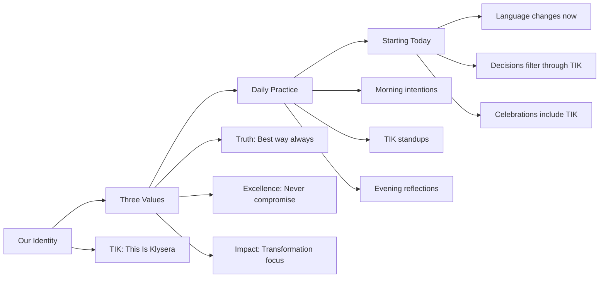

**[Home](//../#/)** | **[Navigation](//../#/)** | **[Culture Hub](/docs/Klysera//../Culture-Hub.md)** | **[🔧 Operating Principles](/Overview.md)** | **🚀 Implementation**

---

# TIK Quick Start Guide

## Week 1: Foundation Launch

```mermaid
gantt
    title TIK Implementation Timeline
    dateFormat X
    axisFormat %d

    section Week 1
    Leadership Alignment    :milestone, 0, 0
    Team Introduction      :1, 2
    Immediate Practice     :2, 4

    section Week 2-4
    Ritual Establishment   :5, 15
    Culture Integration    :10, 20
    Measurement Setup      :15, 25

    section Month 2+
    Deep Integration       :26, 50
    External Recognition   :35, 60
    Continuous Evolution   :40, 365
```



## Day 1: Launch Protocol

### Leadership Kickoff (2 hours)

**Prerequisites:**
- [ ] All domain leads present
- [ ] CEO commitment secured
- [ ] Team calendar cleared

**Session Agenda:**

#### Part 1: TIK Alignment (30 minutes)
1. **TIK Identity Declaration**
   - CEO: "This Is Klysera. We are Truth, Excellence, Impact."
   - Each leader repeats with conviction
   - Practice TIK salute together

2. **Values Integration Workshop**
   - How does TIK apply to your domain?
   - What decisions will change?
   - What excellence looks like in your area?

#### Part 2: Implementation Planning (30 minutes)
1. **Immediate Changes**
   - Daily standup format changes today
   - Decision framework starts immediately
   - TIK language introduced

2. **Support Structure**
   - Who champions TIK in each domain?
   - How do we address resistance?
   - What resources are needed?

#### Part 3: Practice Session (60 minutes)
1. **TIK Decision Simulation**
   - Use real current decisions
   - Practice TIK framework
   - Identify gaps and solutions

2. **Language Practice**
   - Role-play TIK conversations
   - Practice accountability phrases
   - Master celebration language

### All-Hands Launch (1 hour)

**Opening (10 minutes)**
```
CEO: "Today we're not just announcing values.
We're declaring our identity. This Is Klysera.
We are Truth, Excellence, Impact."

Team Response: "Truth, Excellence, Impact!"
```

**TIK Presentation (30 minutes)**



**Interactive Q&A (15 minutes)**
- Address concerns immediately
- Show how TIK helps (doesn't burden)
- Give specific examples

**Commitment Ceremony (5 minutes)**
```
Everyone says together:
"We are Klysera. We deliver Truth, Excellence, Impact.
This is our standard. This is who we are. TIK!"
```

## Week 1 Daily Implementation

### Day 1: Language Introduction
- [ ] TIK used in all meetings
- [ ] "Is this TIK?" asked for decisions
- [ ] First TIK celebrations happen

### Day 2: Standup Transformation
- [ ] New TIK standup format launched
- [ ] Impact language introduced
- [ ] Team practices responses

### Day 3: Decision Framework
- [ ] First formal TIK decision documented
- [ ] Team uses framework for real choice
- [ ] Success story shared

### Day 4: Excellence Focus
- [ ] Quality standards discussed
- [ ] "Above and beyond" examples identified
- [ ] TIK excellence celebrated

### Day 5: Impact Measurement
- [ ] Week 1 impact stories collected
- [ ] Individual purpose connections made
- [ ] TIK success metrics reviewed

## Quick Reference Cards

### For Managers
```
TIK Manager Quick Reference

Daily Must-Dos:
□ Start meetings with TIK energy
□ Use "Is this TIK?" for decisions
□ Celebrate TIK moments immediately
□ Model values in every interaction
□ End with "Did we deliver TIK?"

TIK Language Starters:
• "How does this create impact?"
• "What would TIK excellence look like?"
• "Let's make this more TIK"
• "That's a TIK moment!"

Red Flags:
• "Good enough" thinking
• Avoiding difficult conversations
• Activity without outcomes
• Compromise on standards
```

### For Individual Contributors
```
TIK Individual Quick Reference

Daily Ritual:
Morning: "Today I create impact by: ___"
Standup: Share impact, not tasks
Evening: "Did I deliver TIK today?"

Decision Filter:
□ Truth: Is this the best way?
□ Excellence: Am I proud of this?
□ Impact: Does this transform?

TIK Opportunities:
• Challenge ideas respectfully
• Go above baseline quality
• Connect work to purpose
• Share failures as learning
• Support team excellence
```

### For New Team Members
```
TIK New Member Quick Start

Week 1: Learn TIK
• Understand our three values
• Practice daily rituals
• Observe TIK in action

Week 2: Practice TIK
• Use TIK language naturally
• Apply decision framework
• Share first TIK moment

Week 3: Live TIK
• Coach others on TIK
• Lead with TIK standard
• Embody This Is Klysera
```

## Common Week 1 Challenges

### Challenge: "This feels forced"
**Response:**
- Start with small doses
- Focus on natural adoption
- Share why TIK matters personally
- Give permission to practice imperfectly

### Challenge: "We don't have time for this"
**Response:**
- TIK doesn't add work, it improves work
- Better decisions save time
- Excellence prevents rework
- Impact creates efficiency

### Challenge: "What if we disagree with a decision?"
**Response:**
- Use TIK framework to discuss
- Challenge ideas, not people
- Find truth together
- Document reasoning

### Challenge: "How do we measure TIK?"
**Response:**
- Start with participation metrics
- Track TIK language usage
- Measure decision quality
- Document impact stories

## Week 1 Success Metrics

### Participation
- [ ] 100% of team attends launch
- [ ] 90%+ use TIK language daily
- [ ] 80%+ complete daily rituals
- [ ] 100% of meetings include TIK

### Understanding
- [ ] Everyone can explain TIK values
- [ ] 5+ TIK decisions documented
- [ ] 10+ TIK moments celebrated
- [ ] 0 confusion about expectations

### Early Adoption
- [ ] TIK language feels natural
- [ ] Decision quality improves
- [ ] Team energy increases
- [ ] First client notices difference

## Beyond Week 1

### Week 2-4: Habit Formation
- TIK becomes automatic
- Excellence standards raise
- Impact stories accumulate
- Culture shifts noticeably

### Month 2+: Deep Integration
- TIK influences major decisions
- Client relationships reflect TIK
- Hiring includes TIK assessment
- Market recognizes TIK difference

## Emergency Support Resources

### If TIK Implementation Stalls
1. **Emergency leadership session** - realign and recommit
2. **One-on-one TIK coaching** - address individual concerns
3. **TIK workshop reset** - refresh understanding and practice
4. **Success story focus** - highlight early wins

### If Resistance Emerges
1. **Listen deeply** - understand concerns
2. **Address specifically** - solve real problems
3. **Show benefits** - demonstrate TIK value
4. **Support transition** - provide tools and coaching

---

*[← Back to Values Overview](/../Culture/TIK-Identity.md) | [View Leadership Guide →](/Leadership/Leadership-Responsibilities.md)*