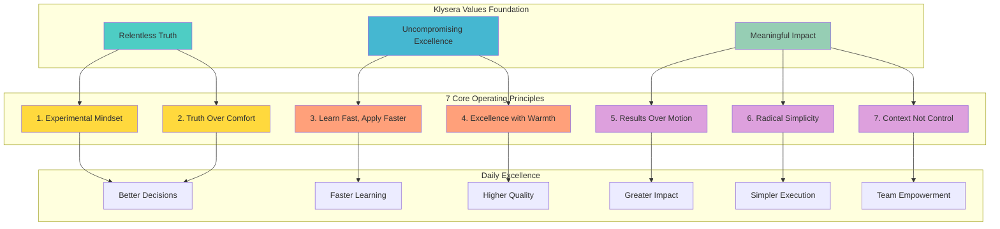

**[Home](//#/)** | **[Navigation](//#/)** | **[Culture Hub](/docs/Klysera//Culture-Hub.md)** | **🔧 Operating Principles**

---

# Klysera Operating Principles - Overview

**How We Translate Klysera Values into Daily Excellence**

---

## Our 7 Core Operating Principles

These principles bridge our Klysera values (Relentless Truth, Uncompromising Excellence, Meaningful Impact) to specific daily behaviors across all roles and functions.

### High-Level Framework



### 1. Experimental Mindset
**"Test everything. Measure results. Pivot on evidence."**

We approach work as experiments with clear hypotheses. Every initiative is a learning opportunity.

**[📖 View Implementation Guide →](./Principles/01-Experimental-Mindset.md)**

### 2. Truth Over Comfort
**"Seek what's right, not what's easy."**

We prioritize finding the objectively best way over what's convenient or politically safe.

**[📖 View Implementation Guide →](./Principles/02-Truth-Over-Comfort.md)**

### 3. Learn Fast, Apply Faster
**"Turn every experience into immediate improvement."**

Speed of learning is our competitive advantage. We apply insights immediately, not eventually.

**[📖 View Implementation Guide →](./Principles/03-Learn-Fast-Apply-Faster.md)**

### 4. Excellence with Warmth
**"Deliver exceptional quality with genuine care."**

High standards don't require harshness. Excellence comes from caring about the work and each other.

**[📖 View Implementation Guide →](./Principles/04-Excellence-with-Warmth.md)**

### 5. Results Over Motion
**"Measure impact, not activity."**

Being busy isn't being productive. We focus on outcomes that matter and have courage to stop what isn't working.

**[📖 View Implementation Guide →](./Principles/05-Results-Over-Motion.md)**

### 6. Radical Simplicity
**"Eliminate complexity that doesn't add value."**

The best solution is the simplest one that works. Clear communication. Clean execution. No bureaucracy.

**[📖 View Implementation Guide →](./Principles/06-Radical-Simplicity.md)**

### 7. Context Not Control
**"Empower through information and purpose."**

We share the why, not just the what. Trust smart people with context to find optimal solutions.

**[📖 View Implementation Guide →](./Principles/07-Context-Not-Control.md)**

---

## Quick Reference

### The Decision Framework
For any significant decision, ask these 7 questions:
1. Have we tested this assumption?
2. Is this the truth, or what we want to hear?
3. What can we learn and apply immediately?
4. Does this meet our excellence standards?
5. Will this deliver measurable results?
6. Can we make this simpler?
7. Does everyone understand the context?

### Daily Application
- **Morning:** Which principles guide today's work?
- **Decisions:** Run through the 7-question framework
- **Recognition:** "TIK! That's [Principle] in action!"
- **Evening:** How did we live the principles today?

---

## Implementation Resources

### 🚀 Getting Started
- **[Quick Start Guide →](./Implementation/Quick-Start-Guide.md)** - Week 1 launch
- **[Leadership Guide →](./Implementation/Leadership-Guide.md)** - Leader responsibilities and modeling
- **[Reference Cards →](./Tools/Quick-Reference-Cards.md)** - Daily decision aids

### 📊 Tools & Templates
- **[Decision Framework →](./Tools/Decision-Framework.md)** - "Is this TIK?" decision guide
- **[Daily Rituals Framework →](./Tools/Daily-Rituals-Framework.md)** - Morning intentions, standups, reflections
- **[TIK Language Guide →](./Tools/TIK-Language-Guide.md)** - How to speak TIK fluently

### 📈 Measurement & Success
- **[Culture Metrics →](./Measurement/Culture-Metrics.md)** - How to measure principle adoption
- **[Health Dashboard →](./Measurement/Health-Dashboard.md)** - Monthly pulse checks
- **[Progress Tracking →](./Measurement/Progress-Tracking.md)** - Implementation milestones

---

## Document Structure

```
Operating-Principles/
├── 📄 Overview.md (This file)
├── 📁 Principles/
│   ├── 📄 01-Experimental-Mindset.md
│   ├── 📄 02-Truth-Over-Comfort.md
│   ├── 📄 03-Learn-Fast-Apply-Faster.md
│   ├── 📄 04-Excellence-with-Warmth.md
│   ├── 📄 05-Results-Over-Motion.md
│   ├── 📄 06-Radical-Simplicity.md
│   └── 📄 07-Context-Not-Control.md
├── 📁 Implementation/
│   ├── 📄 Quick-Start-Guide.md
│   └── 📄 Leadership-Guide.md
├── 📁 Tools/
│   ├── 📄 Decision-Framework.md
│   ├── 📄 Daily-Rituals-Framework.md
│   ├── 📄 TIK-Language-Guide.md
│   └── 📄 Quick-Reference-Cards.md
└── 📁 Measurement/
    └── 📄 Culture-Metrics.md
```

---

*Klysera Operating Principles v1.0 | October 2025*
*Living Document - Updates based on organizational learning*