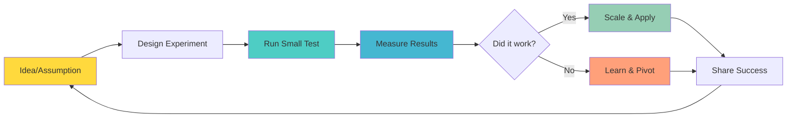

**[🏠 Home](../../README.md)** | **[🧭 Navigation](../../README.md)** | **[📚 Culture Hub](../../Culture-Hub.md)** | **[🔧 Operating Principles](../Overview.md)** | **[🧪 Principles](../Tools/Quick-Reference-Cards.md)** | **Experimental Mindset**

---

# Experimental Mindset

**"Test everything. Measure results. Pivot on evidence."**

**[← Back to Operating Principles Overview](../Overview.md)**

---

## Definition

**Experimental Mindset** means approaching all work as experiments with clear hypotheses, success criteria, and learning outcomes. We don't assume we know the answer - we test to find out. Every initiative is designed to teach us something, whether it succeeds or fails.

---

## What It Means

- **Hypothesis-Driven Work:** Frame every initiative as "We believe X will achieve Y because Z"
- **Test Before Scale:** Run small experiments before big implementations
- **Learning from Everything:** Success teaches us what works; failure teaches us what doesn't
- **Evidence Over Opinion:** Let data guide decisions, not assumptions or hierarchy
- **Rapid Iteration:** Quick tests lead to fast learning and better solutions

---

## In Practice

### Daily Implementation

**Project Planning:**
- Start with clear hypothesis: "We believe [action] will result in [outcome] because [reasoning]"
- Define success metrics upfront
- Plan minimum viable tests
- Set learning review dates

**Decision Making:**
- Ask "How can we test this assumption?"
- Look for ways to validate before committing resources
- Collect evidence from multiple sources
- Document reasoning for future reference

**Problem Solving:**
- Try multiple approaches on small scale
- Measure what works and what doesn't
- Iterate based on results
- Share learnings across teams

### Weekly Practices

**Experiment Reviews:**
- What did we test this week?
- What did we learn?
- What will we test next?
- How do we apply the learnings?

**Hypothesis Planning:**
- What assumptions are we making?
- Which ones can we test quickly?
- What would success/failure look like?
- How will we measure results?

---

## Examples in Action

### ✅ Living Experimental Mindset

**Product Development:**
- Before building a full feature, create a prototype and test with 5 users
- A/B test different approaches to see what works better
- Run technical spikes to validate architecture decisions

**Process Improvement:**
- Test new meeting format with one team before rolling out company-wide
- Try different communication tools for a week before committing
- Pilot new hiring process with a few candidates first

**Client Work:**
- Propose small proof-of-concept before full implementation
- Test different solutions with client feedback
- Run parallel approaches and compare results

**TIK Moments:**
- "TIK! Great experimental design - clear hypothesis and success criteria!"
- "TIK! You tested before scaling - that's experimental mindset!"

### ❌ Violating Experimental Mindset

- "We've always done it this way, so we'll keep doing it"
- Implementing big changes without testing first
- Making decisions based on opinion without validation
- Continuing initiatives that aren't delivering results
- Not measuring or learning from outcomes

---

## Tools & Frameworks

### Experiment Design Template

**Hypothesis:**
We believe [specific action] will result in [specific outcome] because [clear reasoning].

**Success Criteria:**
- Primary metric: [What indicates success?]
- Secondary metrics: [What else should we track?]
- Timeline: [How long will we test?]
- Sample size: [How many people/cases?]

**Learning Plan:**
- How will we measure results?
- When will we review outcomes?
- What would make us pivot?
- How will we share learnings?

### Quick Test Framework

**Before any major initiative:**
1. **What's the smallest version we can test?**
2. **What's the fastest way to get feedback?**
3. **What would prove us right or wrong?**
4. **How do we learn without major risk?**

### Results Review Framework

**After every experiment:**
1. **What was our hypothesis?**
2. **What actually happened?**
3. **What surprised us?**
4. **What do we do next?**
5. **Who else should know this?**

---

## Common Challenges

### "We don't have time to test"
- **Response:** Testing saves time by preventing bigger failures
- **Solution:** Design micro-tests that take hours, not weeks
- **Mindset:** "We don't have time NOT to test"

### "Our work isn't measurable"
- **Response:** Everything has some measurable outcome
- **Solution:** Define qualitative success criteria
- **Examples:** Stakeholder feedback, engagement levels, completion rates

### "Experiments feel like extra work"
- **Response:** Experiments ARE the work - just done smarter
- **Solution:** Build testing into normal workflow
- **Benefits:** More confidence, fewer surprises, better results

---

## Measuring Success

### Individual Level
- Number of hypotheses formed per quarter
- Percentage of work framed as experiments
- Learning documentation and sharing
- Pivots made based on evidence

### Team Level
- Experiment-to-implementation ratio
- Speed from hypothesis to results
- Cross-team knowledge sharing
- Failure celebration frequency

### Organizational Level
- Reduced risk of major failures
- Faster time to successful solutions
- Increased innovation rate
- Evidence-based decision culture

---

## Daily Reflection Questions

- **Morning:** What will I test today?
- **During work:** Is this an assumption I can validate?
- **End of day:** What did I learn that I can apply tomorrow?
- **Weekly:** How did experiments improve our outcomes this week?

---

## Next Steps

1. **Start Small:** Choose one current project to reframe as an experiment
2. **Practice:** Use the experiment design template for your next initiative
3. **Share:** Tell others about your experimental approach and results
4. **Reflect:** Notice when you're assuming vs. testing

**Remember:** Every expert was once a beginner who kept experimenting.

---

*This Is Klysera. We test to learn. We learn to excel.*