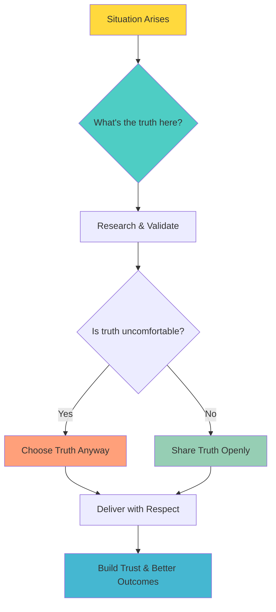
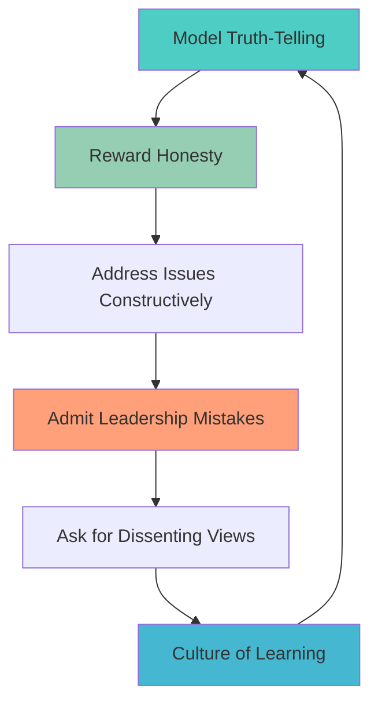

**[Home](//../#/)** | **[Navigation](//../#/)** | **[Culture Hub](/docs/Klysera//../Culture-Hub.md)** | **[🔧 Operating Principles](/Overview.md)** | **[🧪 Principles](/Tools/Quick-Reference-Cards.md)** | **Truth Over Comfort**

---

# Truth Over Comfort

**"Seek what's right, not what's easy."**

**[← Back to Operating Principles Overview](/Overview.md)**

---

## Definition

**Truth Over Comfort** means prioritizing finding the objectively best way over what's convenient or politically safe. We believe reality matters more than perception, and honest communication builds stronger teams and better outcomes. We say what needs saying, even when it's uncomfortable.

---

## What It Means

- **Evidence Over Opinion:** We base decisions on facts, data, and research, not assumptions
- **Intellectual Honesty:** We acknowledge what we don't know and actively seek to close gaps
- **Difficult Conversations:** We address problems directly rather than avoiding them
- **Transparent Communication:** We share information openly, even when it challenges status quo
- **Constructive Directness:** We speak truth with respect, kindness, and purpose

---

## In Practice

### Daily Implementation

**Decision Making:**
- Ask "What does the evidence actually show?"
- Research multiple perspectives before concluding
- Challenge popular opinions with data
- Admit when we lack sufficient information
- Say "I don't know, but I'll find out"

**Communication:**
- Share bad news quickly and directly
- Give honest feedback with specific examples
- Challenge ideas respectfully in meetings
- Acknowledge mistakes openly and quickly
- Ask "How do we know this is true?"

**Problem Solving:**
- Address root causes, not just symptoms
- Question assumptions that everyone takes for granted
- Seek external perspectives and best practices
- Document reasoning for future reference
- Welcome dissenting views and devil's advocates

### Weekly Practices

**Truth-Seeking Reviews:**
- What assumptions did we validate or invalidate?
- Where did comfort bias influence our decisions?
- What difficult truths emerged that we need to act on?
- How well did we balance directness with respect?

**Evidence Gathering:**
- What external research informed our choices?
- Which opinions need data validation?
- Where are we making decisions with incomplete information?
- How can we improve our truth-seeking processes?

---

## Examples in Action

### ✅ Living Truth Over Comfort

**Project Management:**
- "The timeline is unrealistic based on our past performance data. Here's what's achievable..."
- Sharing project delays immediately rather than hoping to catch up
- Admitting when initial estimates were wrong and adjusting

**Team Feedback:**
- "I notice this pattern in your work that's affecting outcomes. Can we discuss?"
- Addressing performance issues promptly and constructively
- Celebrating someone's growth while acknowledging areas for improvement

**Business Decisions:**
- Presenting data that challenges leadership's preferred direction
- Recommending stopping a project that isn't delivering value
- Sharing customer feedback that's difficult to hear but necessary

**Client Work:**
- "This approach has risks we should discuss before proceeding"
- Proposing alternatives when client's initial request isn't optimal
- Sharing honest assessments about project feasibility

**TIK Moments:**
- "TIK! Thank you for that honest assessment - it changes our approach!"
- "TIK! You chose truth over comfort and it led to a better solution!"

### ❌ Violating Truth Over Comfort

- Avoiding difficult conversations and hoping problems resolve themselves
- Telling people what they want to hear instead of what they need to hear
- Making decisions based on politics rather than evidence
- Withholding important information because it might be unpopular
- Continuing with plans when data shows they're not working

---

## Tools & Frameworks

### Truth-Seeking Questions

**Before any decision:**
1. **What evidence supports this?**
2. **What evidence contradicts this?**
3. **What don't we know that we should?**
4. **Who might disagree and why?**
5. **What would prove us wrong?**

### Difficult Conversation Framework

**Step 1: Prepare**
- Gather specific examples and data
- Understand the impact of the issue
- Plan your key messages

**Step 2: Set Context**
- "I care about [outcome/relationship], which is why I need to share..."
- Create psychological safety
- Clarify your positive intent

**Step 3: Share Truth**
- Be specific and factual
- Avoid judgment or blame language
- Focus on observable behaviors and outcomes

**Step 4: Listen & Collaborate**
- Understand their perspective
- Work together on solutions
- Follow up to ensure progress

### Research & Validation Process

**For any significant assumption:**
1. **External Research:** How do others handle this challenge?
2. **Data Analysis:** What do our metrics actually show?
3. **Stakeholder Input:** What perspectives are we missing?
4. **Historical Context:** What has worked/failed before?
5. **Expert Consultation:** Who knows more about this than we do?

---

## Common Challenges

### "This will hurt feelings"
- **Response:** Respect people enough to tell them the truth
- **Solution:** Focus on impact and growth, not personal judgment
- **Remember:** Avoiding truth often causes more pain later

### "It's too risky to speak up"
- **Response:** The risk of not speaking truth is usually higher
- **Solution:** Create psychological safety through consistent truth-telling
- **Start:** Begin with low-stakes truth-telling to build trust

### "We don't have perfect information"
- **Response:** Share what we know and what we don't know
- **Solution:** "Based on current evidence..." and "Here's what we need to find out..."
- **Action:** Commit to gathering missing information

### "This might upset leadership"
- **Response:** Leaders need truth to make good decisions
- **Solution:** Present truth with recommendations and alternatives
- **Frame:** "Here's what I see and what I recommend..."

---

## Measuring Success

### Individual Level
- Frequency of acknowledging unknowns
- Speed of sharing difficult news
- Quality of evidence in decision-making
- Feedback on directness and helpfulness

### Team Level
- Time from problem identification to discussion
- Quality of team decision-making
- Psychological safety indicators
- External validation of team conclusions

### Organizational Level
- Reduced surprise failures
- Improved decision quality
- Faster problem resolution
- Increased trust and transparency

---

## Creating Psychological Safety

### For Truth-Telling Culture

**Leadership Actions:**
- Share your own mistakes and learnings openly
- Thank people publicly for bringing difficult news
- Ask "What am I missing?" and "Who disagrees?"
- Change course when evidence warrants it
- Never punish messenger for sharing truth

**Team Practices:**
- Regular "What's not working?" discussions
- Celebrate learning from failures
- Practice giving direct, kind feedback
- Create forums for anonymous truth-sharing
- Document and act on insights gathered

---

## Daily Reflection Questions

- **Morning:** What assumptions am I making today that I should validate?
- **During work:** Am I being honest about what I see here?
- **Difficult moments:** What truth needs sharing, and how can I share it kindly?
- **End of day:** Did I choose truth over comfort when it mattered?
- **Weekly:** How did truth-telling improve our outcomes this week?

---

## Next Steps

1. **Start Small:** Practice truth-telling in low-stakes situations
2. **Build Skills:** Use the difficult conversation framework
3. **Create Safety:** Model vulnerability and learning from mistakes
4. **Measure Impact:** Notice how truth-telling improves outcomes

**Remember:** Truth-telling is a muscle that gets stronger with practice.

---

*This Is Klysera. We choose truth. We build trust.*