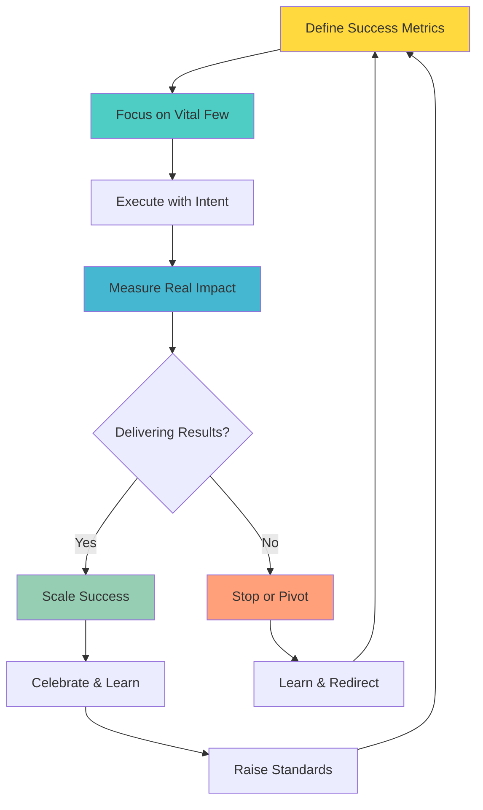
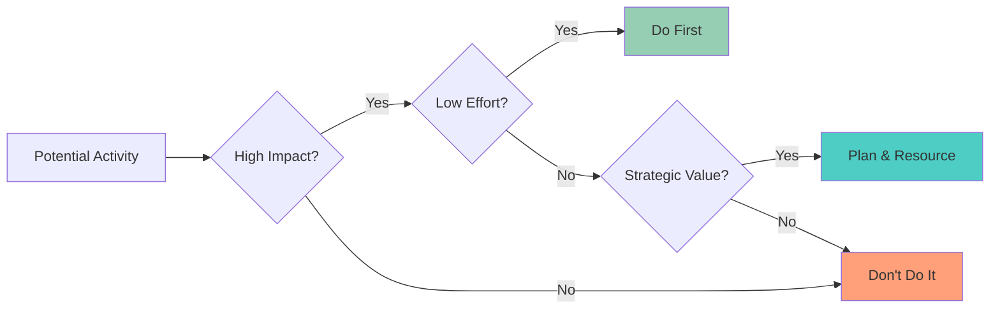
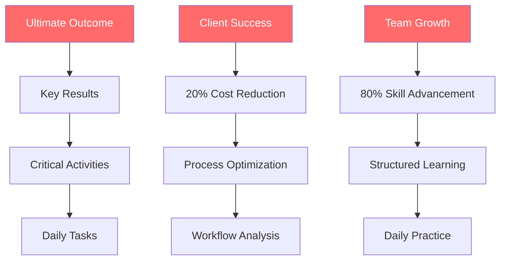
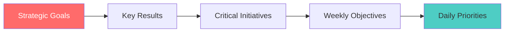
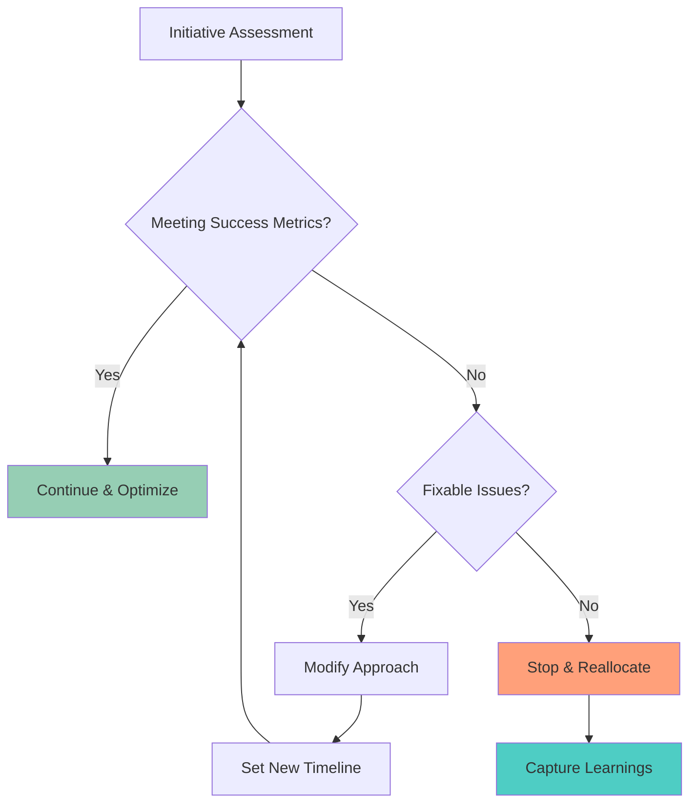

---

# Results Over Motion

**"Measure impact, not activity."**

**[← Back to Operating Principles Overview](/Overview.md)**

---

## Definition

**Results Over Motion** means focusing on outcomes that matter rather than being busy. Activity without impact is waste. We measure success by the transformation we create, not the tasks we complete. We have the courage to stop what isn't working and double down on what delivers value.

---

## What It Means

- **Outcome Orientation:** Success measured by transformation achieved, not tasks completed
- **Vital Few Focus:** Concentrate on the 20% of work that delivers 80% of value
- **Impact Clarity:** Clear metrics that matter to stakeholders and business goals
- **Courage to Stop:** End initiatives that aren't delivering despite effort invested
- **Value Creation:** Every action should contribute to meaningful outcomes

---

## In Practice

### Daily Implementation

**Before Starting Work:**
- What specific outcome am I trying to achieve?
- How will I measure success?
- What's the most direct path to that outcome?
- What would happen if I didn't do this task?

**During Execution:**
- Is this activity moving me toward the defined outcome?
- What's the simplest way to achieve the desired result?
- Am I being efficient or just being busy?
- Should I continue, modify, or stop this approach?

**End of Day/Week:**
- What impact did I actually create today?
- Which activities delivered the most value?
- What should I stop doing?
- How can I spend more time on high-impact work?

### Impact Focus Framework

**High Impact + Low Effort = Do First**
**High Impact + High Effort = Plan & Resource Properly**
**Low Impact = Don't Do (regardless of effort)**

---

## Examples in Action

### ✅ Living Results Over Motion

**Project Management:**
- Killing a feature that took weeks to build because user testing shows no value
- Focusing team sprint on the 3 most impactful items instead of trying to do everything
- Measuring project success by client outcomes, not deliverables completed

**Daily Work:**
- Spending 2 hours on analysis that saves 20 hours of unnecessary work
- Choosing to automate a 15-minute weekly task that affects whole team
- Saying no to meetings that don't drive toward defined outcomes

**Client Service:**
- Proactively solving client's underlying problem instead of just their stated request
- Measuring success by client business improvement, not hours billed
- Recommending stopping a project that won't deliver promised value

**Team Development:**
- Focusing performance review on impact created, not activities completed
- Investing in skills that directly improve team's value delivery
- Eliminating processes that don't improve outcomes

**TIK Moments:**
- "TIK! You focused on what actually moves the needle!"
- "TIK! Results that matter, not just motion!"

### ❌ Violating Results Over Motion

- Continuing projects that aren't delivering value because "we've already invested so much"
- Measuring team productivity by hours worked instead of outcomes achieved
- Creating reports that no one reads or acts upon
- Attending meetings without clear purpose or outcomes
- Completing tasks because they're on the list, not because they create value

---

## Tools & Frameworks

### The Value Stack Framework

**Work backwards from outcomes:**
1. What's the ultimate result we want?
2. What key indicators show we're achieving it?
3. What critical activities drive those indicators?
4. What daily tasks support those activities?

### Weekly Impact Review

**Every Friday, assess:**
- **Impact Created:** What real outcomes did we deliver?
- **Value Activities:** Which tasks drove the most results?
- **Motion Activities:** What felt busy but didn't create value?
- **Stop Doing:** What should we eliminate next week?
- **Double Down:** What should we do more of?

### The "So What?" Test

**For any work, ask:**
- So what happens if we do this successfully?
- So what's the impact on our key stakeholders?
- So what would happen if we didn't do this at all?
- So what makes this the most important thing right now?

If you can't answer these clearly, reconsider the work.

---

## Common Challenges

### "Everything seems important"
- **Response:** If everything is important, nothing is important
- **Solution:** Force-rank priorities and choose the top 3
- **Practice:** Ask "If I could only do one thing this week, what would create the most value?"

### "I don't control the outcomes"
- **Response:** Focus on the outcomes you can influence
- **Solution:** Define success metrics within your sphere of control
- **Example:** Instead of "client happiness," focus on "response time" and "solution quality"

### "Our work is hard to measure"
- **Response:** Every work has observable outcomes
- **Solution:** Define qualitative indicators if quantitative ones aren't available
- **Examples:** Stakeholder feedback, engagement levels, problem resolution rates

### "Stopping feels like failure"
- **Response:** Stopping unsuccessful work IS success - it frees resources for better results
- **Solution:** Celebrate intelligent pivots and resource reallocation
- **Mindset:** Sunk cost is sunk; focus on future value creation

---

## Measuring Success

### Individual Level Results Focus
- Percentage of time spent on high-impact activities
- Ratio of outcomes achieved to tasks completed
- Ability to articulate impact of daily work
- Frequency of stopping low-value activities

### Team Level Results Focus
- Team's contribution to key business metrics
- Speed from idea to measurable impact
- Resource allocation to highest-value work
- Success rate of initiatives launched

### Organizational Level Results Focus
- Business outcomes per effort invested
- Speed of pivoting from unsuccessful initiatives
- Resource efficiency and value creation
- Strategic goal achievement rate

---

## Building Results Culture

### Outcome-Driven Planning

**Start with outcomes, work backward to activities**

### Meeting Transformation

**Before Every Meeting:**
- What specific outcome do we need to achieve?
- What decisions will we make?
- How will we know we succeeded?

**During Meetings:**
- Are we moving toward our defined outcome?
- Should we continue this discussion or schedule follow-up?
- What actions will directly impact our goals?

**After Meetings:**
- What outcomes did we achieve?
- What actions will create the most value?
- Should future meetings on this topic happen differently?

---

## Intelligent Stopping Framework

### When to Stop or Pivot

**Stop When:**
- Success metrics consistently missed despite multiple attempts
- Effort required outweighs potential value
- Better opportunities emerge that would use same resources
- External conditions have changed significantly

**Pivot When:**
- Core concept is sound but execution needs adjustment
- Partial success suggests different approach might work
- New information suggests modified direction
- Resource constraints require scaled approach

---

## Daily Habits for Results Focus

### Morning Results Planning
- **Review:** What outcomes am I working toward?
- **Prioritize:** What 1-3 things will create the most value today?
- **Eliminate:** What can I not do today to focus on what matters?

### Hourly Impact Check
- **Assess:** Is what I'm doing right now contributing to my key outcomes?
- **Adjust:** Should I continue, modify, or switch to higher-impact work?

### Evening Results Review
- **Measure:** What impact did I create today?
- **Learn:** What worked well for driving results?
- **Plan:** How can I be more results-focused tomorrow?

---

## Results-Driven Communication

### Status Updates
❌ **Motion-focused:** "Completed 15 tasks, attended 6 meetings, sent 30 emails"
✅ **Results-focused:** "Resolved client issue reducing their processing time by 40%"

### Project Reports
❌ **Motion-focused:** "80% of planned activities completed on schedule"
✅ **Results-focused:** "Achieved 85% of success metrics, exceeding user satisfaction target"

### Performance Reviews
❌ **Motion-focused:** "Consistently busy, works long hours, completes assignments"
✅ **Results-focused:** "Delivered 3 major outcomes that improved client retention by 15%"

---

## Daily Reflection Questions

- **Morning:** What specific results will I create today?
- **Midday:** Is my current activity the highest-impact thing I could be doing?
- **End of day:** What real outcomes did I achieve?
- **Weekly:** Which activities consistently drive the most value?
- **Monthly:** What should I stop doing to focus on better results?

---

## Next Steps

1. **Define Your Key Results:** What 3-5 outcomes matter most in your role?
2. **Audit Current Activities:** What percentage of time goes to high-impact work?
3. **Eliminate Low Value:** Choose one thing to stop doing this week
4. **Measure Regularly:** Track outcomes, not just outputs

**Remember:** Busy doesn't equal productive. Impact equals success.

---

*This Is Klysera. We create results. We focus on what matters. We have courage to stop what doesn't.*