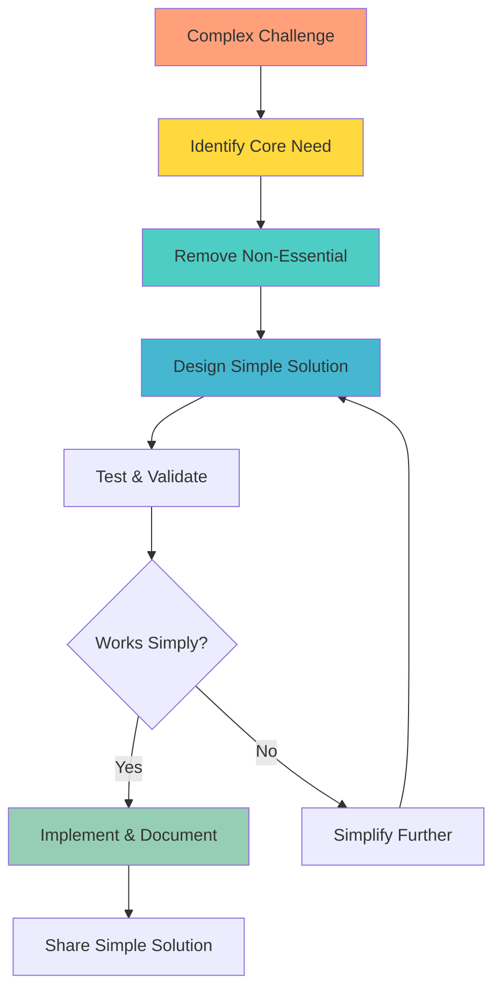
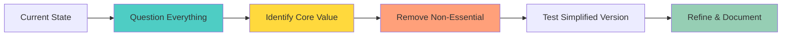
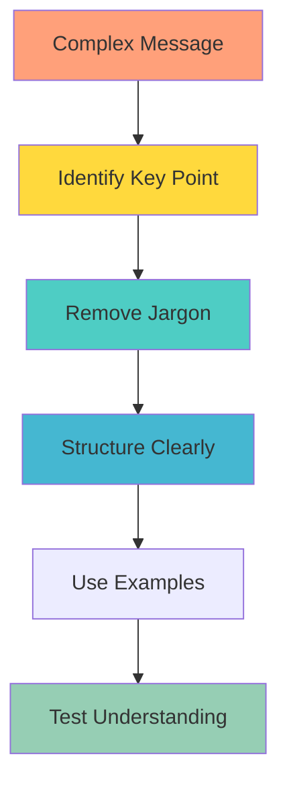
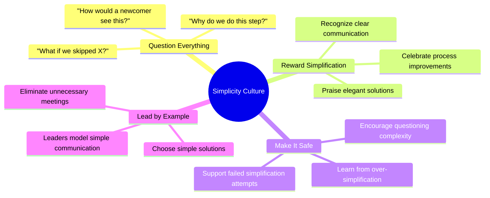

**[Home](//../#/)** | **[Navigation](//../#/)** | **[Culture Hub](/docs/Klysera/../Culture-Hub.md)** | **[🔧 Operating Principles](/Overview.md)** | **[🧪 Principles](/Tools/Quick-Reference-Cards.md)** | **Radical Simplicity**

---

# Radical Simplicity

**"Eliminate complexity that doesn't add value."**

**[← Back to Operating Principles Overview](/Overview.md)**

---

## Definition

**Radical Simplicity** means actively eliminating unnecessary complexity from everything we do. The best solution is often the simplest one that works. We choose clarity over cleverness, streamlined processes over bureaucracy, and direct communication over complicated explanations. Simplicity enables speed, understanding, and excellence.

---

## What It Means

- **Essential Focus:** Identify what truly matters and eliminate everything else
- **Clear Communication:** Explain complex ideas in simple, understandable terms
- **Streamlined Processes:** Remove steps that don't add value
- **Direct Paths:** Choose the most straightforward route to outcomes
- **Accessible Excellence:** Make high quality achievable through simplicity

---

## In Practice

### Daily Implementation

**Communication:**
- Use simple words instead of jargon
- Structure messages with clear main points
- Remove unnecessary details that obscure key information
- Ask "What's the simplest way to explain this?"

**Process Design:**
- Remove approval steps that don't add value
- Automate repetitive tasks
- Combine related activities into single workflows
- Question whether each step is truly necessary

**Problem Solving:**
- Start with the simplest solution that could work
- Ask "What's the minimum viable approach?"
- Avoid over-engineering solutions
- Build complexity only when simplicity fails

**Decision Making:**
- Use simple frameworks and criteria
- Reduce options to the essential few
- Make decisions at the lowest appropriate level
- Create clear yes/no criteria

### Simplification Process

**Step 1:** What are we really trying to achieve?
**Step 2:** What's absolutely necessary to achieve it?
**Step 3:** What can we remove without losing value?
**Step 4:** Does the simplified version still work?
**Step 5:** How do we maintain simplicity over time?

---

## Examples in Action

### ✅ Living Radical Simplicity

**Meeting Efficiency:**
- Default to 25-minute meetings instead of 30
- Standard agenda: Problem → Options → Decision → Next Steps
- Cancel meetings where email would suffice
- Start meetings with "What decision do we need to make?"

**Documentation:**
- One-page summaries instead of lengthy reports
- Bullet points instead of paragraphs when possible
- Visual diagrams to explain complex processes
- Templates that make good work easier

**Process Improvement:**
- Reducing 8-step approval process to 3 essential checks
- Creating self-service tools instead of manual requests
- Automating status updates instead of manual reporting
- Single point of contact instead of multiple handoffs

**Technical Solutions:**
- Choosing proven, simple tools over complex custom solutions
- Writing code that's easy to understand and maintain
- Using standard approaches unless complexity is clearly justified
- Building minimum viable features first

**TIK Moments:**
- "TIK! You made that beautifully simple and clear!"
- "TIK! Radical simplicity that works perfectly!"

### ❌ Violating Radical Simplicity

- Creating complex processes "just in case" scenarios that rarely occur
- Using technical jargon when simple language would be clearer
- Building features that aren't needed by users
- Adding approval layers that don't improve quality
- Over-explaining concepts that could be demonstrated simply

---

## Tools & Frameworks

### The Simplicity Questions

**For Any Process or Solution:**
1. **What's the core purpose?** (Strip to essential need)
2. **What's the minimum viable version?** (Start simple)
3. **What can we remove?** (Eliminate non-essential)
4. **How would we explain this to a newcomer?** (Test clarity)
5. **What would break if we removed X?** (Validate necessity)

### Communication Simplification Framework

**Simple Message Structure:**
1. **Main Point First:** What's the most important thing?
2. **Supporting Details:** Only include what's necessary
3. **Clear Action:** What happens next?
4. **Easy Questions:** Make it safe to ask for clarification

### Process Simplification Audit

**Monthly Review:**
- Which processes took longer than expected?
- Where did people ask for clarification?
- What steps didn't change the outcome?
- Which tools aren't being used as intended?
- Where are we working around the system?

---

## Common Challenges

### "Simple might miss important edge cases"
- **Response:** Handle the common cases simply; address edge cases separately
- **Solution:** 80/20 rule - simple solution for 80% of cases, special handling for 20%
- **Practice:** Build simple first, add complexity only when proven necessary

### "Stakeholders expect comprehensive documentation"
- **Response:** Comprehensive doesn't have to mean complicated
- **Solution:** Organize information clearly with executive summaries
- **Approach:** Layer information - simple overview with detailed appendices

### "Our work is inherently complex"
- **Response:** Complex work can still use simple processes and communication
- **Solution:** Break complex work into simple, understandable pieces
- **Example:** Complex software with simple user interfaces

### "Simplifying takes extra time upfront"
- **Response:** Simplification saves exponentially more time downstream
- **Solution:** Invest in simplification for anything used repeatedly
- **Quote:** "I would have written a shorter letter, but I did not have the time" - Pascal

---

## Measuring Success

### Simplicity Indicators
- Time to understand new processes or information
- Number of clarifying questions needed
- Speed of task completion
- Error rates in following procedures
- User adoption rates of new tools or processes

### Efficiency Gains
- Reduction in process steps over time
- Decreased training time for new team members
- Faster decision-making cycles
- Reduced communication overhead
- Improved user satisfaction scores

### Innovation Through Simplicity
- New solutions that are both simple and effective
- Processes that scale easily
- Tools that don't require extensive training
- Ideas that are easily adopted by others

---

## Building Simplicity Culture

### Team Practices

### Simplicity Champions

**Designate team members to:**
- Review processes quarterly for simplification opportunities
- Challenge unnecessary complexity in meetings
- Help others communicate more clearly
- Share examples of successful simplification

### Regular Simplification Reviews

**Weekly:** What got more complicated than it needed to be?
**Monthly:** Which processes could be streamlined?
**Quarterly:** What systems or tools aren't being used simply?
**Annually:** How has our overall complexity changed?

---

## Advanced Simplification Techniques

### The "Explain to a 10-Year-Old" Test
If you can't explain it simply to a smart child, you don't understand it well enough yet.

### The "Single Page" Challenge
Can you explain this process/decision/concept on one page? If not, what's essential vs. nice-to-have?

### The "New Employee" Lens
How would someone brand new to the organization understand this? What assumptions are we making?

### The "Emergency" Scenario
If we had to make this decision in 10 minutes, what information is actually critical?

---

## Simplicity in Different Contexts

### Technical Simplicity
- Choose standard solutions over custom builds
- Write self-documenting code
- Use familiar tools unless complexity is justified
- Design intuitive user interfaces

### Communication Simplicity
- Start with the conclusion
- Use visual aids for complex concepts
- Avoid unnecessary technical terms
- Structure information hierarchically

### Process Simplicity
- Minimize handoffs between people
- Remove approval steps that don't add value
- Automate routine decisions
- Create self-service options

### Decision Simplicity
- Use clear criteria and frameworks
- Limit options to essential few
- Make reversible decisions quickly
- Document reasoning simply

---

## Daily Reflection Questions

- **Morning:** What's the simplest way to achieve today's outcomes?
- **During work:** Am I making this more complicated than it needs to be?
- **Communication:** Could I explain this more clearly?
- **End of day:** What complexity did I eliminate today?
- **Weekly:** Where can I simplify my regular workflows?

---

## Next Steps

1. **Audit Current Complexity:** Identify one unnecessarily complex process
2. **Practice Simple Communication:** Explain something complex in simple terms
3. **Challenge Assumptions:** Ask "Do we really need this step?"
4. **Measure Impact:** Track time saved through simplification

**Remember:** Simplicity is the ultimate sophistication.

---

*This Is Klysera. We choose simple. We eliminate complexity. We make excellence accessible.*