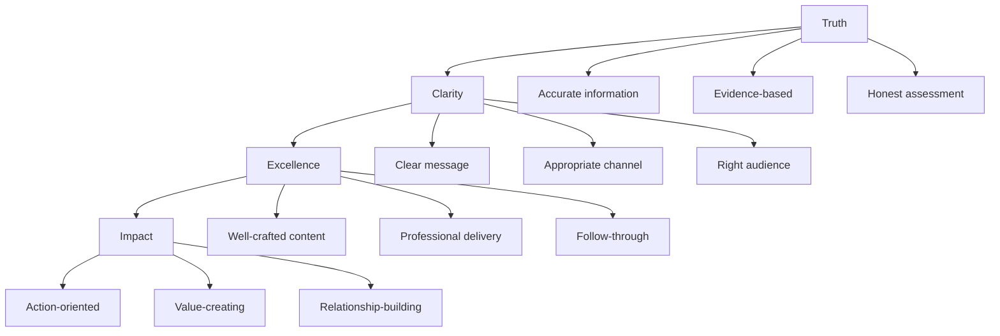

---

# Communication Guide

**How We Connect with Truth, Excellence, and Impact**

---

## The TIK Communication Model



---

## Communication Guidelines

### When Sharing Information
- Lead with the key message
- Provide context and evidence
- Specify required actions
- Set clear timelines

### When Asking Questions
- State the purpose and context
- Be specific about what you need
- Suggest potential solutions when appropriate
- Express appreciation for assistance

### When Giving Feedback
- Use the Excellence with Warmth approach
- Focus on specific behaviors and outcomes
- Offer support and resources
- Follow up on progress

---

## Channel Guidelines

| Communication Type | Primary Channel | Secondary Channel | Response Time |
|-------------------|----------------|------------------|---------------|
| Urgent issues | Direct message/Call | Email follow-up | Within 1 hour |
| Project updates | Team channel | Weekly reports | Same day |
| Recognition | Public channel | Team meetings | Immediate |
| Feedback | 1:1 meeting | Private message | Within 48hrs |
| Announcements | All-hands | Email | As scheduled |

---

## TIK Communication Examples

### Truth-Based Communication
**Instead of:** "This might work"
**TIK Way:** "Based on our test data, this approach showed 85% success rate"

### Excellence Communication
**Instead of:** "Here's the update"
**TIK Way:** "Here's a comprehensive update with next steps and support needed"

### Impact-Focused Communication
**Instead of:** "We completed the task"
**TIK Way:** "We delivered this solution, which enables the client to achieve X outcome"

---

## Feedback Framework

### Giving Feedback (Excellence with Warmth)
1. **Start with appreciation** - What's working well
2. **Be specific** - Exact behaviors and impact
3. **Offer support** - How you can help improve
4. **Follow up** - Check progress and provide ongoing support

### Receiving Feedback
1. **Listen actively** - Understand before responding
2. **Ask clarifying questions** - Get specific examples
3. **Thank the giver** - Appreciate their investment in you
4. **Act on insights** - Apply learnings immediately

---

## Recognition Communication

### TIK Recognition Format
```
🎯 TIK! [Value Name]

[Name], [specific behavior/action] demonstrated
[value] by [impact created].

This is exactly what [value] looks like in action!
Thank you for living TIK!
```

### Examples
- "TIK! Sarah's truth-seeking saved us from a costly assumption!"
- "TIK! Marcus delivered excellence that exceeded client expectations!"
- "TIK! Emma's solution created meaningful impact for the entire team!"

---

## Meeting Communication

### Before Meetings
- Share agenda 24 hours in advance
- Include purpose and expected outcomes
- Send relevant materials for preparation

### During Meetings
- Stay focused on agenda topics
- Participate actively and constructively
- Summarize key decisions and actions

### After Meetings
- Send summary within 24 hours
- Include action items with owners and deadlines
- Follow up on progress regularly

---

## Crisis Communication

### When Things Go Wrong
1. **Assess quickly** - Gather facts and evidence
2. **Communicate honestly** - Share what you know and don't know
3. **Focus on solutions** - What actions are being taken
4. **Update regularly** - Keep stakeholders informed of progress

### Difficult Conversations
1. **Prepare thoroughly** - Facts, examples, desired outcomes
2. **Choose right time/place** - Private, appropriate setting
3. **Lead with care** - Express positive intent
4. **Focus on behavior** - Not personality or character
5. **Collaborate on solutions** - Work together on improvement

---

## Digital Communication Best Practices

### Email Excellence
- Clear, specific subject lines
- Important information first
- Action items clearly marked
- Professional but warm tone

### Messaging Platforms
- Use threads for organized discussions
- Tag relevant people appropriately
- Share updates in team channels
- Keep personal conversations private

### Video Calls
- Professional background and lighting
- Mute when not speaking
- Be present and engaged
- Follow up with written summary

---

## External Communication

### Client Communication
- Professional and responsive
- Clear about timelines and expectations
- Proactive with updates and changes
- Focused on their success and outcomes

### Stakeholder Updates
- Regular, scheduled communication
- Data-driven insights and progress
- Transparent about challenges
- Clear about support needed

### Public Representation
- Consistent with TIK values
- Professional and excellent quality
- Focused on industry thought leadership
- Aligned with company messaging

---

## Communication Development

### Skills to Build
- Active listening
- Clear writing
- Persuasive speaking
- Conflict resolution
- Cross-cultural communication

### Practice Opportunities
- Team presentations
- Client interactions
- Peer feedback sessions
- Leadership communication
- Public speaking events

### Resources
- Communication training programs
- Writing workshops
- Presentation skills development
- Conflict resolution training
- Cultural competency development

---

## Troubleshooting Communication Issues

### When Communication Breaks Down
1. **Pause and assess** - What's really happening?
2. **Seek to understand** - Ask questions and listen
3. **Take responsibility** - Own your part in the breakdown
4. **Focus on solutions** - How to move forward effectively
5. **Learn and improve** - What to do differently next time

### Common Pitfalls to Avoid
- Assuming intent from limited information
- Using wrong channel for sensitive topics
- Waiting too long to address issues
- Focusing on blame instead of solutions
- Not following up on commitments

---

## Related Resources

- **[Meeting Culture →](docs/Klysera/Playbook/Meeting-Culture.md)** - How we meet effectively
- **[Decision Framework →](docs/Klysera/Playbook/Decision-Framework.md)** - How we make decisions
- **[Recognition Framework →](/Recognition-Rituals/Recognition-Framework.md)** - How we celebrate
- **[← Back to Playbook Overview](docs/Klysera/Playbook/Overview.md)**

---

**Great communication is how TIK values come alive in every interaction.**

**Communicate with truth, deliver with excellence, create impact through connection.**