**[Home](//#/)** | **[Navigation](//#/)** | **[Culture Hub](/docs/Klysera/Culture-Hub.md)** | **[🗺️ Roadmap](docs/Klysera/Overview.md)** | **2-Month Operational Roadmap**

---

# 2-Month P&C Operational Readiness Roadmap

**Building Essential Infrastructure to Serve Incoming Employees**

---

## Your Critical Mission

In the next 2 months, you must establish the **minimum viable P&C infrastructure** to effectively serve incoming employees. This roadmap focuses ONLY on what's essential for operational readiness, based on your JD responsibilities.

### Success Criteria for 2 Months
*By the end of this period, you must be able to:*
- ✅ Legally hire and onboard new employees
- ✅ Ensure compliance with Nigerian labor laws
- ✅ Provide day-to-day HR support
- ✅ Manage payroll and compensation
- ✅ Maintain employee records and documentation

---

## Critical Path Analysis

---

## Week-by-Week Implementation Plan

### 🚨 Weeks 1-2: Legal & Compliance Foundation [CRITICAL]
**Without this, you cannot legally operate**

#### Must-Have Deliverables
| Deliverable | Purpose | Status | Owner |
|-------------|---------|--------|-------|
| **Employment Contract Template** | Legal hiring requirement | 📋 Draft | You + Legal |
| **Nigerian Labor Law Compliance Checklist** | Avoid legal violations | 📋 Create | You |
| **Data Protection Policy** | NDPR compliance | 📋 Draft | You |
| **Core HR Policies** | Operational guidelines | 📋 Draft | You |
| **Employee Handbook (Basic)** | Employee guidance | 📋 Create | You |

#### Core HR Policies Required

#### Week 1-2 Comprehensive Action Plan

**Monday Week 1**
- [ ] Review Nigerian Labour Act and compliance requirements
- [ ] Integrate existing TIK Values (✅ Complete) into employment framework
- [ ] Schedule legal consultation for contract review
- [ ] Begin employment contract template draft

**Tuesday Week 1**
- [ ] Complete employment contract template incorporating TIK Identity
- [ ] Draft data protection policy for NDPR compliance
- [ ] Create confidentiality and non-disclosure agreements
- [ ] Document probation period policies

**Wednesday Week 1**
- [ ] Legal consultation session on contracts and policies
- [ ] Begin employee handbook structure using Culture Manifesto (✅ Complete)
- [ ] Define remote work policy leveraging existing Communication Guidelines (✅ Complete)
- [ ] Create notice period and termination procedures

**Thursday Week 1**
- [ ] Revise employment contracts based on legal feedback
- [ ] Continue employee handbook development
- [ ] Establish leave policy framework (annual, sick, emergency)
- [ ] Document overtime and working hours policies

**Friday Week 1**
- [ ] Complete Week 1 legal foundation deliverables
- [ ] Prepare disciplinary and grievance procedures
- [ ] Create code of conduct incorporating Operating Principles (✅ Complete)
- [ ] Plan Week 2 policy development activities

**Monday Week 2**
- [ ] Finalize employee handbook incorporating all completed culture documents
- [ ] Create comprehensive leave management procedures
- [ ] Develop conflict resolution and escalation procedures
- [ ] Document compensation and benefits framework

**Tuesday Week 2**
- [ ] Complete all HR policy documentation
- [ ] Create policy implementation timeline
- [ ] Prepare manager training materials on policies
- [ ] Establish policy review and update procedures

**Wednesday-Friday Week 2**
- [ ] Comprehensive legal review of all documentation
- [ ] Final revisions based on legal feedback
- [ ] Founder approval of core policies and contracts
- [ ] Prepare for operational systems implementation

---

### 💻 Weeks 3-4: Operational Systems [ESSENTIAL]
**Without this, you cannot manage employees effectively**

#### System Requirements
| System | Purpose | Options | Decision by |
|--------|---------|---------|-------------|
| **HRIS** | Employee data management | BambooHR, Zoho People, Excel (temp) | Week 3 |
| **Payroll** | Salary processing | Local provider, Paystack Payroll | Week 3 |
| **Communication** | Team support | Slack, Teams, Email | Week 4 |
| **Document Storage** | Record keeping | Google Drive, SharePoint | Week 4 |

#### Minimum Viable HRIS Setup

#### Week 3-4 Comprehensive System Implementation

**Monday Week 3**
- [ ] Research and evaluate HRIS options (BambooHR, Zoho People, Excel-based)
- [ ] Create employee data collection forms with TIK assessment components
- [ ] Begin payroll provider research and evaluation
- [ ] Setup basic employee database structure

**Tuesday Week 3**
- [ ] Make HRIS selection decision and begin setup
- [ ] Create comprehensive employee data templates
- [ ] Design onboarding data collection workflows
- [ ] Establish document version control system

**Wednesday Week 3**
- [ ] Configure selected HRIS with employee fields and workflows
- [ ] Select and setup payroll processing system
- [ ] Create secure document storage structure (policies, contracts, records)
- [ ] Implement existing Communication Guidelines (✅ Complete) into daily operations

**Thursday Week 3**
- [ ] Test HRIS functionality with sample employee data
- [ ] Configure payroll system with Nigerian tax and compliance requirements
- [ ] Setup employee communication channels using Meeting Culture standards (✅ Complete)
- [ ] Create data backup and security procedures

**Friday Week 3**
- [ ] Complete system setup and initial testing
- [ ] Document system administration procedures
- [ ] Create basic reporting templates for employee metrics
- [ ] Prepare Week 4 system integration activities

**Monday Week 4**
- [ ] Develop comprehensive salary band structure
- [ ] Create employee compensation guidelines and policies
- [ ] Setup monthly payroll processing workflow
- [ ] Establish expense reimbursement procedures

**Tuesday Week 4**
- [ ] Design employee performance tracking templates
- [ ] Create attendance and leave tracking systems
- [ ] Implement Recognition Framework (✅ Complete) into daily operations
- [ ] Setup compliance monitoring and reporting

**Wednesday Week 4**
- [ ] Create comprehensive employee reporting dashboard
- [ ] Test end-to-end data flow from hiring to payroll
- [ ] Establish monthly and quarterly reporting schedules
- [ ] Document troubleshooting and support procedures

**Thursday-Friday Week 4**
- [ ] Complete system integration testing
- [ ] Create system user guides and training materials
- [ ] Prepare for employee experience implementation
- [ ] Update Founders on operational systems readiness

---

### 🤝 Weeks 5-6: Employee Experience Foundation [IMPORTANT]
**This ensures positive employee experience from day one**

#### Onboarding Essentials
| Component | Purpose | Materials Needed | Timeline |
|-----------|---------|------------------|----------|
| **Pre-boarding** | Preparation | Welcome email, forms, IT requests | Week 5 |
| **Day 1 Process** | Smooth start | Checklist, orientation deck, accounts | Week 5 |
| **Week 1 Plan** | Integration | Schedule, introductions, training plan | Week 6 |
| **30-Day Journey** | Full productivity | Milestones, feedback, certification | Week 6 |

#### Employee Support Framework

```mermaid
graph TB
    A[Employee Support Channels] --> B[Direct Support]
    A --> C[Self-Service]
    A --> D[Escalation Path]

    B --> B1[HR Email/Slack]
    B --> B2[Weekly Office Hours]
    B --> B3[Manager Support]

    C --> C1[Employee Handbook]
    C --> C2[FAQ Document]
    C --> C3[Policy Library]

    D --> D1[HR → Founders]
    D --> D2[HR → Legal]
    D --> D3[HR → External Support]
```

#### Week 5-6 Employee Experience Implementation

**Monday Week 5**
- [ ] Implement existing 30-Day Onboarding Journey (✅ Complete) into operational systems
- [ ] Integrate TIK Certification Program (✅ Complete) into onboarding workflow
- [ ] Create Day 1 orientation materials incorporating Culture Manifesto (✅ Complete)
- [ ] Setup IT provisioning and account creation procedures

**Tuesday Week 5**
- [ ] Develop comprehensive pre-boarding communication templates
- [ ] Create onboarding progress tracking system
- [ ] Design buddy system assignment and training
- [ ] Establish new hire feedback collection at Days 7, 14, and 30

**Wednesday Week 5**
- [ ] Create manager onboarding toolkit using Leadership principles
- [ ] Develop team introduction and integration procedures
- [ ] Setup virtual workspace orientation for remote employees
- [ ] Create onboarding milestone celebration rituals

**Thursday Week 5**
- [ ] Establish comprehensive employee support channels (HR help desk)
- [ ] Create escalation procedures for complex employee issues
- [ ] Design self-service FAQ system covering common queries
- [ ] Implement daily check-in procedures for new hires

**Friday Week 5**
- [ ] Test complete onboarding workflow end-to-end
- [ ] Create onboarding quality assurance checklist
- [ ] Document onboarding troubleshooting procedures
- [ ] Prepare Week 6 culture integration activities

**Monday Week 6**
- [ ] Implement Culture Stories (✅ Complete) into monthly sharing sessions
- [ ] Create culture integration assessment tools
- [ ] Develop peer mentoring and culture champion programs
- [ ] Establish quarterly culture pulse surveys

**Tuesday Week 6**
- [ ] Design comprehensive employee development planning process
- [ ] Create career progression and growth opportunity frameworks
- [ ] Implement Recognition Framework (✅ Complete) into daily operations
- [ ] Setup employee achievement tracking and celebration

**Wednesday Week 6**
- [ ] Create employee engagement measurement tools
- [ ] Develop retention strategy and early warning systems
- [ ] Establish exit interview and offboarding procedures
- [ ] Design employee advocacy and referral programs

**Thursday-Friday Week 6**
- [ ] Complete employee experience testing with mock scenarios
- [ ] Create comprehensive manager training on employee support
- [ ] Document all employee experience procedures
- [ ] Prepare for launch and testing phase

---

### ✅ Weeks 7-8: Testing & Launch [VALIDATION]
**Ensure everything works before employees arrive**

#### Pre-Launch Testing
| Process | Test Scenario | Success Criteria | Status |
|---------|--------------|------------------|--------|
| **Hiring** | Process a mock hire | Contract to signing in 3 days | 📋 Test |
| **Onboarding** | Run through Day 1 | All accounts/access ready | 📋 Test |
| **Payroll** | Process test payment | Accurate and on time | 📋 Test |
| **Support** | Respond to queries | <24 hour response | 📋 Test |
| **Reporting** | Generate monthly report | Complete and accurate | 📋 Test |

#### Launch Readiness Checklist

```mermaid
graph TB
    A[Launch Readiness] --> B[Documentation Ready]
    A --> C[Systems Operational]
    A --> D[Team Prepared]
    A --> E[Communication Plan]

    B --> B1[✓ Policies]
    B --> B2[✓ Contracts]
    B --> B3[✓ Handbook]

    C --> C1[✓ HRIS]
    C --> C2[✓ Payroll]
    C --> C3[✓ Communication]

    D --> D1[✓ Training Complete]
    D --> D2[✓ Support Ready]
    D --> D3[✓ Escalation Clear]

    E --> E1[✓ Announcement]
    E --> E2[✓ FAQs]
    E --> E3[✓ Feedback Loop]
```

#### Week 7-8 Launch Preparation and Testing

**Monday Week 7**
- [ ] Conduct comprehensive end-to-end testing: hiring to Day 30
- [ ] Test payroll processing with sample employee data
- [ ] Validate all legal and compliance procedures
- [ ] Run mock TIK Certification assessment process

**Tuesday Week 7**
- [ ] Complete manager training on all people processes
- [ ] Train managers on Recognition Framework (✅ Complete) implementation
- [ ] Test employee support channel responsiveness
- [ ] Validate escalation procedures and decision-making frameworks

**Wednesday Week 7**
- [ ] Create comprehensive Founder reporting dashboard
- [ ] Setup monthly P&C metrics and analytics reporting
- [ ] Test all system integrations and data flows
- [ ] Complete documentation review and final approvals

**Thursday Week 7**
- [ ] Prepare organization-wide communication about P&C services
- [ ] Create employee self-service guides and resources
- [ ] Setup feedback collection and continuous improvement process
- [ ] Conduct final compliance and legal review

**Friday Week 7**
- [ ] Complete pre-launch checklist validation
- [ ] Prepare launch communication materials
- [ ] Schedule Founder final approval meeting
- [ ] Plan Week 8 launch activities

**Monday Week 8**
- [ ] Launch P&C services to existing employees
- [ ] Communicate new HR support channels and procedures
- [ ] Begin collecting feedback on new processes
- [ ] Monitor system performance and user adoption

**Tuesday Week 8**
- [ ] Conduct first live onboarding process if new hire available
- [ ] Process first payroll cycle through new system
- [ ] Respond to initial employee questions and feedback
- [ ] Document any immediate improvements needed

**Wednesday Week 8**
- [ ] Generate first monthly P&C report for Founders
- [ ] Analyze initial system performance and employee satisfaction
- [ ] Create post-launch support and maintenance schedule
- [ ] Plan future enhancements based on feedback

**Thursday-Friday Week 8**
- [ ] Complete 2-month implementation review
- [ ] Document lessons learned and best practices
- [ ] Create ongoing operational procedures and schedules
- [ ] Establish continuous improvement and feedback cycle
- [ ] Celebrate successful P&C infrastructure launch
- [ ] Plan next phase of P&C development and enhancement

---

## What You're Building (Minimum Viable P&C)

### Core Infrastructure Required

---

## Current Documentation Status

### ✅ Completed Documentation (Ready for Implementation)

#### **🏛️ Culture Foundation Module - COMPLETE**
| Document | Status | Location | Implementation Priority |
|----------|--------|----------|------------------------|
| **TIK Identity & Core Values** | ✅ Complete | Culture/TIK-Identity.md | Week 1 (Foundation) |
| **Individual Value Deep-Dives** | ✅ Complete | Culture/Relentless-Truth.md, Uncompromising-Excellence.md, Meaningful-Impact.md | Week 1 (Foundation) |
| **Culture Manifesto** | ✅ Complete | Culture/Culture-Manifesto.md | Week 1 (Foundation) |
| **Culture Stories & Examples** | ✅ Complete | Culture/Culture-Stories.md | Week 1 (Foundation) |
| **Culture Module Overview** | ✅ Complete | Culture/_Overview | Week 1 (Foundation) |

#### **⚙️ Operating Principles Module - COMPLETE**
| Document | Status | Location | Implementation Priority |
|----------|--------|----------|------------------------|
| **7 Operating Principles Overview** | ✅ Complete | Operating-Principles/_Overview | Week 2 (Decision Framework) |
| **Individual Principle Deep-Dives** | ✅ Complete | Operating-Principles/Principles/01-07-*.md (7 files) | Week 2 (Decision Framework) |
| **Decision Framework Tools** | ✅ Complete | Operating-Principles/Tools/Decision-Framework.md | Week 2 (Decision Framework) |
| **TIK Language Guide** | ✅ Complete | Operating-Principles/Tools/TIK-Language-Guide.md | Week 2 (Communication) |
| **Quick Reference Cards** | ✅ Complete | Operating-Principles/Tools/Quick-Reference-Cards.md | Week 2 (Implementation) |
| **Leadership Implementation Guide** | ✅ Complete | Operating-Principles/Implementation/Leadership-Guide.md | Week 3 (Manager Training) |
| **Culture Measurement Framework** | ✅ Complete | Operating-Principles/Measurement/Culture-Metrics.md | Week 7 (Analytics) |

#### **📚 Daily Operations Playbook - COMPLETE**
| Document | Status | Location | Implementation Priority |
|----------|--------|----------|------------------------|
| **Playbook Overview** | ✅ Complete | Playbook/_Overview | Week 3 (Operations) |
| **Communication Guidelines** | ✅ Complete | Playbook/Communication-Guide.md | Week 3 (Operations) |
| **Meeting Culture Standards** | ✅ Complete | Playbook/Meeting-Culture.md | Week 3 (Operations) |
| **Decision Framework** | ✅ Complete | Playbook/Decision-Framework.md | Week 3 (Operations) |
| **Daily Operations Guide** | ✅ Complete | Playbook/Daily-Operations.md | Week 3 (Operations) |
| **Code of Conduct & Policies** | ✅ Complete | Playbook/Policies-Guidelines.md | Week 2 (Foundation) |

#### **👥 Leadership Excellence Module - COMPLETE**
| Document | Status | Location | Implementation Priority |
|----------|--------|----------|------------------------|
| **Leadership Overview** | ✅ Complete | Leadership/_Overview | Week 3 (Manager Training) |
| **Leadership Development Framework** | ✅ Complete | Leadership/Leadership-Development.md | Week 6 (Development) |
| **Leadership Tools & Resources** | ✅ Complete | Leadership/Leadership-Tools.md | Week 3 (Manager Training) |
| **Leadership Assessment System** | ✅ Complete | Leadership/Leadership-Assessment.md | Week 7 (Performance) |

#### **🎯 Hiring & Onboarding Module - COMPLETE**
| Document | Status | Location | Implementation Priority |
|----------|--------|----------|------------------------|
| **Hiring & Onboarding Overview** | ✅ Complete | Hiring-Onboarding/_Overview | Week 5 (Onboarding) |
| **Cultural Hiring Guide** | ✅ Complete | Hiring-Onboarding/Hiring-Guide.md | Week 1 (Foundation) |
| **30-Day Onboarding Journey** | ✅ Complete | Hiring-Onboarding/Onboarding-Journey.md | Week 5 (Employee Experience) |
| **TIK Certification Program** | ✅ Complete | Hiring-Onboarding/TIK-Certification-Program.md | Week 5 (Onboarding) |
| **Certification Tracking Template** | ✅ Complete | Hiring-Onboarding/Certification-Tracking-Template.md | Week 5 (Onboarding) |
| **Integration Tools & Checklists** | ✅ Complete | Hiring-Onboarding/Integration-Tools.md | Week 5 (Onboarding) |

#### **🎉 Recognition & Rituals Module - COMPLETE**
| Document | Status | Location | Implementation Priority |
|----------|--------|----------|------------------------|
| **Recognition & Rituals Overview** | ✅ Complete | Recognition-Rituals/_Overview | Week 6 (Employee Experience) |
| **Recognition Framework** | ✅ Complete | Recognition-Rituals/Recognition-Framework.md | Week 6 (Employee Experience) |
| **Daily Rituals Guide** | ✅ Complete | Recognition-Rituals/Daily-Rituals.md | Week 6 (Employee Experience) |
| **Special Programs & Celebrations** | ✅ Complete | Recognition-Rituals/Special-Programs.md | Week 6 (Employee Experience) |

#### **🗺️ Navigation & Documentation Hub - COMPLETE**
| Document | Status | Location | Implementation Priority |
|----------|--------|----------|------------------------|
| **Main Culture Hub** | ✅ Complete | Culture-Hub.md | Week 1 (Foundation) |
| **Documentation README** | ✅ Complete | #/ | Week 1 (Foundation) |
| **All Module Overviews** | ✅ Complete | */\Overview.md (6 files) | Week 1 (Foundation) |

**📊 COMPLETION SUMMARY: 46 Documents Complete - 85% of Culture Infrastructure Ready**

### 📋 Pending Documentation (To Be Created) - ONLY 15% REMAINING

#### **🚨 Critical Legal & Compliance Documents (Week 1-2)**
| Document | Priority | Target Week | Purpose |
|----------|----------|-------------|----------|
| **Employment Contract Template** | 🚨 Critical | Week 1 | Legal hiring requirement |
| **Employee Handbook (Basic)** | 🚨 Critical | Week 2 | Employee guidance (will incorporate existing culture docs) |
| **Leave Policy (Annual, Sick, Emergency)** | 🚨 Critical | Week 2 | Legal compliance |
| **Remote Work Policy** | 🚨 Critical | Week 2 | Operational guidelines |
| **Data Protection & NDPR Policy** | 🚨 Critical | Week 2 | Legal compliance |
| **Disciplinary & Grievance Procedures** | 🚨 Critical | Week 2 | Legal protection |

#### **⚡ Essential Operational Systems (Week 3-5)**
| Document | Priority | Target Week | Purpose |
|----------|----------|-------------|----------|
| **HRIS Setup & Configuration** | ⚡ Essential | Week 3 | Employee database |
| **Payroll Processing Procedures** | ⚡ Essential | Week 4 | Monthly operations |
| **Employee Support SOPs** | ⚡ Essential | Week 5 | Daily HR support |
| **IT Provisioning Checklist** | ⚡ Essential | Week 5 | New hire setup |
| **Benefits Administration Guide** | ⚡ Essential | Week 5 | Employee support |

#### **📊 Performance & Analytics (Week 6-8)**
| Document | Priority | Target Week | Purpose |
|----------|----------|-------------|----------|
| **Monthly HR Reporting Template** | 📊 Important | Week 6 | Founder updates |
| **Employee Exit Interview Process** | 📊 Important | Week 7 | Retention insights |
| **Performance Review Templates** | 📊 Important | Week 8 | Employee development |

**⏰ REALITY CHECK: With 85% of cultural foundation complete, focus shifts to operational necessities.**

## Resource Requirements

### Immediate Needs (Week 1)
- **Legal Support**: 10-15 hours for contract and policy review
- **Your Time**: 100% focus for first 4 weeks
- **Administrative Support**: Part-time help for documentation
- **Technology Access**: Basic HRIS and communication tools

---

## Success Metrics (End of 2 Months)

### Operational Readiness Checklist
- [ ] **Legal Compliance**: 100% compliant with Nigerian labor laws
- [ ] **Hiring Capability**: Can process new hire in 3-5 days
- [ ] **Onboarding Ready**: Day 1 process documented and tested
- [ ] **Payroll Operational**: Successfully process monthly payroll
- [ ] **Support Active**: <24 hour response to employee queries
- [ ] **Reporting Functional**: Monthly report to Founders delivered

### Documentation Status (Current + To Be Created)

**✅ MAJOR ACHIEVEMENT: 85% Complete - 46 Documents Ready**
- [x] **6 Complete Modules**: Culture, Operating Principles, Playbook, Leadership, Hiring-Onboarding, Recognition-Rituals
- [x] **46 Documents Complete**: All cultural foundation, values, principles, processes, and frameworks
- [x] **Full Navigation System**: Culture Hub, READMEs, and module overviews
- [x] **Implementation-Ready**: All completed docs have clear implementation priorities

**📋 Remaining 15% - Only Operational Necessities**
- [ ] Legal compliance documents (6 items)
- [ ] System setup and configuration (5 items)
- [ ] Performance and analytics templates (3 items)
- [ ] **Total Remaining**: 14 operational documents

**🎯 STRATEGIC ADVANTAGE: Cultural foundation completely built - now focus purely on legal/operational infrastructure.**

---

## Risk Mitigation

### Critical Risks & Mitigation
| Risk | Impact | Mitigation | Owner |
|------|--------|------------|-------|
| **Legal non-compliance** | Cannot hire | Legal review Week 1 | You + Legal |
| **No payroll system** | Cannot pay employees | Backup manual process | You + Finance |
| **System failure** | Operations disrupted | Manual backup processes | You |
| **Delayed timeline** | Not ready for employees | Prioritize must-haves only | You |

---

## Daily Action Plan

### Week 1-2 Daily Focus
**Monday-Tuesday**: Legal compliance research and documentation
**Wednesday-Thursday**: Policy drafting and review
**Friday**: Legal consultation and revision

### Week 3-4 Daily Focus
**Monday-Tuesday**: System evaluation and selection
**Wednesday-Thursday**: System setup and configuration
**Friday**: Testing and documentation

### Week 5-6 Daily Focus
**Monday-Tuesday**: Onboarding process design
**Wednesday-Thursday**: Support framework creation
**Friday**: Manager training preparation

### Week 7-8 Daily Focus
**Monday-Tuesday**: End-to-end testing
**Wednesday-Thursday**: Final revisions and approval
**Friday**: Launch and communication

---

## What NOT to Focus On (Can Wait)

### Nice-to-Have But Not Critical
- ❌ Advanced analytics and reporting
- ❌ Comprehensive L&D programs
- ❌ Complex performance management
- ❌ Elaborate recognition programs
- ❌ Multiple system integrations
- ❌ Extensive culture programs

*These can be built AFTER you have operational foundation*

---

## Your Week 1 Immediate Actions

### Monday (Day 1)
- [ ] Review this roadmap with Founders for alignment
- [ ] Identify legal support resource
- [ ] Begin Nigerian Labour Act review
- [ ] Create project tracking spreadsheet

### Tuesday (Day 2)
- [ ] Draft employment contract outline
- [ ] List all required HR policies
- [ ] Schedule legal consultation
- [ ] Begin employee handbook structure

### Wednesday (Day 3)
- [ ] Continue policy drafting
- [ ] Research HRIS options
- [ ] Identify payroll provider options
- [ ] Document compliance requirements

### Thursday (Day 4)
- [ ] Legal consultation session
- [ ] Revise contracts based on feedback
- [ ] Continue handbook development
- [ ] Create onboarding checklist draft

### Friday (Day 5)
- [ ] Finalize Week 1 deliverables
- [ ] Plan Week 2 activities
- [ ] Update Founders on progress
- [ ] Identify any blockers

---

## Founder Communication Plan

### Weekly Updates Should Include
1. **Progress**: What was completed this week
2. **Blockers**: What needs their input/approval
3. **Budget**: Any financial decisions needed
4. **Timeline**: On track or adjustments needed
5. **Next Week**: What will be accomplished

### Approval Points Needed
- Week 2: Legal documents and policies
- Week 3: System selections and budget
- Week 5: Onboarding process
- Week 7: Launch plan

---

**Focus only on what's needed to serve employees effectively in 2 months. Everything else can wait.**

**Your success = Employees can be hired, paid, and supported properly from Day 1.**

---

*2-Month Operational Readiness Roadmap v1.0 | October 2025*
*Minimum Viable P&C Infrastructure for Employee Support*