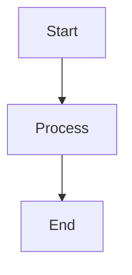

# Development Guide

## Prerequisites

### Required Software
- **Node.js**: Version 18+ (for Docsify CLI and Playwright)
- **Git**: Version control and collaboration
- **Text Editor**: Markdown-friendly editor (VS Code, Typora, etc.)
- **Web Browser**: Modern browser for testing and preview

### Optional Tools
- **Docsify CLI**: `npm install -g docsify-cli` (for local development)
- **Playwright**: For automated testing (included in package.json)

## Environment Setup

### 1. Repository Setup
```bash
# Clone the repository
git clone https://github.com/klysera/people-and-culture.git
cd people-and-culture

# Install dependencies
npm install
```

### 2. Local Development Server
```bash
# Start local development server
docsify serve docs

# Alternative: Use npx if docsify-cli not installed globally
npx docsify-cli serve docs

# Access at: http://localhost:3000
```

### 3. Environment Configuration
- **No environment variables required** - Pure static documentation
- **Configuration files**: `_sidebar.md`, `_navbar.md`, `index.html`
- **Docsify settings**: Configured in `index.html` window.$docsify object

## Development Workflow

### Content Creation Process

#### 1. Creating New Documentation
```bash
# Create new markdown file in appropriate directory
touch docs/Klysera/[Domain]/new-document.md

# Follow naming convention: kebab-case-titles.md
# Examples: hiring-guide.md, culture-manifesto.md
```

#### 2. Markdown Best Practices
- **Headers**: Use semantic heading hierarchy (H1 → H2 → H3)
- **Links**: Use relative paths within docs/ structure
- **Images**: Place in appropriate subdirectories, reference relatively
- **Mermaid**: Wrap diagrams in \`\`\`mermaid code blocks

#### 3. Mermaid Diagram Integration
```markdown
# Example mermaid diagram


**Supported diagram types**:
- Flowcharts, Sequence diagrams, Gantt charts
- Class diagrams, State diagrams, Entity relationships
- Custom styling supported through Mermaid configuration
```

### Testing and Quality Assurance

#### 1. Local Testing
```bash
# Start development server and test manually
docsify serve docs

# Check for:
# - Navigation functionality
# - Link accuracy
# - Mermaid diagram rendering
# - Mobile responsiveness
```

#### 2. Automated Testing (Optional)
```bash
# Run Playwright tests
npm test

# Run tests with UI (if configured)
npm run test:headed

# Generate test report
npm run test:report
```

#### 3. Content Validation
- **Spell check**: Use editor spell check or external tools
- **Link validation**: Ensure all internal links work
- **Diagram validation**: Verify mermaid syntax is correct
- **Mobile testing**: Check responsive behavior

### Version Control Workflow

#### 1. Branch Management
```bash
# Create feature branch
git checkout -b feature/new-documentation

# Work on documentation
# ... edit files ...

# Stage and commit changes
git add .
git commit -m "Add new documentation for [feature]"

# Push branch
git push origin feature/new-documentation
```

#### 2. Pull Request Process
1. **Create PR**: Submit pull request to main branch
2. **Review**: Team review for accuracy and consistency
3. **Testing**: Automated deployment testing (if configured)
4. **Approval**: Merge after approval
5. **Deployment**: Automatic deployment to GitHub Pages

### Build Process

#### 1. Local Build Simulation
```bash
# Simulate the GitHub Actions build process
mkdir -p dist
cp -r docs dist/
cp index.html dist/
cp _sidebar.md dist/
cp _navbar.md dist/
cp .nojekyll dist/

echo "Local build complete - check dist/ directory"
```

#### 2. Deployment Pipeline
**Automatic deployment on push to main branch**:
1. **Trigger**: Push to main or pull request
2. **Environment**: Ubuntu latest with Node.js 18
3. **Build**: Docsify compilation with asset copying
4. **Deploy**: GitHub Pages deployment with custom domain support
5. **Verification**: Build success confirmation

## Configuration Management

### Docsify Configuration (`index.html`)
```javascript
window.$docsify = {
  name: 'Klysera People & Culture',
  repo: 'https://github.com/klysera/people-and-culture',
  loadSidebar: true,
  loadNavbar: true,
  subMaxLevel: 3,
  search: 'auto',
  // ... additional configuration
}
```

### Navigation Configuration
- **`_sidebar.md`**: Left sidebar navigation structure
- **`_navbar.md`**: Top navigation bar links
- **Auto-generated**: Table of contents from markdown headers

### Styling and Branding
- **CSS customization**: Embedded in `index.html`
- **Theme**: Docsify Vue theme with Klysera branding
- **Colors**: Custom CSS variables for brand consistency
- **Responsive**: Mobile-first responsive design

## Common Development Tasks

### Adding New Content Section
1. Create directory structure in `docs/Klysera/[NewSection]/`
2. Add `Overview.md` as section landing page
3. Update `_sidebar.md` with new navigation entry
4. Update `Culture-Hub.md` with new section link
5. Test navigation and links

### Updating Mermaid Diagrams
1. Edit mermaid code block in markdown
2. Test locally with `docsify serve`
3. Verify rendering in multiple browsers
4. Check mobile compatibility

### Content Organization Best Practices
- **Consistent naming**: Use kebab-case for files and directories
- **Clear hierarchy**: Logical information architecture
- **Cross-references**: Link related content appropriately
- **Version control**: Meaningful commit messages

## Troubleshooting

### Common Issues
- **Mermaid not rendering**: Check syntax and browser console
- **Links broken**: Verify relative paths and file existence
- **Navigation issues**: Check `_sidebar.md` syntax
- **Build failures**: Review GitHub Actions logs

### Performance Optimization
- **Image optimization**: Compress images before committing
- **Large files**: Avoid committing large binary files
- **CDN usage**: External dependencies via CDN (already configured)

### Support Resources
- **Docsify Documentation**: https://docsify.js.org/
- **Mermaid Documentation**: https://mermaid-js.github.io/mermaid/
- **GitHub Pages**: https://docs.github.com/en/pages