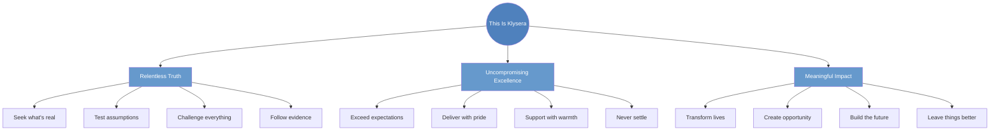
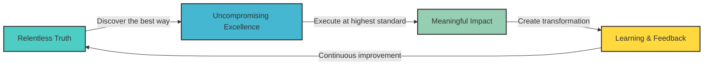
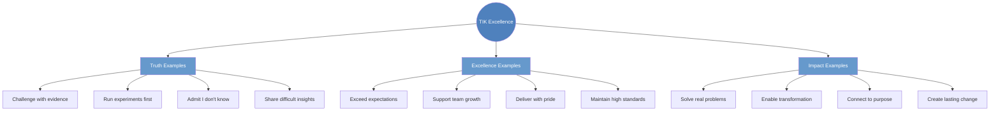

---

# TIK Identity

**Our Values and Cultural DNA**

---

## The Klysera Spirit

---

## Our 3 Core Values

### We Are Truth Seekers
**"Seeking the objectively best way to solve problems through experimentation and first principles thinking"**

We don't accept "good enough" or "that's how it's done." We dig deeper, ask harder questions, and find the objectively best way forward. We experiment boldly and let evidence guide us, even when it's uncomfortable.

**"If it's worth doing, it's worth understanding truly."**

**[📖 Learn More: Relentless Truth →](docs/Klysera/Culture/Relentless-Truth.md)**

### We Are Excellence Embodied
**"Delivering exceptional quality that exceeds expectations in everything we do"**

Quality isn't our goal—it's our identity. We deliver exceptional results with genuine care, supporting each other to achieve heights we didn't know were possible. Excellence energizes us rather than exhausts us.

**"Excellence isn't what we deliver—it's who we are."**

**[📖 Learn More: Uncompromising Excellence →](docs/Klysera/Culture/Uncompromising-Excellence.md)**

### We Are Impact Creators
**"Creating genuine transformation for people, organizations, and the future of work"**

We measure success by the transformation we create. Every role contributes to meaningful change that extends far beyond our immediate tasks. We connect individual growth to collective impact.

**"When we succeed, lives are transformed."**

**[📖 Learn More: Meaningful Impact →](docs/Klysera/Culture/Meaningful-Impact.md)**

---

## How Klysera Values Work Together

**TIK is the complete package:** When we say "This Is Klysera," we're declaring that we embody all three Klysera values in everything we do.

### Value Integration
- **Truth enables Excellence:** We can't deliver exceptional quality without understanding what excellence means and how to achieve it
- **Excellence creates Impact:** High-quality work creates lasting transformation that scales and sustains
- **Impact validates Truth:** Real results prove whether our approach was actually the best one
- **All three together:** The complete cycle creates continuous improvement and sustainable success

---

## Living Klysera Culture

### The TIK Declaration

### TIK Moments
When we see someone embodying our values:
- "That's Relentless Truth in action!"
- "Uncompromising Excellence delivered with care!"
- "Meaningful Impact that transforms!"

### Our Cultural Foundation
- **Morning:** "Today, I will live TIK by..."
- **Decisions:** "Is this aligned with our values?"
- **Celebrations:** "This Is Klysera!"
- **Reflection:** "How did I embody TIK today?"

---

## TIK in Action Examples

**[📖 View Complete Examples →](docs/Klysera/Culture/Culture-Stories.md)**

---

## What TIK Means

- **Identity:** This is who we are—not who we aspire to be
- **Standard:** This is the quality we deliver—no compromises
- **Culture:** This is how we relate to each other—with truth, excellence, and impact
- **Declaration:** When we say "TIK," we're declaring our commitment to all three values

---

## From Values to Action

### Values Define Who We Are
Our three core values represent our fundamental beliefs and identity as an organization. They answer the question: "What do we stand for?"

### Operating Principles Define How We Work
To translate these values into daily excellence, we have developed 7 Core Operating Principles that provide specific guidance on how to live these values in practice.

**[📖 Explore Our Operating Principles →](/../Operating-Principles/Overview.md)**

---

## Related Resources

- **[Culture Manifesto →](docs/Klysera/Culture/Culture-Manifesto.md)** - Our inspirational story
- **[Culture Stories →](docs/Klysera/Culture/Culture-Stories.md)** - TIK examples in action
- **[Daily Rituals →](docs/Klysera/Recognition-Rituals/Daily-Rituals.md)** - Living TIK daily
- **[← Back to Culture Hub](docs/Klysera/Culture-Hub.md)**

---

## The Bottom Line

**These three values—Relentless Truth, Uncompromising Excellence, and Meaningful Impact—are not just words. They are TIK: This Is Klysera. This is who we are and what we stand for.**

When we live these values:
- We discover the best approaches through truth-seeking
- We deliver exceptional quality with genuine care
- We create transformation that matters and lasts
- We can proudly declare: **"TIK! This Is Klysera!"**

**This is who we are. This is what we believe. This Is Klysera.**