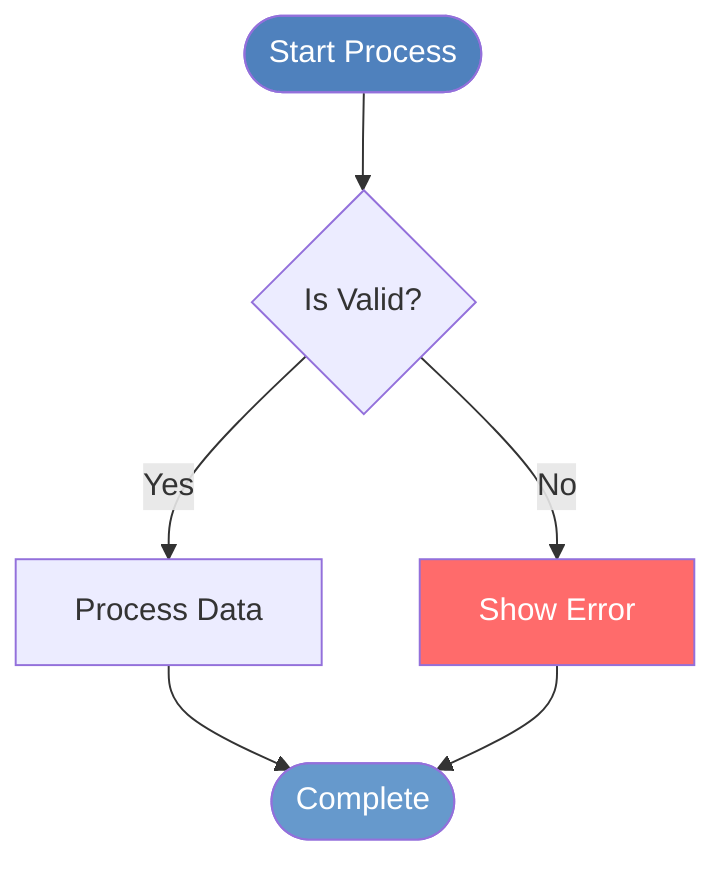
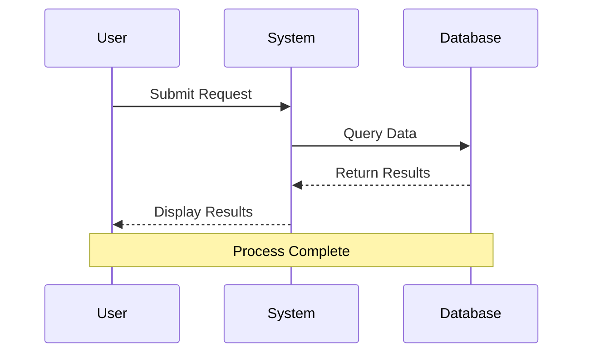
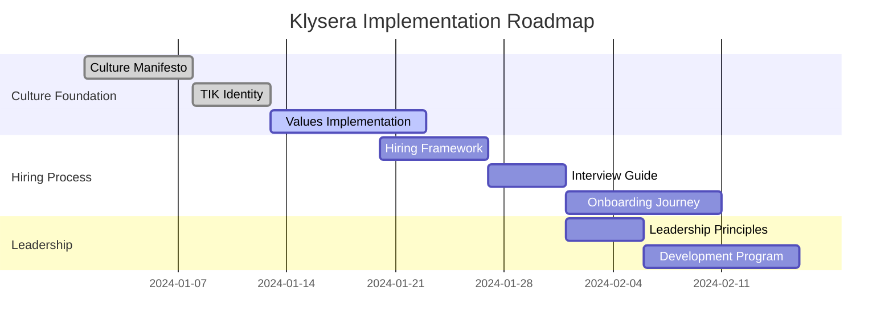
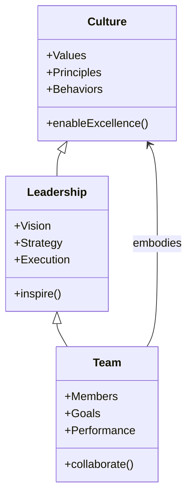
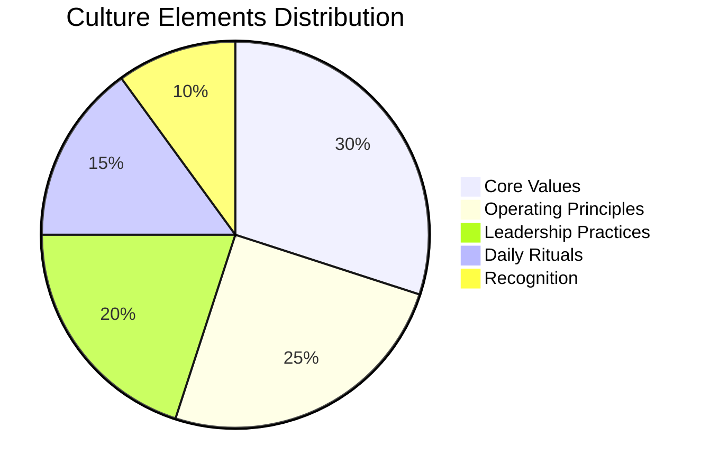
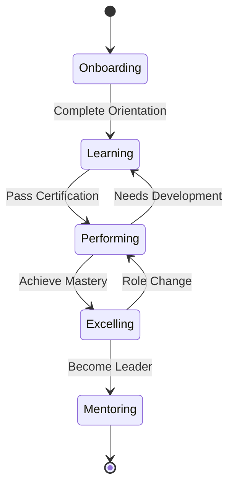
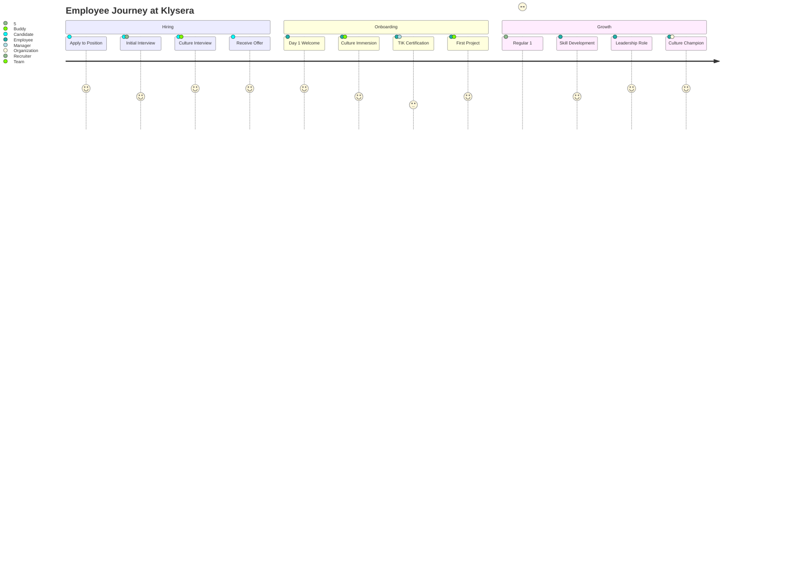

# Mermaid Diagram Test Page

This page demonstrates various Mermaid diagram types for testing rendering functionality.

## Flowchart Example

## Sequence Diagram Example

## Gantt Chart Example

## Class Diagram Example

## Pie Chart Example

## State Diagram Example

## Journey Map Example

---

**Note:** If all diagrams above render correctly, Mermaid integration is working properly.