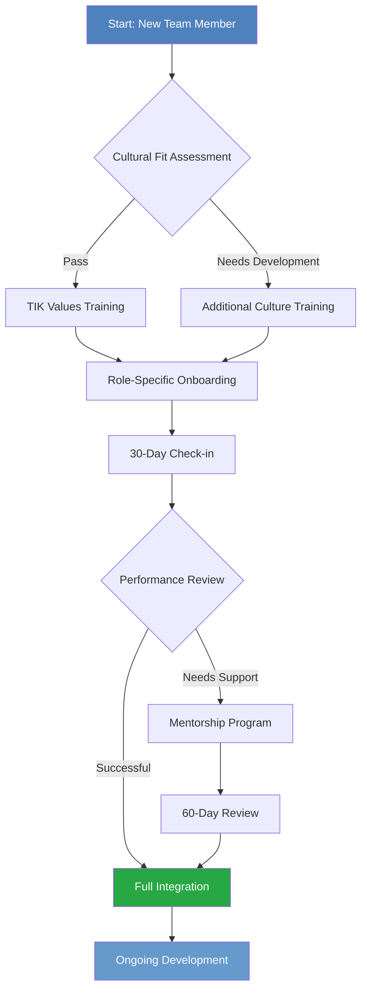
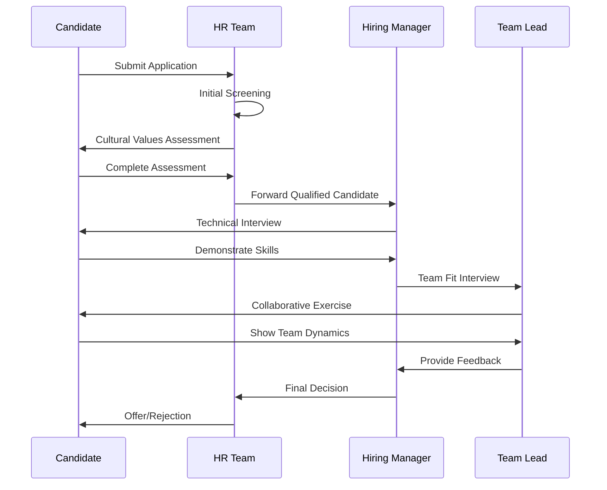
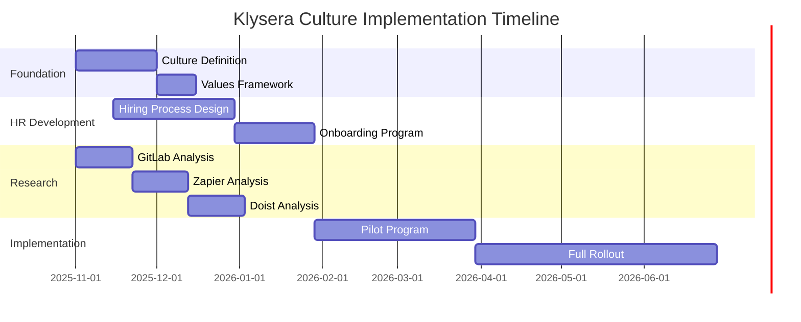
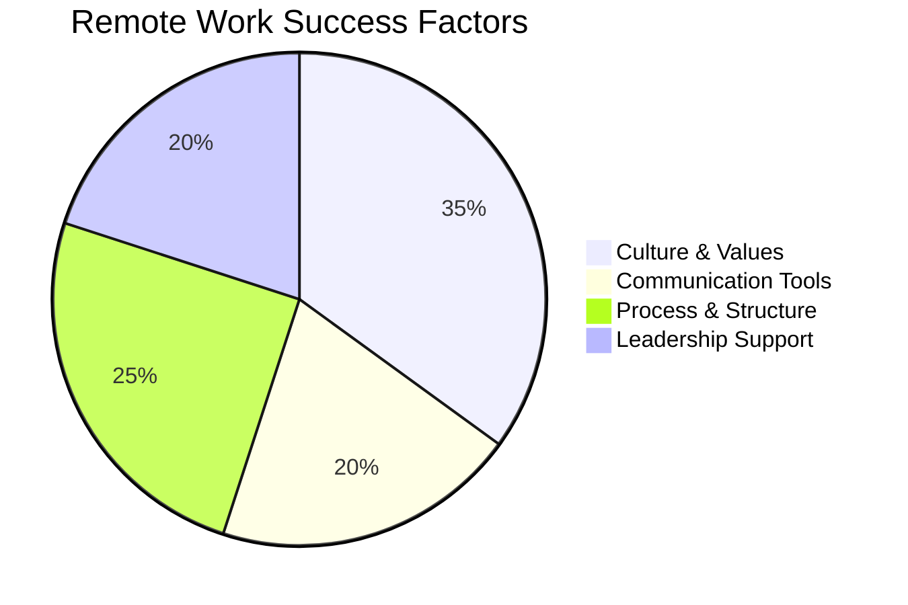
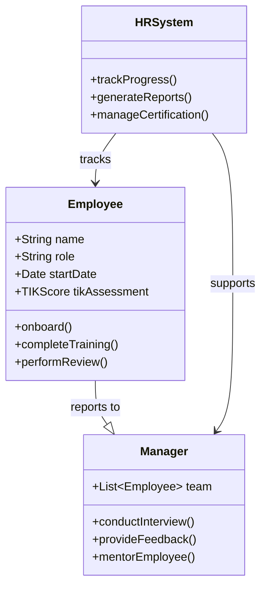
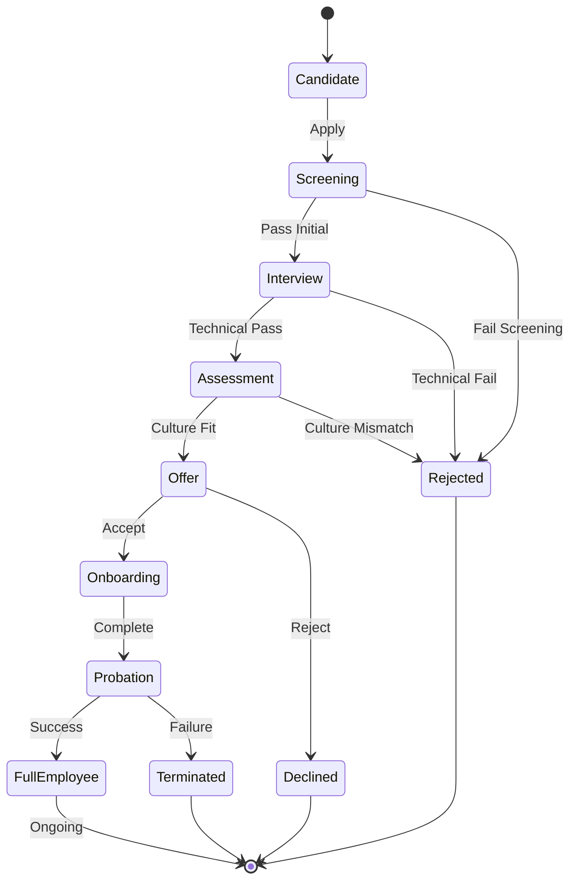

# Mermaid Diagram Test Page

This page tests various Mermaid diagram types to ensure perfect rendering.

## Flowchart Example

## Sequence Diagram Example

## Gantt Chart Example

## Pie Chart Example

## Class Diagram Example

## State Diagram Example

## Test Results

If all diagrams above render correctly with Klysera branding colors, your Mermaid integration is working perfectly!

**Expected Colors:**
- Primary: #4f81bd (Klysera blue)
- Secondary: #6699cc (Light blue)
- Background: #f8f9fa (Light gray)

---

*This test page demonstrates the full range of Mermaid diagram capabilities for the Klysera People & Culture documentation system.*